# MySQL Heatwave 백업


## 세션 소개

이 Lab에서는 MySQL Heatwave DB 시스템에서 백업을 관리하는 방법을 학습합니다.

_Estimated Time:_ 15 minutes 소요


### 목표

이 Lab에서는 다음 작업을 안내해 드립니다.

- Manual Backup 생성
- DB System 백업 Plan 수정
- Manual Backup를 사용하여 new DB System으로 데이터 복구
- Point-in-Time를 사용하여 new DB System으로 데이터 복구
- 사용하지 않는 MySQL Backups 삭제

### Prerequisites (필요사항)

- An Oracle Trial or Paid Cloud Account

## 작업 1: Manual Backup 생성

1. **Navigation Menu** 클릭합니다.

    

2. **Databases** 클릭, **DB Systems** 클릭합니다.  
    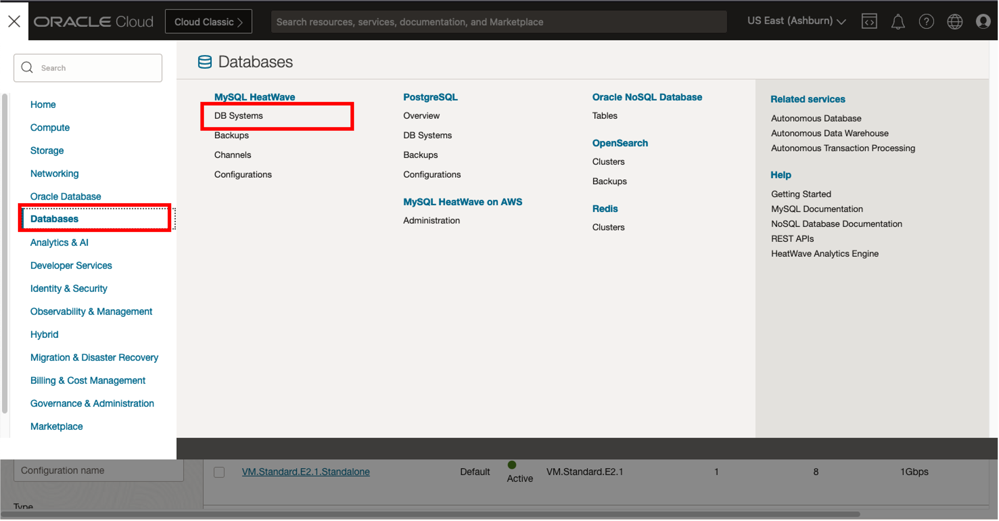

    root compartment를 선택했는지 확인
    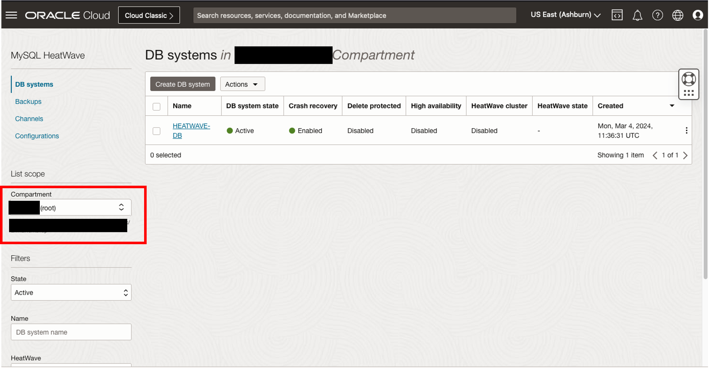

3. deatils한 정보를 보기 위해 **HEATWAVE-DB** 클릭합니다.  
    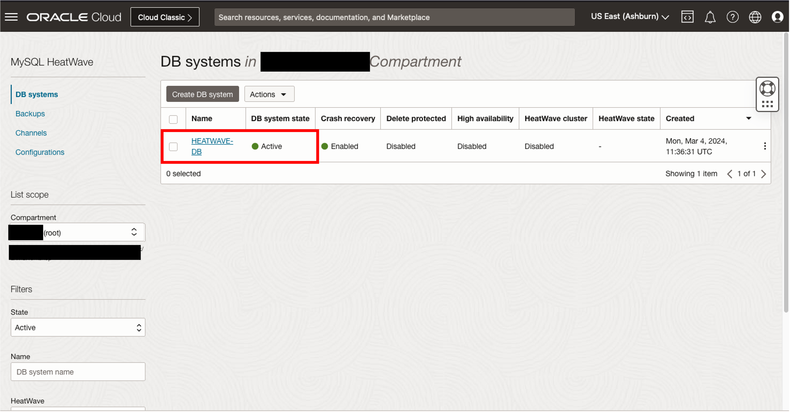

4. **More Actions** menu 에서, **Create Manual Backup** 선택합니다.
    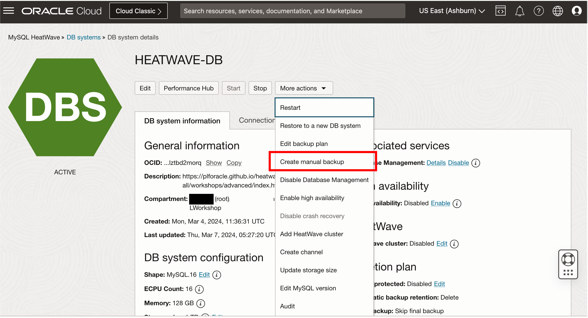

5. 요청된 정보를 입력한 후 **Create Manual Backup**를 클릭하세요.
    * Display Name: Manual Backup
    * description를 그대로 두세요
    * Backup Type: Full Backup
    * 보존기간(Retention Period)을 그대로 두세요

    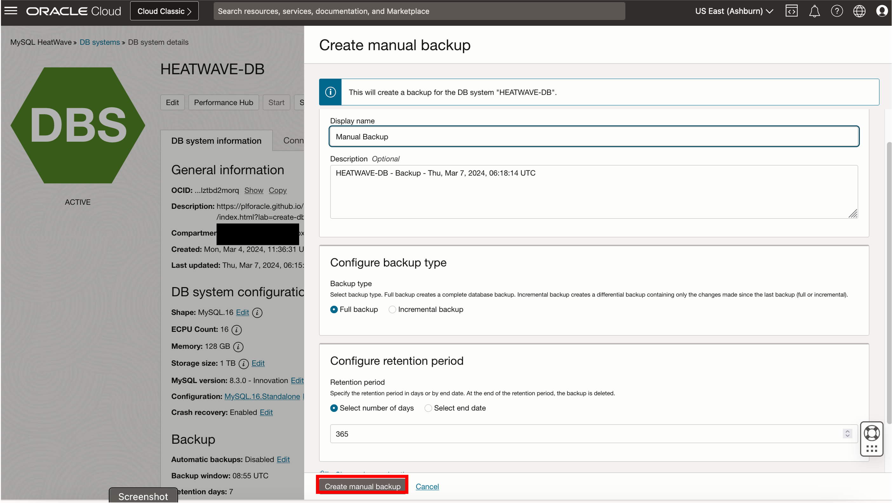

    **참고**: 백업이 완료되는 데 몇 분이 걸릴 수 있습니다.

6. **Navigation Menu** 클릭, **Databases** 클릭, **Backups** 클릭  
    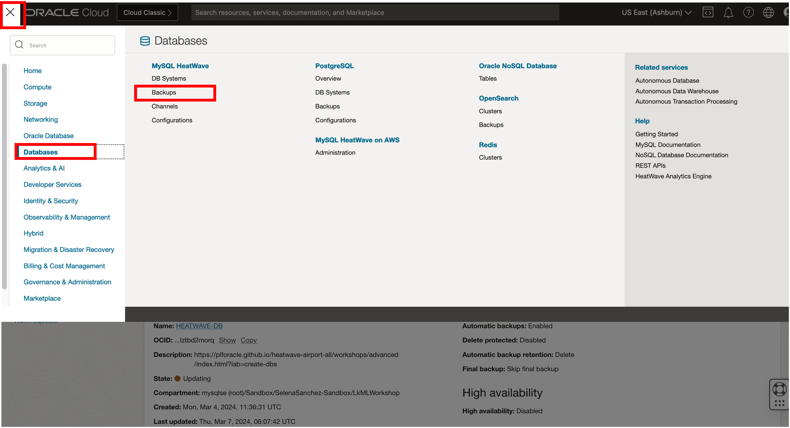

    수동 백업이 성공적으로 생성되었는지 확인하세요
    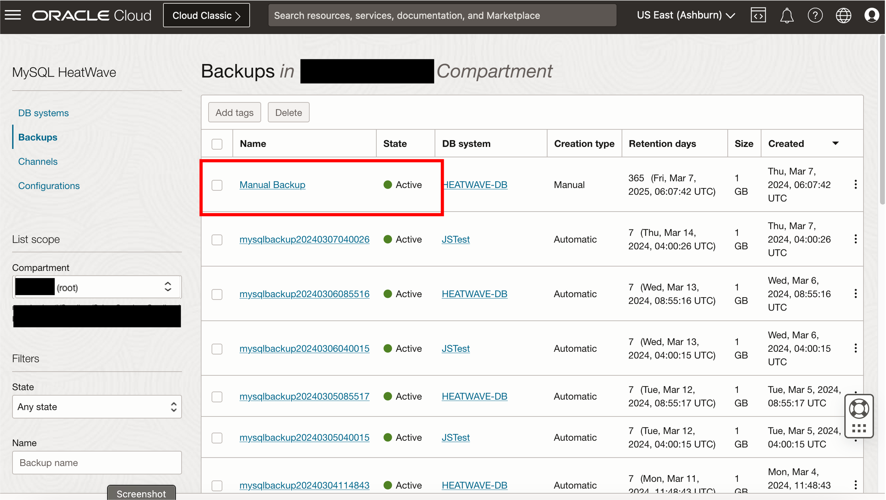


## 작업 2: DB System 백업 Plan 수정

1. **Navigation Menu** 클릭합니다.

    

2. **Databases** 클릭, **DB Systems** 클릭합니다. 
    

    root compartment를 선택했는지 확인
    

3. deatils한 정보를 보기 위해 **HEATWAVE-DB** 클릭합니다.
    

4. **More Actions** menu에서, **Edit Backup Plan** 선택합니다.
    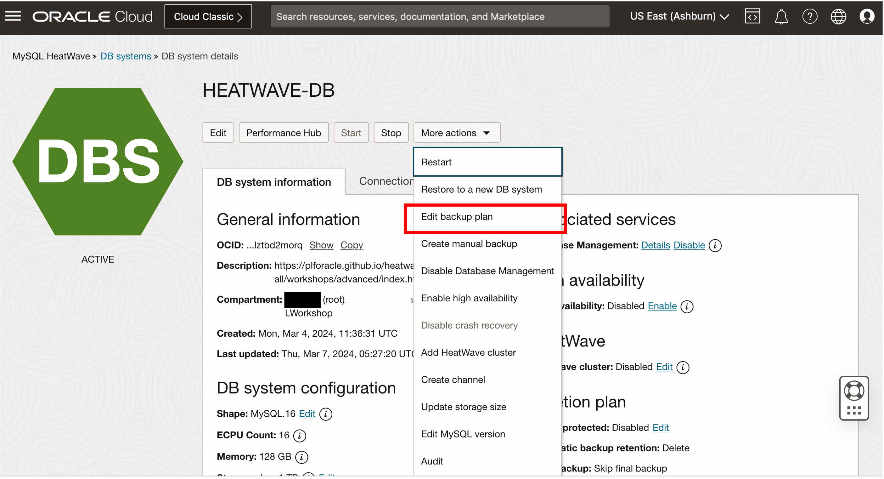

5. **Automatic Backups**를 enable하고 요청된 정보를 입력하세요
    * Backup Retention Period: 1
    * Window Start Time: 07:00 UTC
    * Enable Point in Time Recovery

    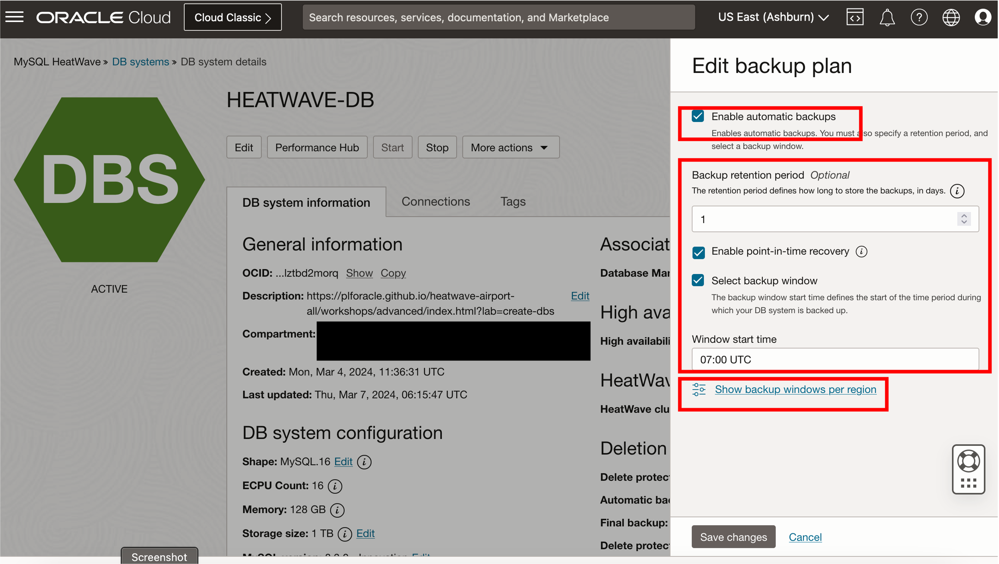 

6. **Show backup windows per region** 클릭합니다. 지역별 모든 백업 윈도우 목록이 나타납니다. 백업 윈도우를 정의하지 않으면 Oracle이 지역을 기준으로 하나를 선택합니다.
    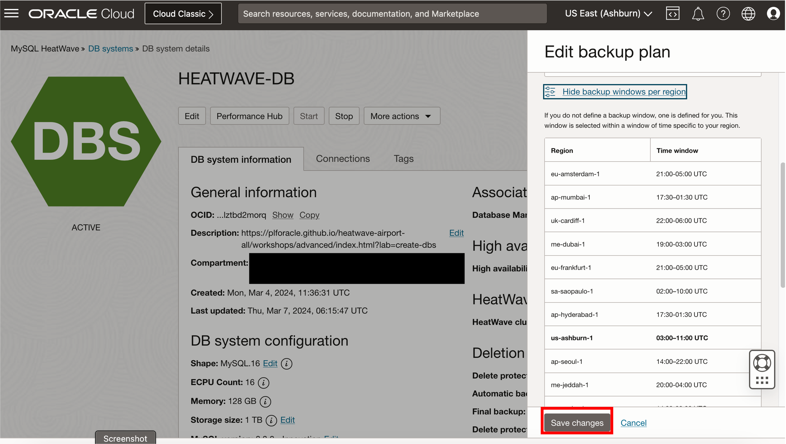

7. **Save Changes** 클릭합니다.


## 작업 3: Manual Backup를 사용하여 new DB System으로 데이터 복구

1. **HEATWAVE-DB** 데이터베이스의 **More Actions** 메뉴에서 **Restore to a new DB System**을 선택하세요.
    

2. **Restore from a backup**을 선택한 다음 **Select backup** 버튼을 클릭하여 **Browse all backup** 페이지를 엽니다.

    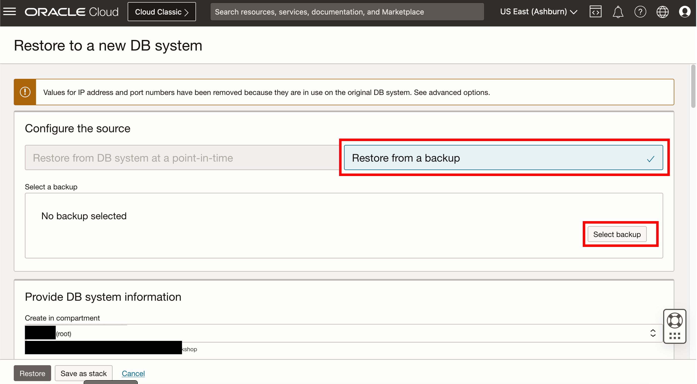

3. **Manual** 버튼을 클릭하고 이전에 만든 **Manual Backup** 옆의 확인란을 선택합니다. 그런 다음 **Select Backup**을 클릭합니다.
    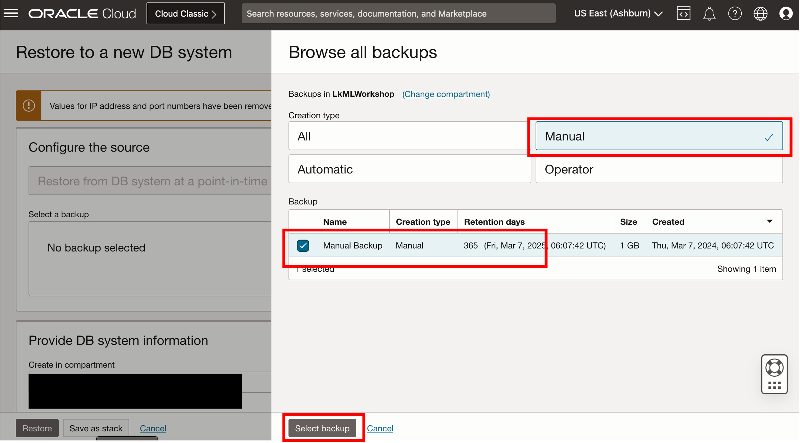

4. root compartment이 선택되었는지 확인하고 새 DB 시스템의 이름을 입력하고 **Standalone** 옵션을 선택합니다.
    ```bash
    <copy>NEWDB</copy>
    ```
    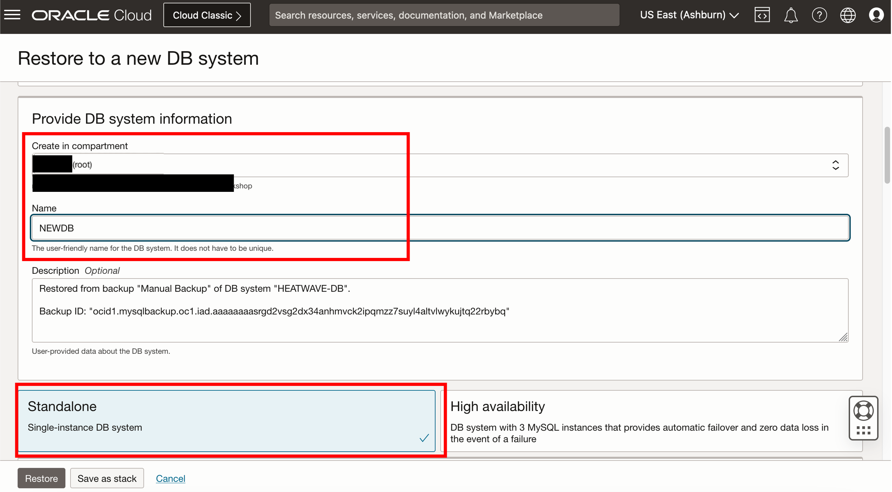

5. 네트워크 구성 섹션에서 HEATWAVE-VCN 및 해당 private subnet이 선택되었는지 확인하십시오.
    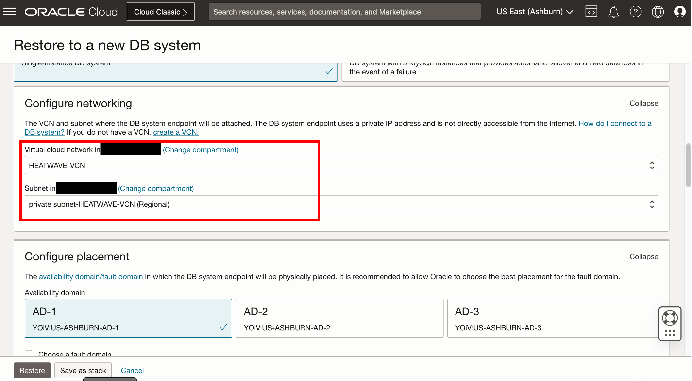

6. **MySQL.HeatWave.VM.Standard** 모양이 선택되었는지 확인하세요.

    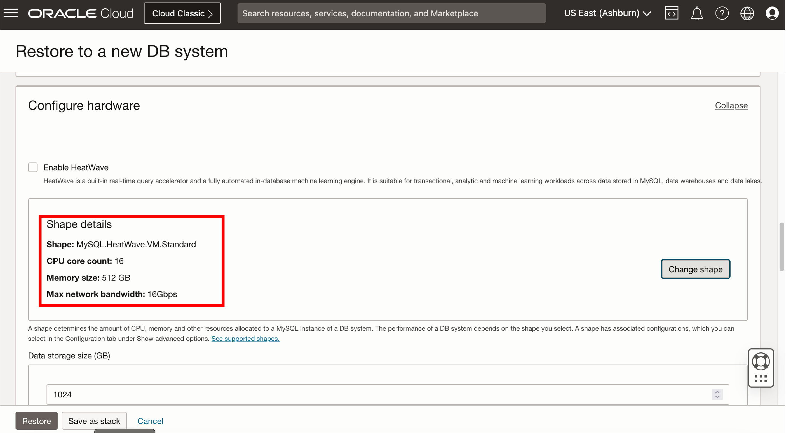

    그렇지 않은 경우 **Change Shape**을 클릭하고 **MySQL.HeatWave.VM.Standard** 모양을 찾아 선택합니다.

7. **데이터 저장 크기(Data Storage Size)**는 그대로 둡니다.

8. 백업 구성에서 'Enable Automatic Backup'을 disable 합니다.

    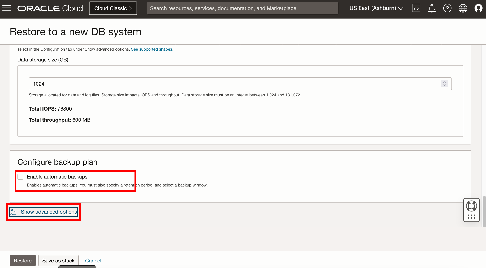 

9. **Show Advanced Options**를 클릭하고 **Connections** 탭으로 가서 **NEWDB**를 새 호스트 이름으로 지정합니다.

    그리고나서, **Restore** 클릭합니다.

    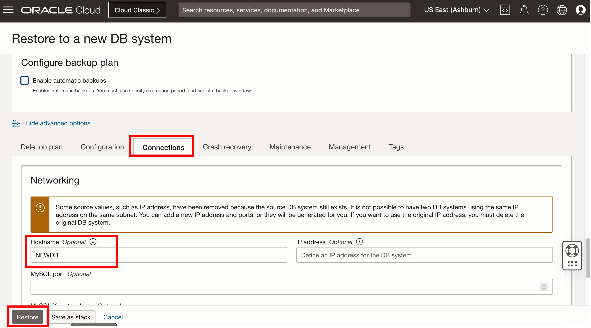

    **참고**: DB 시스템이 생성되는 데 몇 분이 걸릴 수 있습니다. DB 시스템 상태가 활성으로 변경되면 DB 시스템을 사용할 준비가 됩니다.


## 작업 4: Point-in-Time를 사용하여 new DB System으로 데이터 복구

1. **Navigation Menu** 클릭합니다.

    

2. **Databases** 클릭, 그리고 **DB Systems** 클릭합니다. 
    

    root compartment를 선택했는지 확인
    

3. deatils한 정보를 보기 위해 **HEATWAVE-DB** 클릭합니다. 
    

4. **HEATWAVE-DB** 데이터베이스의 **More Actions** 메뉴에서 **Restore to a new DB System**을 선택하세요.
    

5. 다음으로 **latest available point-in-time** 옵션을 선택하고 **Restore from DB System at a point in time**을 클릭합니다.

    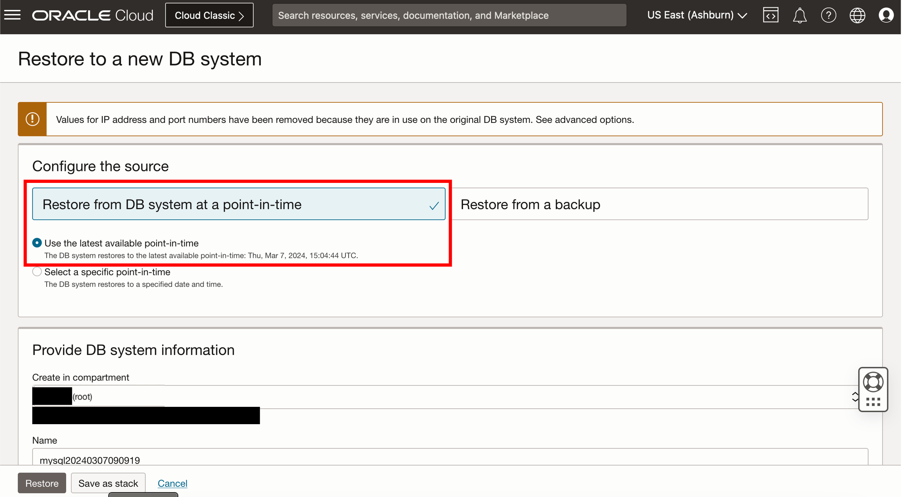


6. root compartment이 선택되었는지 확인하고 새 DB 시스템의 이름을 입력하고 **Standalone** 옵션을 선택합니다.
    ```bash
    <copy>NEWDB2</copy>
    ```
    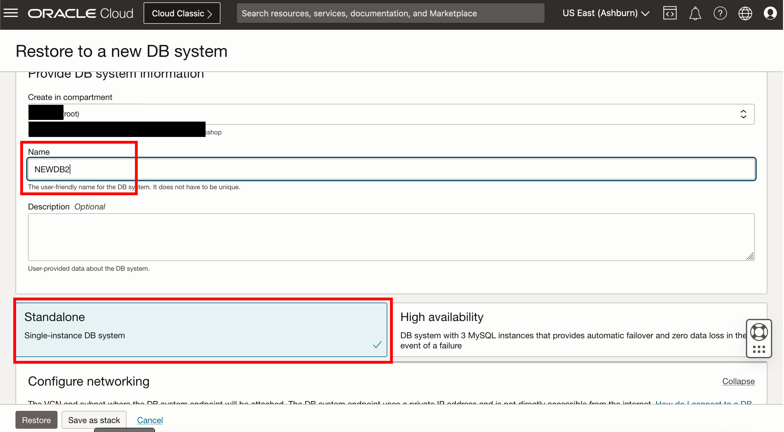

7. 네트워크 구성 섹션에서 HEATWAVE-VCN 및 해당 private subnet이 선택되었는지 확인하십시오.
    

8. **MySQL.HeatWave.VM.Standard** 모양이 선택되었는지 확인하세요.

    

    그렇지 않은 경우 **Change Shape**을 클릭하고 **MySQL.HeatWave.VM.Standard** 모양을 찾아 선택합니다.

9. **데이터 저장 크기(Data Storage Size)**는 그대로 둡니다.

10. 백업 구성에서 **'자동 백업 사용'**을 disable 합니다.

     

11. **Show Advanced Options**를 클릭하고 **Connections tab**으로 가서 **NEWDB**를 새 호스트 이름으로 지정합니다.

    그리고나서, **Restore** 클릭합니다.
    

    **참고**: DB 시스템이 생성되는 데 몇 분이 걸릴 수 있습니다. DB 시스템 상태가 활성으로 변경되면 DB 시스템을 사용할 준비가 됩니다.
    
## 작업 5: 사용하지 않는 MySQL Backups 삭제

1. **Navigation Menu** 클릭합니다.

    

2. **Databases** 클릭, 그리고 **Backups** 클릭합니다.
    

    root compartment를 선택했는지 확인
    

3. 이전에 생성한 수동 백업 옆에 있는 **Actions** 버튼을 클릭하고 드롭다운 메뉴에서 **Delete**를 선택합니다.
    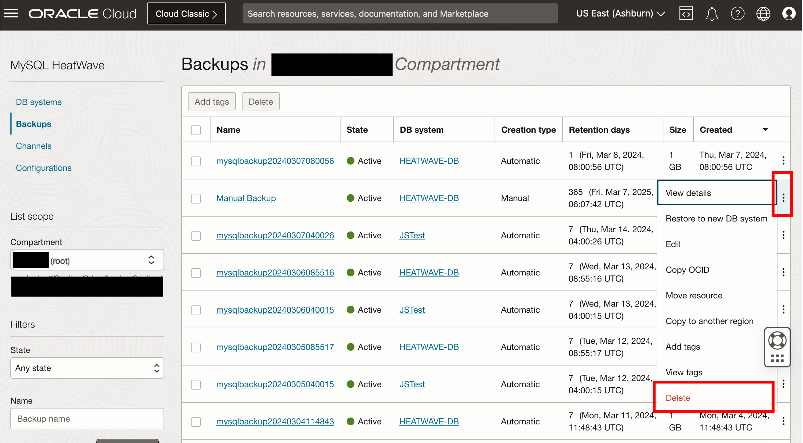

4. 백업을 삭제할 것인지 확인하는 팝업 창이 나타나면 **Delete Backup**를 클릭하세요.
    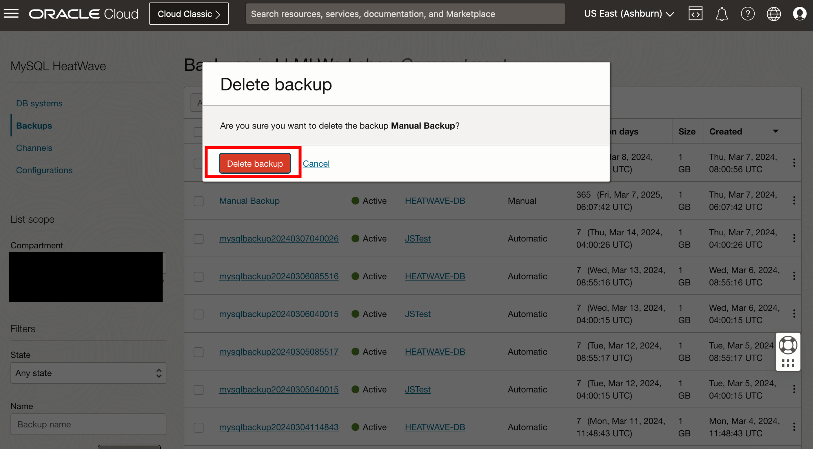

5. 백업이 삭제되면 상태가 **Deleted**으로 변경되며 복원할 수 없습니다. 
    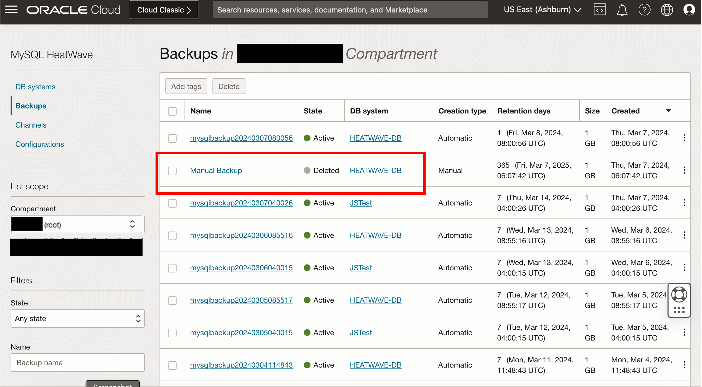

    > **참고**: 
    - 백업이 삭제되는 데 몇 분이 걸릴 수 있습니다.
    - 나중에 문제가 발생하지 않도록 PITR을 비활성화하거나 백업을 완전히 비활성화하세요.
 
이제 **다음 Lab으로 진행**할 수 있습니다.

## Acknowledgements

- **Author** - Selena Sanchez, MySQL Solution Engineering 
- **Last Updated By/Date** - kihyuk, MySQL Solution Engineering, July 2024
