# MySQL HeatWave DB System 설정


## 세션 소개

이 Lab에서는 MySQL Heatwave DB 시스템의 구성을 관리하는 방법을 학습합니다.

_Estimated Time:_ 15 minutes 소요


### 목표

이 Lab에서는 다음 작업을 안내해 드립니다.

- MySQL Configuration 생성
- MySQL Configuration 복사, variables 변경 및 기존 설정과 비교
- MySQL Configuration 변경
- 사용하지 않는 MySQL Confiigurations 삭제

### Prerequisites (필수사항)

- An Oracle Trial or Paid Cloud Account

## 작업 1: MySQL Configuration 생성

1. **Navigation Menu** 클릭합니다.

    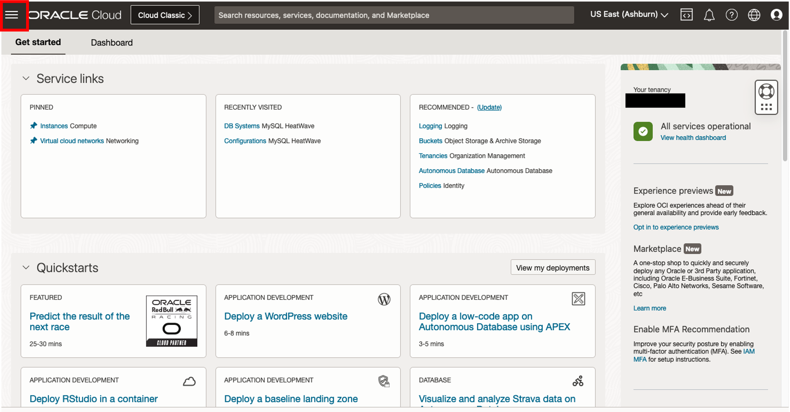

2. **Databases** 클릭, 그리고 **Configurations** 클릭합니다.
    

    root compartment을 사용하고 있는지 확인하세요
    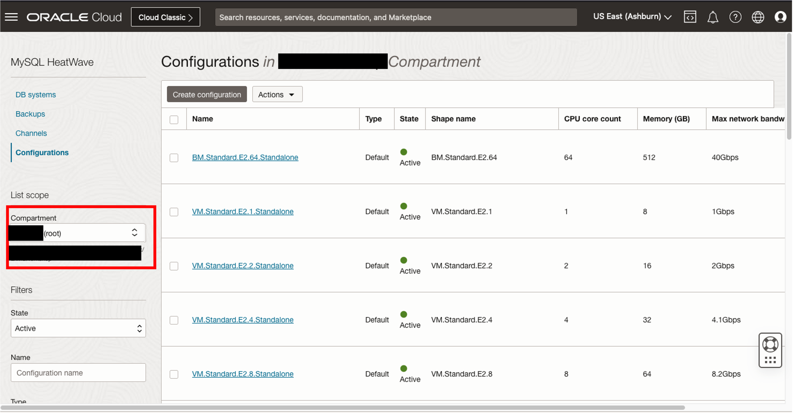

3. **Create Configuration** 클릭합니다.
    

    Enter a name for your configuration: 

    ```bash
    <copy>MyConfig</copy>
    ```
  
    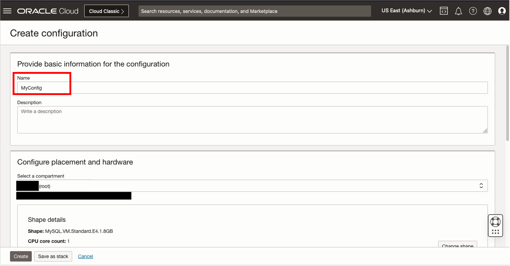

    
4. **Change Shape** 버튼을 클릭합니다. 
    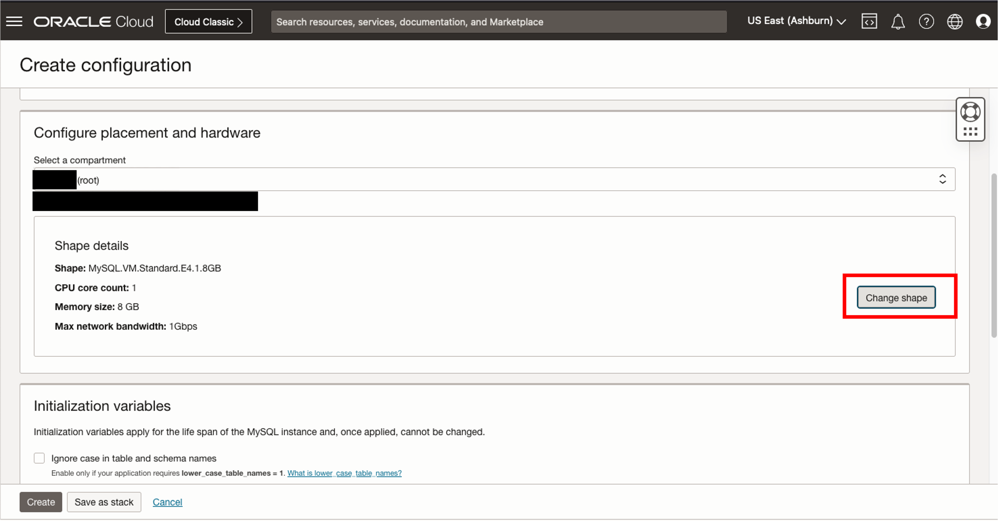
    
5. **OCPU** 탭을 선택하고 **MySQL.HeatWave.VM.Standard** 모양을 찾아 선택합니다. 그런 다음 **Select Shape**을 클릭합니다.
    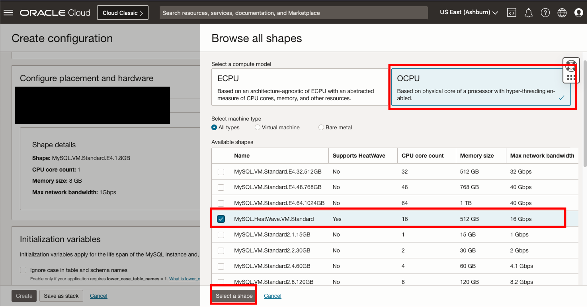

6. 아래로 스크롤하면 변수 정보 페이지가 표시됩니다. **User Variables (Read/Write)** 섹션에서 다음 변수와 값을 추가합니다.

    * Set **max_connections** to 200
    * Set **sort\_buffer\_size** to 500000
    * Set **time\_zone** to +01:00

    

    **참고:** 더 많은 변수를 구성하기 위해 더 많은 행을 추가하려면 **+다른 변수**를 클릭할 수 있습니다.

7. **Create**를 클릭하여 구성을 만듭니다. 구성 세부 정보 페이지가 표시됩니다.
    

8. 아래로 스크롤하여 구성한 변수를 확인하세요.
    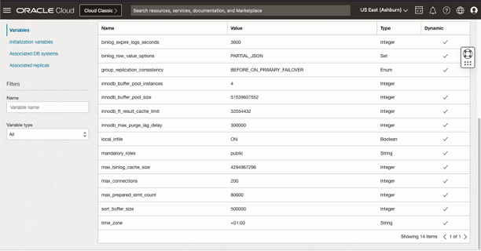


## 작업 2: MySQL Configuration 복사

1. MyConfig 세부 정보 페이지에서 **Copy Configuration**를 클릭하여 MyConfig 구성을 복사합니다.
    

2. 구성 복사 페이지가 표시됩니다. 구성의 이름을 입력합니다.

    ```bash
    <copy>MyConfig2</copy>
    ```

    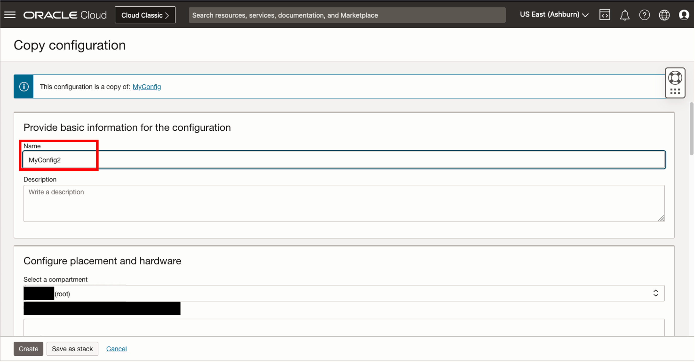

3. 아래로 스크롤하여 **Initialization Variiables** 탭을 클릭하고 **Ignore case in table and schema names** 옵션을 활성화합니다.

    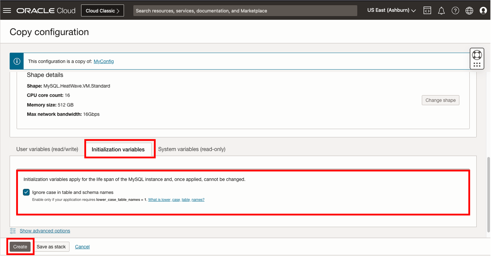

4. **Create**를 클릭하여 MyConfig2 구성을 만듭니다.

5. 구성 목록 페이지로 돌아가기
    

6. MyConfig의 상황에 맞는 메뉴를 클릭하고 **Copy Configuration**를 클릭합니다.
    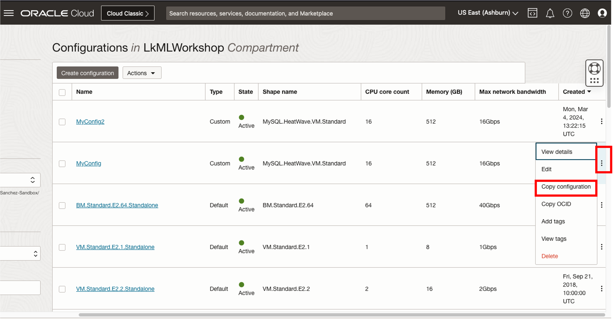

7. 구성 복사 페이지가 표시됩니다. 구성의 이름을 입력합니다.

    ```bash
    <copy>MyConfig3</copy>
    ```
    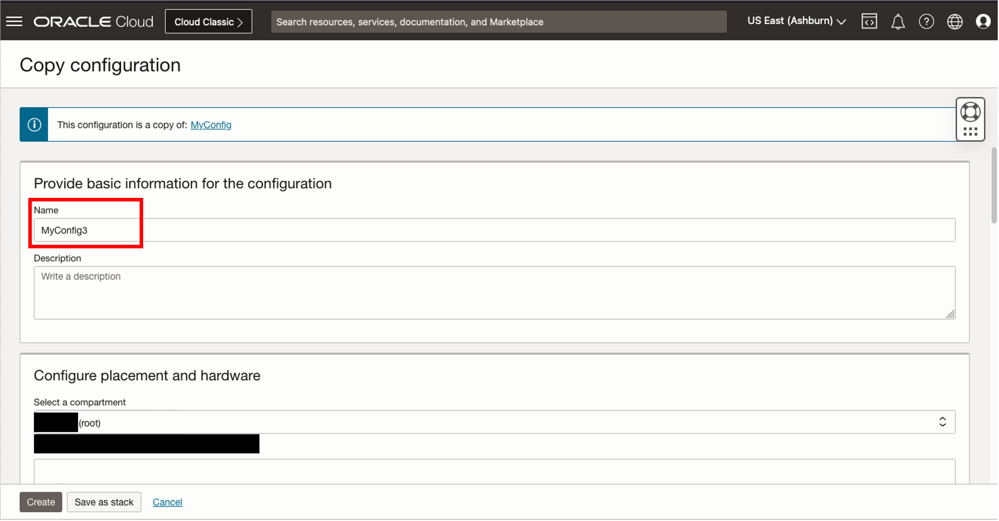

8. **User variables (read/write)** 탭으로 스크롤하여 다음 변경을 수행합니다.
    * Change the value of **max_connections** to 300
    * Change the value **time_zone** to +02:00. 
    * Click **+Another Variable** to add another row.

    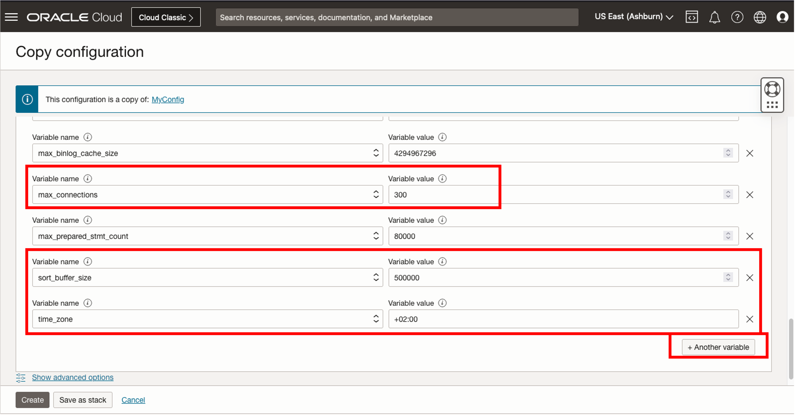

    *  **autocomit** 변수를 추가하고 해당 값을 **OFF**로 설정합니다.

    

9. **Create**를 클릭하여 MyConfig3를 만듭니다.


## 작업 3: 2개의 MySQL Configuration 비교

1. 구성 목록 페이지로 돌아가기
    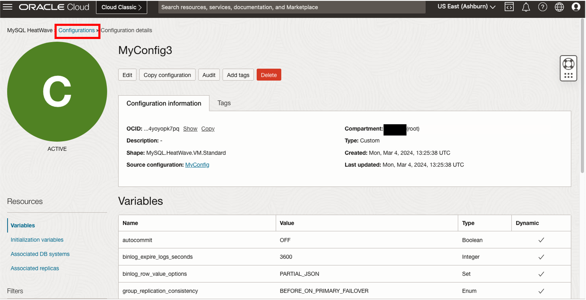
    
2. 구성 목록에서 확인란을 선택하여 **MyConfig2** 및 **MyConfig 3** 구성을 선택합니다. 
    그런 다음 **Actions** 버튼을 클릭하고 드롭다운 메뉴에서 **Compare**를 선택합니다.

    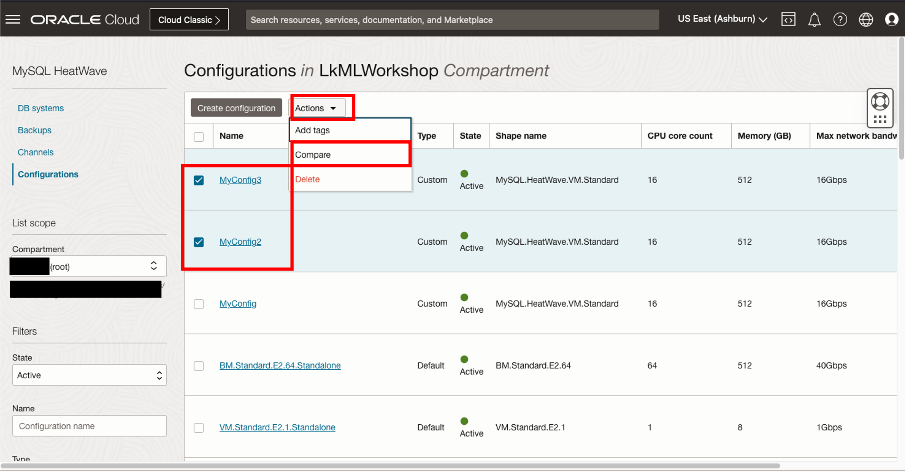

3. 구성 비교 대화 상자가 표시됩니다. **default** 차이점을 보여줍니다. 

    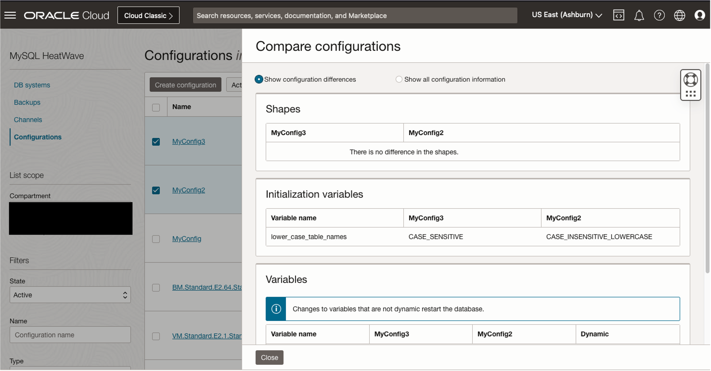

    * 두 구성에 대한 모든 정보를 보려면 **Show all** 버튼을 클릭하세요.
    
    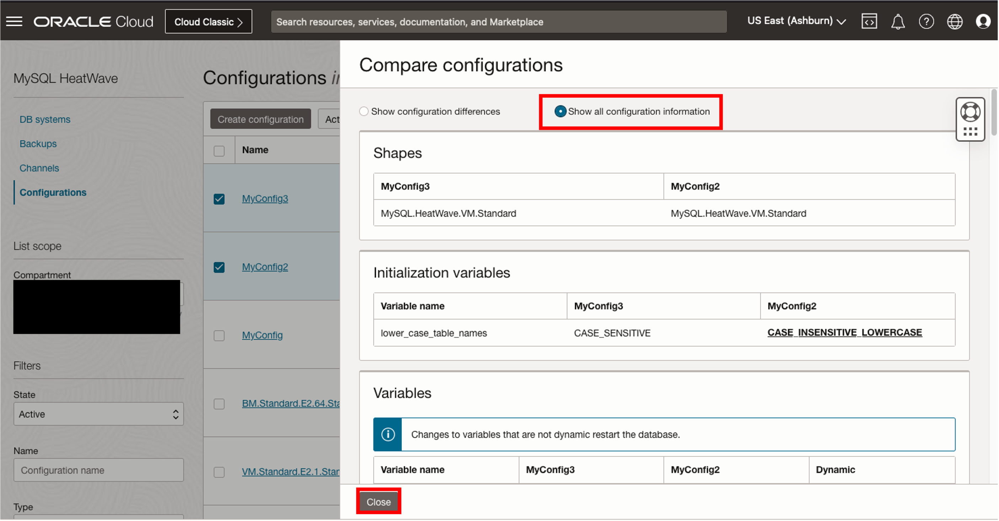

4. **Close** 클릭합니다. 

## Task 4: MySQL Configuration 변경

1. **Navigation Menu** 클릭, **Databases** 클릭, 그리고 **DB Systems** 클릭합니다. 
    

2. **HEATWAVE-DB**를 클릭해서 자세한 내용을 보세요.
    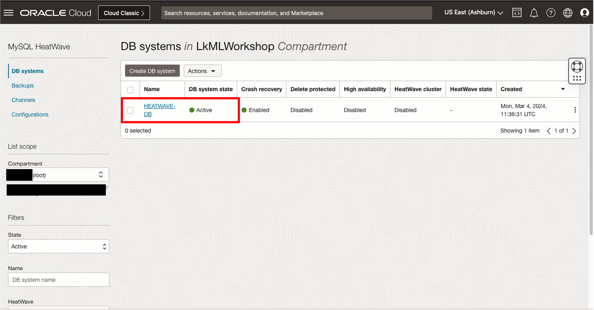

3. **Edit** 버튼을 클릭하여 DB 시스템을 편집하세요.
    

4. DB 시스템 편집 페이지가 표시됩니다. 구성 섹션으로 스크롤하여 **Change Configuration** 버튼을 클릭하여 다른 구성을 선택합니다.
    

5. 찾아보기 구성 대화 상자가 표시됩니다. **that match the shape of the DB System** 모든 구성만 나열합니다.
    
    기본 구성(default configurations)을 숨기려면 사용자 정의 버튼을 클릭하세요.

    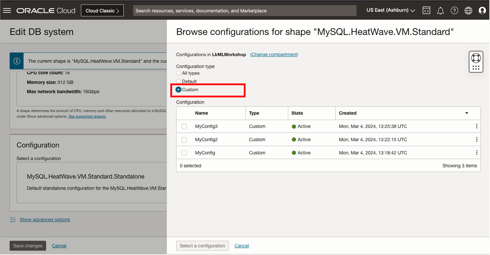

6. **MyConfig2** 구성을 선택합니다. 
    * 오류 메시지가 표시되는 이유는 DB 시스템이 배포된 후에는 초기화 변수를 변경할 수 없기 때문입니다.
    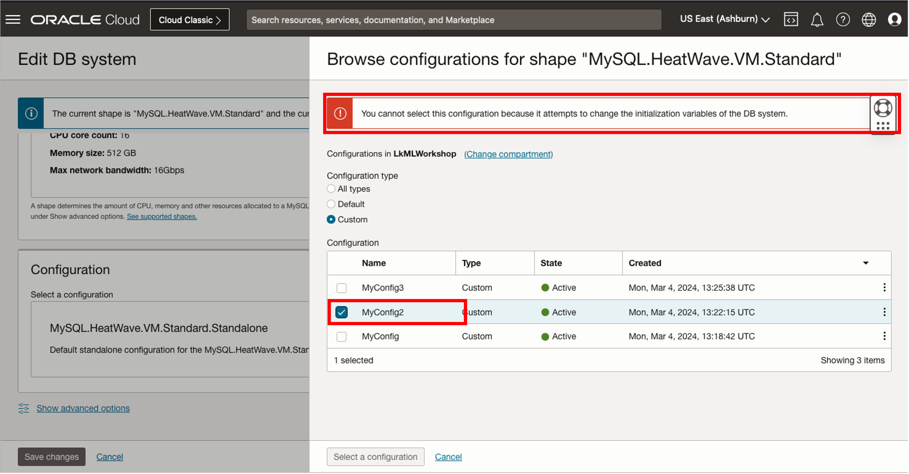
    
7. **MyConfig3** 구성을 선택하고 **Select a Configuration**을 클릭합니다.
    

8. DB 시스템 편집 페이지에서 **Save Changes**을 클릭합니다. HEATWAVE-DB가 업데이트 상태로 변경되고, 구성을 변경한 후 데이터베이스를 다시 시작해야 변경 사항이 적용됩니다.
    

9. 다시 시작하면 데이터베이스가 **ACTIVE** 상태로 변경되고 구성에 MyConfig3이 표시됩니다.
    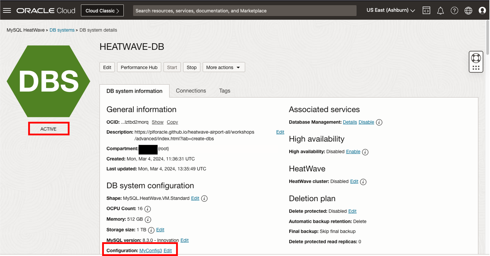


## 작업 5: 사용하지 않는 MySQL Confiigurations 삭제

1. **Navigation Menu** 클릭, 그리고 **Configurations** 클릭합니다.
    

    root compartment에 있는지 확인하세요
    

3. 각각의 확인란을 선택하여 **MyConfig3, MyConfig2 및 MyConfig** 구성을 선택하고 작업 버튼을 클릭한 후 드롭다운 메뉴에서 **Delete**를 선택합니다.
    

4. **Delete configurations**를 클릭하여 확인하세요.
    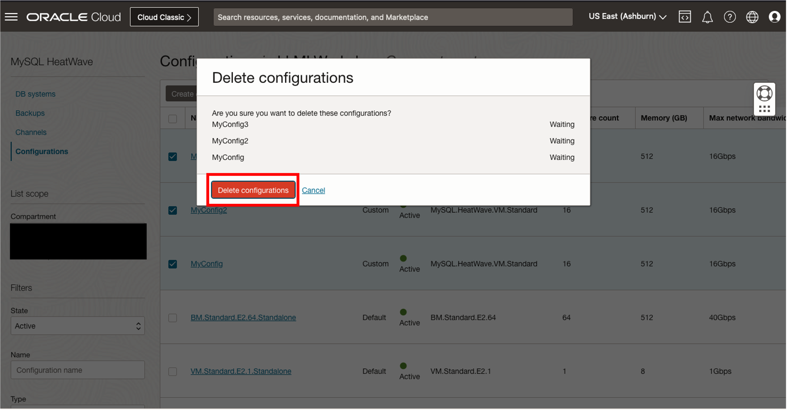

5. 오류가 발생하여 MyConfig3 구성 삭제가 실패합니다. 이유를 보려면 **Show Details**를 클릭하세요.

    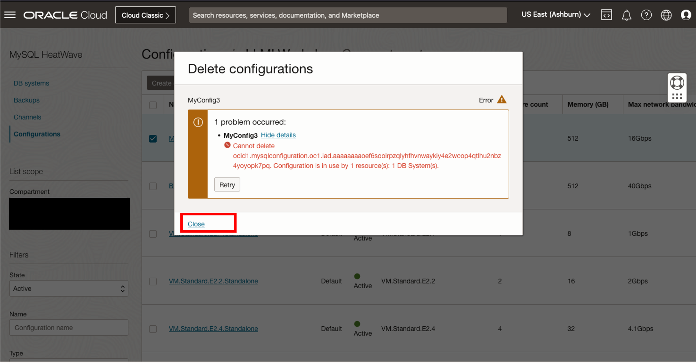
    
    세부 정보에 표시된 대로, MyConfig3 구성은 현재 DB 시스템에서 사용 중이므로 삭제할 수 없습니다.
    세부 정보 페이지에서 닫기를 클릭합니다. 

6. 구성 목록 페이지에서 MyConfig2 및 MyConfig 구성이 삭제된 것을 확인할 수 있습니다.
    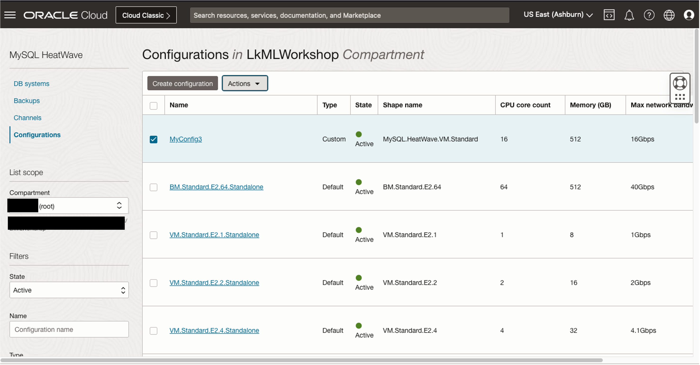


이제 **다음 Lab으로 진행**할 수 있습니다.

## Acknowledgements

- **Author** - Selena Sanchez, MySQL Solution Engineering 
- **Last Updated By/Date** - kihyuk, MySQL Solution Engineering, July 2024
