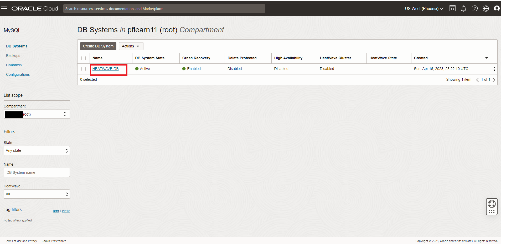
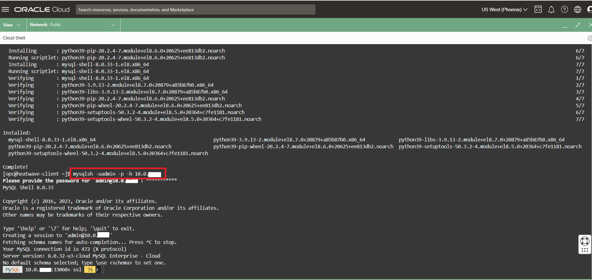
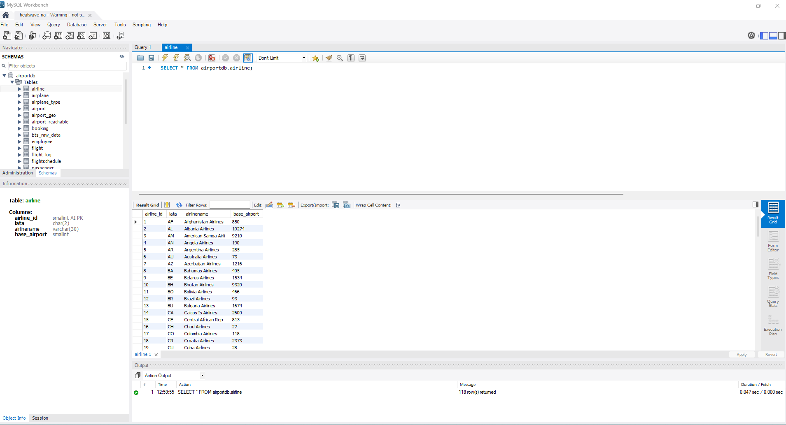

# MySQL Shell and Workbench로 Heatwave 접속


## 세션 소개

원격 IP에서 DB 시스템의 엔드포인트(endpoint)로 직접 연결할 수 없습니다. SSH 또는 RDP를 사용하여 컴퓨트 인스턴스에 연결하고, 컴퓨트 인스턴스에서 MySQL Shell, MySQL Client 또는 MySQL Workbench를 사용하여 DB 시스템에 연결합니다. 자세한 내용은 OCI 문서를 참조하세요.

[Connecting to a DB System with Compute Instance](https://docs.oracle.com/en-us/iaas/mysql-database/doc/compute-instance.html#GUID-6087DA45-06E0-44AD-9CAB-0FC37423A07A)


_Estimated Lab Time:_ 10 minutes 소요

### 목표

이 Lab에서는 다음 작업을 안내해 드립니다.

- Compute System 접속
- MySQL HeatWave Database Endpoint 가져오기
- MySQL Shell로 Database 접속
- Airport-db database 데이터를 로드하기 위해 MySQL Shell 사용하기
- MySQL Workbench를 사용하여 Heatwave 접속

### Prerequisites (필요사항)

- An Oracle Trial or Paid Cloud Account
- MySQL Shell에 사용경험


## 작업 1: Compute System 접속

1. Cloud Shell로 이동하여 새 Compute Instance에 SSH를 실행합니다.

2. username **opc** 과 Public **IP Address**를 아래와 같이 입력합니다.

    참고: **HEATWAVE-Client**는 작업 5: #1에서 언급된 대로 공용 IP 주소를 표시합니다.

    (Example: **ssh -i ~/.ssh/id_rsa opc@132.145.170...**) 

    ```bash
    <copy>ssh -i ~/.ssh/id_rsa opc@<your_compute_instance_ip></copy>
    ```

3. **Are you sure you want to continue connecting (yes/no)?** 에 대해서
    - **yes** 입력

    


## 작업 2: MySQL HeatWave Database Endpoint 가져오기

1. 실행중인 Compute Instance의 공용 IP 주소를 메모장에 복사합니다.

    - Navigation Menu에서 아래와 같이 이동
        - Compute
        - Instances
        - **Public IP** 복사
    

2. 실행중인 MySQL 데이터베이스 서비스 인스턴스의 개인 IP 주소를 메모장에 복사합니다.

    - Navigation Menu에서 아래와 같이 이동
        - Databases 
        - MySQL
        - `HEATWAVE-DB` Database System link를 클릭
     

3. HEATWAVE-DB `Private IP 주소`를 메모장에 복사합니다.
     

4. 메모장은 다음과 같이 보여야 합니다.
     

## 작업 3: MySQL Shell로 Database 접속

1. Compute 인스턴스에서 MySQL Shell 클라이언트 도구를 사용하여 HEATWAVE-DB에 연결합니다.

   endpoint(IP 주소)는 메모장이나 MHEATWAVE-DB 시스템 세부 정보 페이지의 "endpoint" "Private IP 주소"에서 찾을 수 있습니다.

    

2. 다음 명령을 사용하여 MySQL Shell 클라이언트 도구를 사용하여 MySQL에 연결합니다. 명령 끝에 MDS-HW 개인 IP 주소를 추가해야 합니다. 또한 Lab 1에서 만든 관리자 사용자와 db 비밀번호를 입력합니다.

    (Example  **mysqlsh -uadmin -p -h10.0.1..**)

    **[opc@...]$**

    ```bash
    <copy>mysqlsh -uadmin -p -h 10.0.1... </copy>
    ```

    

3. MySQL Shell 프롬프트에서, SQL mode로 전환

    ```bash
    <copy>\sql</copy>
    ```

4. 모든 HeatWave 스키마를 나열하세요

    ```bash
    <copy>SHOW DATABASES;</copy>
    ```

5. 데이터베이스 버전, 현재 날짜 및 사용자 이름을 표시합니다.

    ```bash
    <copy>SELECT VERSION(), CURRENT_DATE, USER();</copy>
    ```

## 작업 4: Airport-db database 데이터를 로드하기 위해 MySQL Shell 사용하기

설치 절차에는 airportdb 데이터베이스를 클라우드 셸에 다운로드하고 MySQL 셸 덤프 로딩 유틸리티를 사용하여 클라우드 셸에서 MySQL DB 시스템으로 데이터를 가져오는 작업이 포함됩니다. 이 유틸리티에 대한 정보는 Dump Loading Utility를 참조하세요: [https://dev.mysql.com/doc/mysql-shell/8.0/en/mysql-shell-utilities-load-dump.htmly](https://dev.mysql.com/doc/mysql-shell/8.0/en/mysql-shell-utilities-load-dump.html)

1. JavaScript mode로 변경

    ```bash
    <copy>\js</copy>
    ```

2. MySQL Shell Dump Loading Utility를 사용하여 airportdb 데이터베이스를 MySQL DB 시스템에 load합니다.

    ```bash
    <copy>util.loadDump("https://objectstorage.us-ashburn-1.oraclecloud.com/p/4TAWm0ayQtIPsxmZqDRNt9j3xxG83Ztjv-YVa7czxzdtu7H-rTKivnkUey97YIQG/n/mysqlpm/b/mysql_airport/o/airportdball/", {threads: 16,progressFile: "progress.json", loadIndexes:false,ignoreVersion:true})</copy>
    ```


    

3. 테이블당 airportdb 총 records 보기

    ```bash
    <copy>\sql</copy>
    ```

    ```bash
    <copy>SELECT table_name, table_rows FROM INFORMATION_SCHEMA.TABLES WHERE TABLE_SCHEMA = 'airportdb';</copy>
    ```

    

4. MySQL Shell에서 나가기

    ```bash
    <copy>\q</copy>
    ```

## 작업 5: MySQL Workbench를 사용하여 Heatwave 접속

local(PC) 머신에서 MySQL Workbench를 사용하면 컴퓨팅 인스턴스를 jump 박스로 사용하여 MySQL 엔드포인트에 연결할 수 있습니다.

1. 사전 설치된 **MySQL Workbench**에서, **Standard TCP/IP over SSH** 방법을 사용하여 연결을 구성하고, 인증은 compute instance에 ssh와 ssh key로 진행합니다.

2. MySQL HeatWave를 위한 MySQL Workbench 구성:

     

3. MySQL HeatWave를 위한 MySQL Workbench 사용 :

     


이제 **다음 Lab으로 진행**할 수 있습니다.

## Acknowledgements

- **Author** - Perside Foster, MySQL Principal Solution Engineering
- **Last Updated By/Date** - kihyuk, MySQL Solution Engineering, July 2024
