# OCI Bastion를 사용하여 Heatwave 접속


## 세션 소개
클라우드에서 작업할 때 서버와 서비스가 퍼블릭 인터넷에 노출되지 않는 경우가 종종 있습니다. Oracle Cloud Infrastructure(OCI) MySQL 클라우드 서비스는 프라이빗 네트워크를 통해서만 액세스할 수 있는 서비스의 예입니다. 이 서비스는 완벽하게 관리되므로 잠재적인 공격과 취약성으로부터 데이터를 보호하기 위해 인터넷에서 분리하여 보관합니다. 리소스 노출을 최대한 제한하는 것이 좋지만 언젠가는 해당 리소스에 연결하고 싶을 것입니다. 바로 여기서 배스천 호스트가 등장합니다. 배스천 호스트는 프라이빗 리소스와 프라이빗 네트워크에 액세스해야 하는 엔드포인트 사이에 있는 리소스로, SSH 또는 RDP와 같은 프로토콜을 통해 프라이빗 리소스에 로그인할 수 있도록 하는 "jump box" 역할을 할 수 있습니다. 배스천 호스트에는 MySQL DB 시스템에 연결하기 위한 가상 클라우드 네트워크가 필요합니다.


Oracle은 OCI에 Bastion Service를 추가했습니다. 그리고 OCI 대시보드에서 브라우저 기반 터미널인 Cloud Shell을 사용할 수 있는 환경도 제공하고 있습니다.

오늘은 이 두 가지 구성 요소를 사용하여 브라우저에서 MDS DB 시스템에 연결합니다.

_Estimated Lab Time:_ 15 minutes 소요

### 목표

이 Lab에서는 다음 작업을 안내해 드립니다.

- Bastion Service 구성
- Bastion session 생성
- MySQL Heatwave 접속

### Prerequisites (필요사항)

- An Oracle Trial or Paid Cloud Account
- MySQL Shell에 사용경험

## 작업 1: Bastion Service 구성

새로운 Bastion 서비스를 사용하면 MySQL DB 시스템에 대한 SSH 터널을 생성할 수 있습니다.

1. Navigation Menu > Identity Security > Bastion 로 이동

    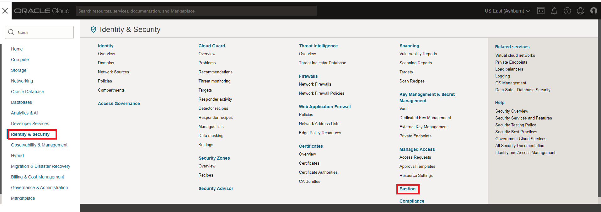

2. Create Bastion 클릭

    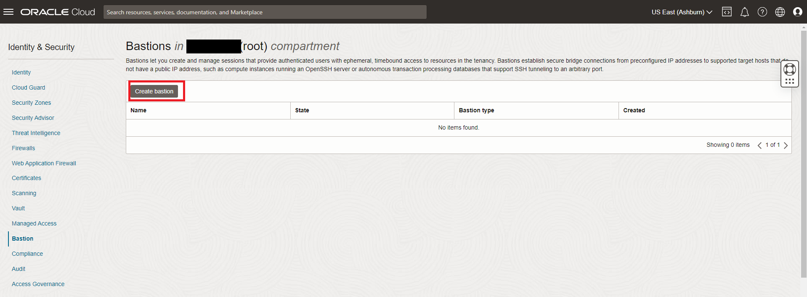

3. Create bastion 화면에서, 다음 필드를 완성하세요:

    Bastion Name

     ```bash
     <copy>MDSBastion</copy>
     ```

    Target virtual Cloud network in .. (root)

    `HEATWAVE-VCN` 선택

    Target subnet in .. (root)

    `Private Subnet-HEATWAVE-VCN` 선택

    CIDR block allowlist (As you don’t know the IP of the Cloud Shell, use 0.0.0.0/0)

     ```bash
     <copy>0.0.0.0/0</copy>
     ```

    `0.0.0.0/0(New)` 클릭

     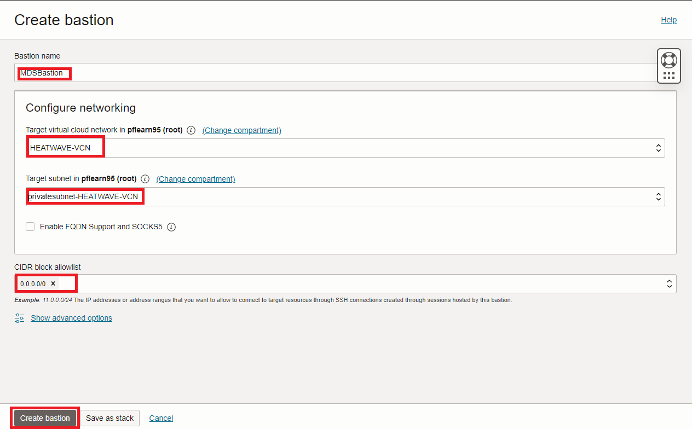

4. `Create Bastion` 버튼 클릭

    완료되면 화면이 다음과 같아야 합니다:

    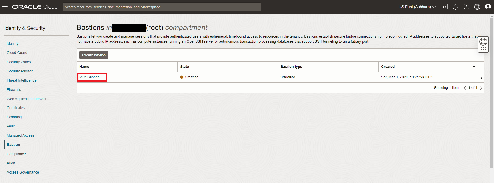

## 작업 2: Bastion session 생성

1. Bastion 세션을 만들기 전에 메모장을 엽니다. 다음 단계를 수행하여 MySQL 데이터베이스 시스템 private IP 주소를 기록합니다.:

    - Navigation Menu > Databases > MySQL 로 이동
     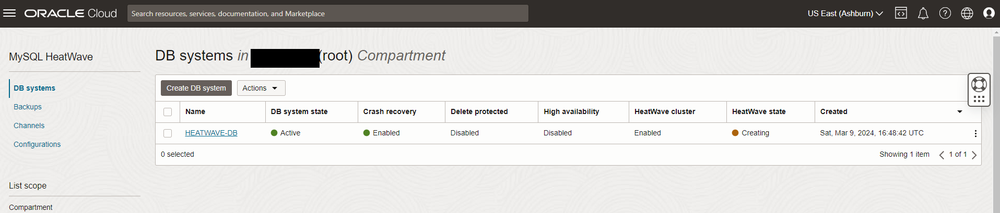

    -  `HEATWAVE-DB` Database System link 클릭

     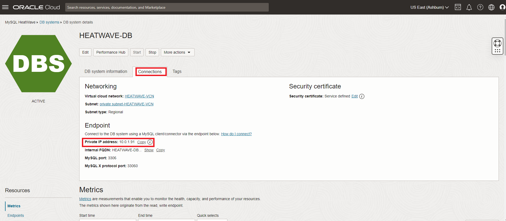

    - **Connections** tab 으로 이동 및 **Private IP address** 를 메모장에 복사

2. public SSH 키를 메모장에 복사하려면 다음 단계를 수행하세요.

    - Cloud shell 오픈
     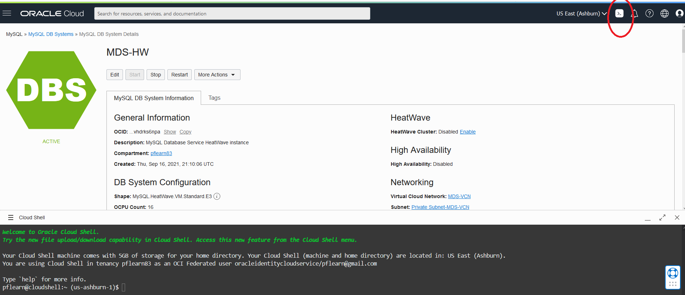

    - 다음 명령을 입력하세요

    ```bash
     <copy>cat .ssh/id_rsa.pub</copy>
    ```

    

3. 메모장에 id\_rsa.pub 내용을 복사합니다.
        메모장에 내용은 다음과 같아야 합니다.
    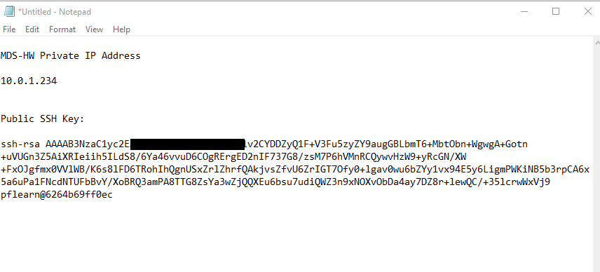  

    >**참고** 로컬 ~/.ssh 폴더에 id\_rsa 및 Id\_rsa.pub 파일의 사본이 있는지 확인하세요. 그렇지 않은 경우 원래 생성한 클라우드 셸에서 다운로드하세요.

4. Navigation Menu > Identity Security > Bastion 로 이동

5. `MDSBastion` link 를 클릭

     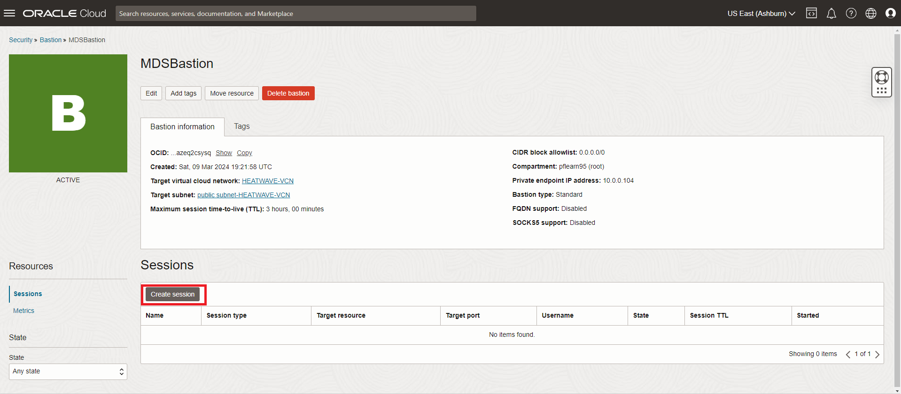

6. `Create Session` 클릭

7. 다음 정보를 설정하세요
    - Session type
      `SSH port forwarding session` 선택
    - Session Name
        *Keep Default*
    - IP address
        * HeatWave DB IP address 입력 ( 메모장 복사에서 )*

8. Port 입력

    ```bash
        <copy>3306</copy>
    ```

9. SSH Key 추가 -  메모장으로부터 SSH Key 복사
    - The screen should look like this
    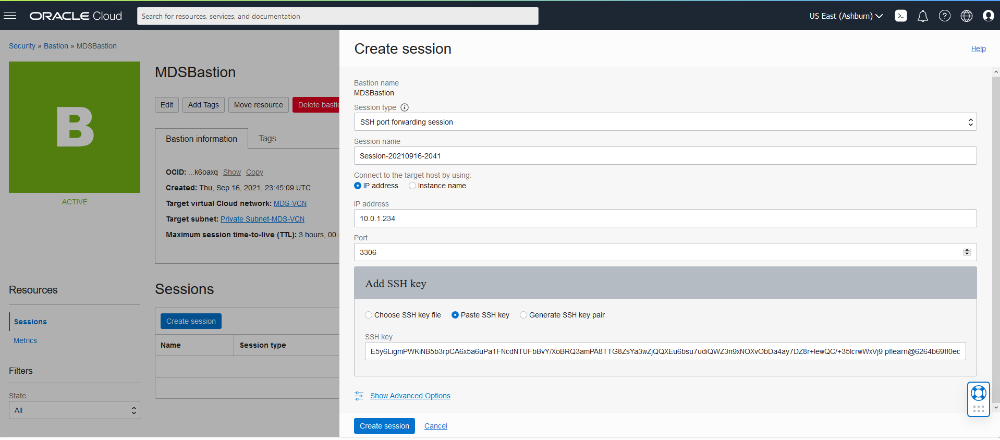
    - `Create Session` 버튼 클릭
10. 완성된 Bastion Session은 다음과 같아야 합니다.
    

    **참고: 세션은 180분 후에 만료됩니다.**

## 작업 3: MySQL Heatwave 접속

1. Bastion Session에서 3개의 세로 점을 클릭하세요.

    

2. `View SSH Command` 클릭

    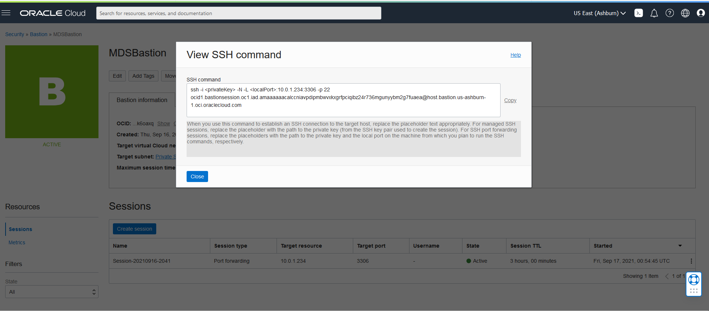

3. 복사를 클릭하고 정보를 메모장에 붙여넣은 후 닫기를 클릭합니다.

4. 메모장에서 세션 명령 업데이트
    - 명령의 시작을 설정 : `ssh -i <privateKey> -N -L 3306`
    - 연결에 대한 자세한 정보를 얻으려면 SSH 명령에 자세한 정보(-v) 옵션을 추가하세요.

    메모장의 명령은 다음과 같아야 합니다.

    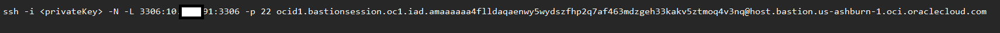

5. Windows PowerShell 또는 Mac 터미널을 열고 메모장에서 명령을 입력합니다. ssh 파일 이름과 데이터베이스 포트 값(3306)을 추가합니다. 다음과 같아야 합니다...

    *-v 문자를 잊지 마세요*

    `ssh -i ~/.ssh/id_rsa -N -L 3306:10.0.1.17:3306 -p 22 ocid1.bastionsession.oc1.iad.amaaaaaa47ys2xaabm3koownovovwekvkitudcvdjk6dc5qtl6c6mtwxdkuq@host.bastion.us-ashburn-1.oci.oraclecloud.com -v`

6. MySQL Shell을 사용하여 MySQL 데이터베이스 서비스에 연결합니다. 다음을 입력합니다:

     ```bash
     <copy>mysqlsh admin@127.0.0.1 --sql</copy>
     ```

7. 테이블당 airportdb 총 records 확인하세요.

    ```bash
    <copy>SELECT table_name, table_rows FROM INFORMATION_SCHEMA.TABLES WHERE TABLE_SCHEMA = 'airportdb';</copy>
    ```

    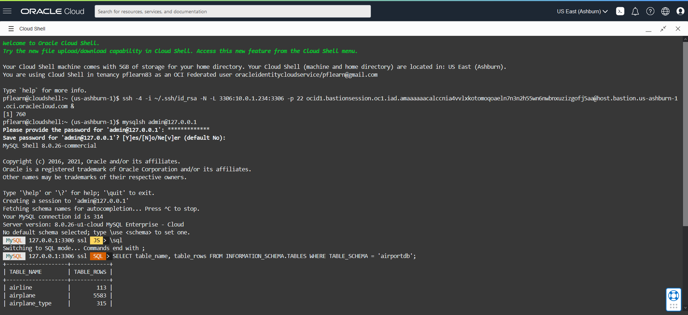

**참고** 또한 bastion 서비스를 사용하여 로컬 컴퓨터에 연결하고 Workbench 또는 Visual Studio Code를 사용하여 MySQL에 액세스할 수 있습니다.

이제 **next lab으로 진행**할 수 있습니다.

## Acknowledgements

- **Author** - Perside Foster, MySQL Principal Solution Engineering
- **Last Updated By/Date** - kihyuk, MySQL Solution Engineering, July 2024
