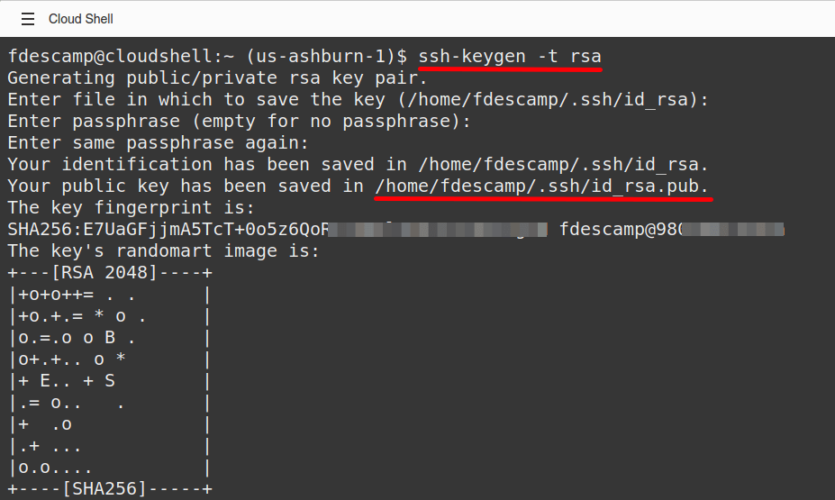
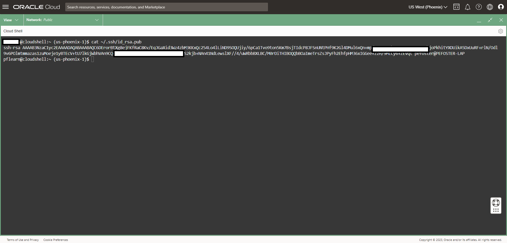
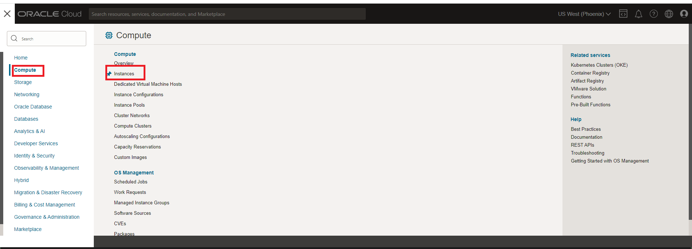
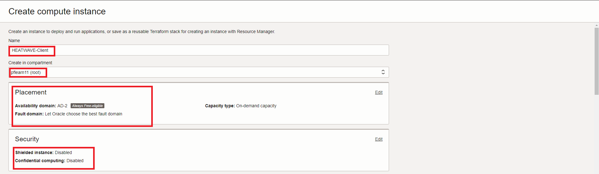
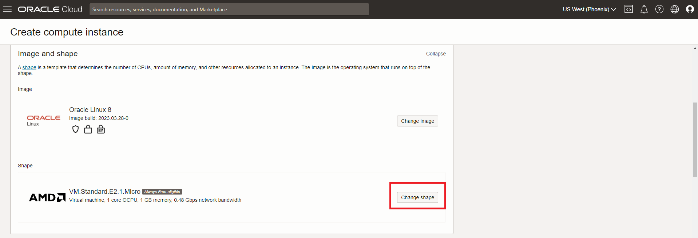
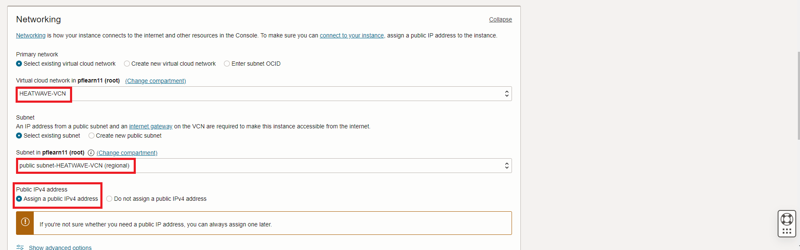
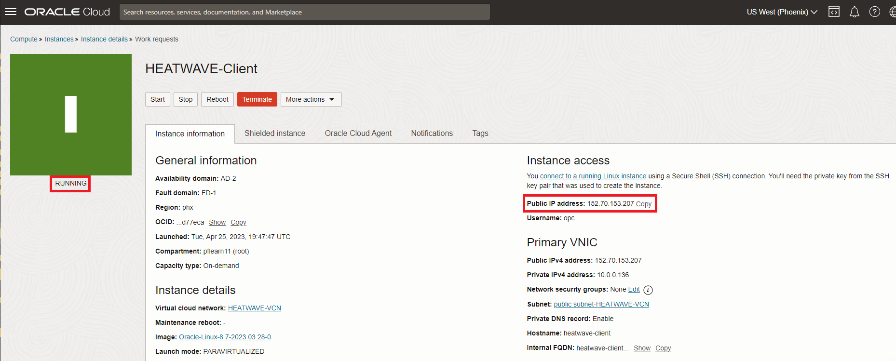

# Compute Instance 생성 (DB 작업 또는 Application 테스트)


## 세션 소개

원격 IP에서 DB 시스템의 엔드포인트(endpoint)로 직접 연결할 수 없습니다. SSH 또는 RDP를 사용하여 컴퓨트 인스턴스에 연결하고, 컴퓨트 인스턴스에서 MySQL Shell, MySQL Client 또는 MySQL Workbench를 사용하여 DB 시스템에 연결합니다. 자세한 내용은 OCI 문서를 참조하세요.

[Creating a Compute Intane Using the Console](https://docs.oracle.com/en-us/iaas/Content/Compute/Tasks/launchinginstance.htm)


_Estimated Lab Time:_ 10 minutes 소요

### 목표

이 Lab에서는 다음과 같은 작업들을 진행합니다.
- OCI에서 사용할 SSH Key 생성
- Compute Instance 생성
- Compute Instance에 MySQL Shell 설치
- MySQL HeatWave System 접속 테스트


### Prerequisites (필요사항)

- An Oracle Trial or Paid Cloud Account
- MySQL Shell에 사용경험

## 작업 1: OCI Cloud Shell에서 SSH Key 생성

Cloud Shell 머신은 Oracle Cloud Console(홈페이지)을 통해 액세스하는 Bash 셸을 실행하는 작은 가상 머신입니다. Cloud Shell을 시작하고 Bastion 세션에 사용할 SSH 키를 생성합니다.

1. Oracle Cloud Shell을 시작하려면 Cloud 콘솔로 이동하여 페이지 오른쪽 상단에 있는 Cloud Shell 아이콘을 클릭합니다. 그러면 브라우저에서 Cloud Shell이 ​​열리고 처음에는 생성하는 데 시간이 걸립니다.

    

    

    

    _참고: Cloud Shell 창의 오른쪽 상단에 있는 아이콘을 사용하여 Cloud Shell 세션을 최소화, 최대화, 다시 시작, 닫을 수 있습니다._

2. 클라우드 셸이 시작되면 다음 명령을 사용하여 SSH 키를 만듭니다.

    ```bash
    <copy>ssh-keygen -t rsa</copy>
    ```

    각 질문에 대해 Enter 키를 누르세요.

    그러면 다음과 같은 모습이 됩니다.

    

3. 공개 및 개인 SSH 키는 ~/.ssh/id_rsa.pub에 저장됩니다.

4. 방금 만든 두 파일을 살펴보세요.

    ```bash
    <copy>cd .ssh</copy>
    ```

    ```bash
    <copy>ls</copy>
    ```

    출력에는 두 개의 파일이 있습니다. *private key:* `id_rsa`와 *public key:* `id_rsa.pub`. 개인 키는 안전하게 보관하고 그 내용을 누구와도 공유하지 마세요. 공개 키는 다양한 활동에 필요하며 특정 시스템에 업로드할 수 있고 클라우드에서 안전한 통신을 용이하게 하기 위해 복사하여 붙여넣을 수도 있습니다.

## 작업 2: Compute instance 생성

새로운 MySQL 데이터베이스에 연결하려면 컴퓨팅 인스턴스가 필요합니다.

1. Compute 인스턴스를 생성하기 전에 메모장을 엽니다.

2. 공개 SSH 키를 메모장에 복사하려면 다음 단계를 수행하세요.

    Cloud shell 오픈
    

    다음 명령을 입력하세요

    ```bash
    <copy>cat ~/.ssh/id_rsa.pub</copy>
    ```

     

3. id_rsa.pub 내용을 메모장에 복사하세요

    귀하의 메모장은 다음과 같아야 합니다.
      

4. cloud shell 최소화

      

5. Linux Compute 인스턴스를 시작하려면 다음으로 이동하세요. ( Navigation Menu > Compute > Instances )
    

6. **(root)** Compartment에서, **Create Instance** 클릭
    

7. Compute Instance 생성 화면에서 

    Name 넣고

    ```bash
    <copy>HEATWAVE-Client</copy>
    ```

8. **(root)** compartment가 선택되었는지 확인하세요

9. On Placement, 선택된 Availability Domain를 유지

10. On Security, default로 유지

    - Shielded instance: Disabled
    - Confidential computing:Disabled

       

11. On Image에서 선택된 Image 유지, Oracle Linux 8 및 Edit 클릭

        

12. Change Shape 클릭

        

13. Instance Shape 선택: VM.Standard.E2.2

        

14. On Networking, Edit 클릭

        

15. **HEATWAVE-VCN** 와  **public subnet-HEATWAVE-VCN** 가 선택되었는지 확인. Public IPV4 address는 **Assign..** 유지 (default)

      

16. SSH keys 추가에서, 메모장에서 공개키를 붙여넣으세요.
  
    

17. Boot Volume에서 **Use in-transit encryption** box 유지 및 Compute Instance 생성을 위해 **Create** 버튼 클릭 

    

18. 새 가상 머신은 몇 분 후에 사용할 준비가 됩니다. 생성 중에 상태가 '프로비저닝'으로 표시됩니다.
    

19. 'Running' 상태는 가상 머신을 사용할 준비가 되었음을 나타냅니다.

    

## 작업 3: Compute System 생성

1. Cloud Shell로 이동하여 새 Compute Instance에 SSH를 실행합니다.

2. **opc** 이름과 Public **IP Address**를 입력.

   참고: **HEATWAVE-Client**는 Compute Detail 페이지에 공용 IP 주소를 표시합니다.

    (Example: **ssh -i ~/.ssh/id_rsa opc@132.145.170...**) 

    ```bash
    <copy>ssh -i ~/.ssh/id_rsa opc@<your_compute_instance_ip></copy>
    ```

3. **Are you sure you want to continue connecting (yes/no)?** 에 대해서
    - **yes** 로 입력

    

## 작업 4: Compute Instance에 MySQL Shell 설치

1. 클라이언트 머신에서 새로운 MySQL DB 시스템에 연결하려면 MySQL 클라이언트 도구가 필요합니다.

2. 다음 명령으로 MySQL Shell을 설치하세요(질문마다 y를 입력하세요)

    **[opc@…]$**

    ```bash
    <copy>sudo yum install mysql-shell -y</copy>
    ```

    


이제 **다음 Lab으로 진행**할 수 있습니다.

## Acknowledgements

- **Author** - Perside Foster, MySQL Principal Solution Engineering
- **Last Updated By/Date** - kihyuk, MySQL Solution Engineering, July 2024
