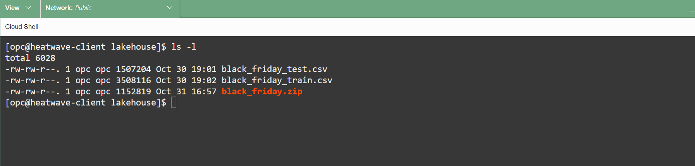
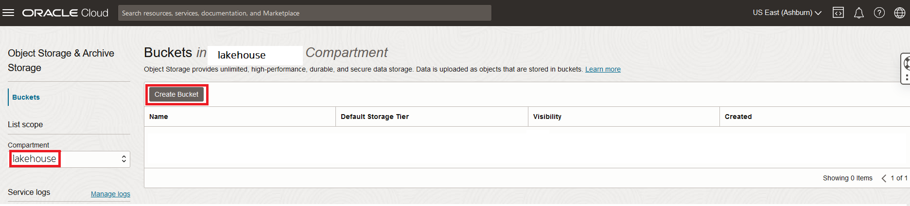
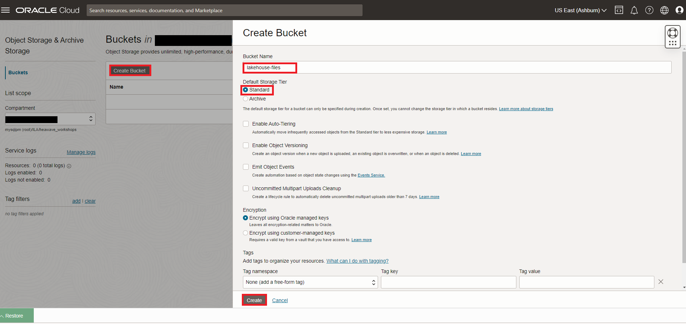
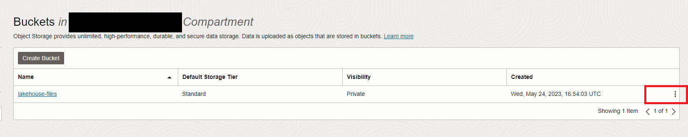
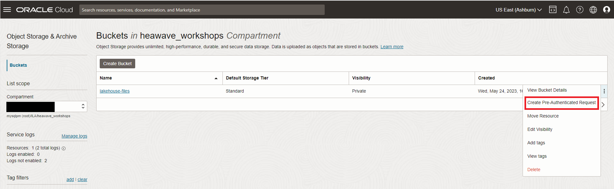
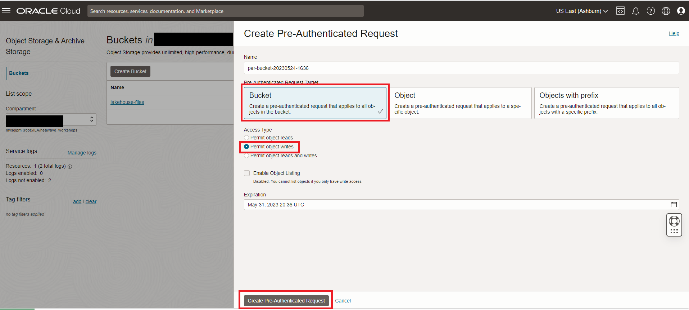
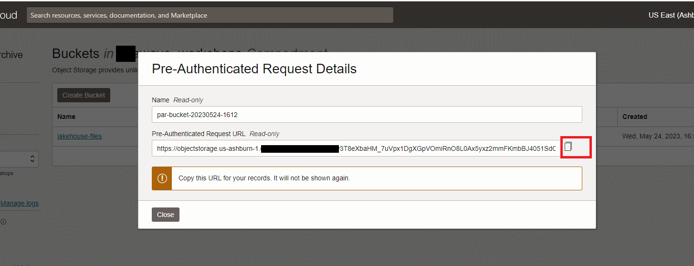
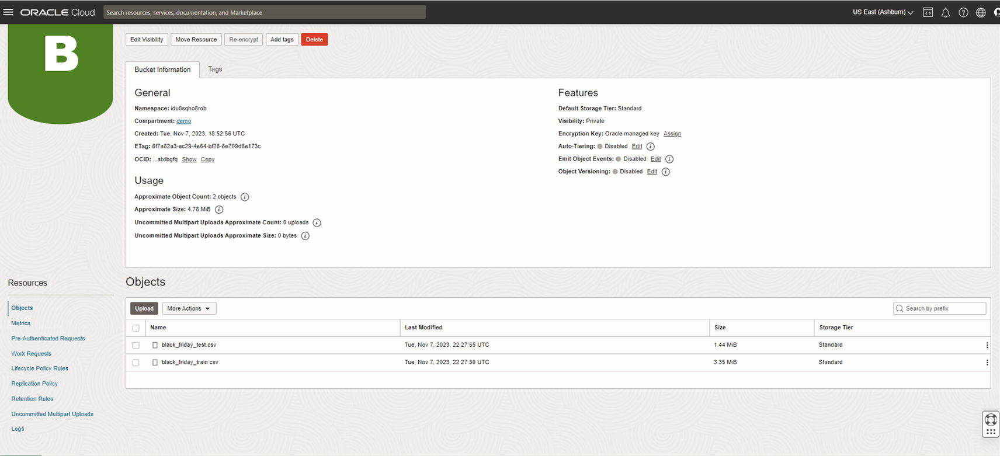

# HeatWave Lakehouse의 Object Storage에 데이터 업로드 - 블랙 프라이데이

## 세션 소개

이 워크숍에서 사용할 데이터(파일 세트)가 생성합니다. 개체 저장소 버킷을 생성하고 여기에 파일을 업로드합니다.

### 목표

- 샘플 파일을 다운로드하고 압축 해제하세요
- 개체 저장소 버킷 생성(Object Storage bucket)
- 저장된 PAR URL을 사용하여 버킷에 파일 추가

### Prerequisites (필요사항)

- An Oracle Trial or Paid Cloud Account
- MySQL Shell에 사용경험
- Lab 4까지 생성 및 테스트 완료

## 작업 1: 샘플 파일을 다운로드하고 압축 해제하세요

1. SSH로 아직 연결되지 않은 경우 명령줄에서 SSH를 사용하여 Compute 인스턴스에 연결합니다. "private key file"과 "생성된 Compute 인스턴스 IP"를 반드시 바꿔야 합니다.

     ```bash
    <copy>ssh -i private_key_file opc@new_compute_instance_ip</copy>
     ```

2. 가져온 샘플 데이터를 보관할 폴더 설정

    a. 홈 디렉토리로 이동

    ```bash
    <copy>cd ~ </copy>
     ```

    b. 홈 디렉토리에 폴더 생성

    ```bash
    <copy>mkdir lakehouse</copy>
     ```

    c. 해당 폴더로 이동

    ```bash
    <copy>cd lakehouse</copy>
     ```

3. 샘플 파일 다운로드

    ```bash
    <copy>wget https://objectstorage.us-ashburn-1.oraclecloud.com/p/Ukv1g5qyvJK6asGvVoksGkUDIu8KaoVfmbhBzpmbRahXu7a2EmaVTJev2a-lHvUa/n/mysqlpm/b/mysql_customer_orders/o/black_friday.zip</copy>
     ```

4. black_friday.zip 파일을 압축 해제하면 서로 다른 파일 2개가 생성됩니다.

    ```bash
    <copy>unzip black_friday.zip</copy>
     ```

5. 파일을 리스트 하세요

    ```bash
    <copy>ls -l</copy>
    ```

    

## 작업 2: 개체 저장소 버킷 생성 (Object Storage bucket)

1. 콘솔 탐색 메뉴에서 **Storage**를 클릭합니다.
2. Object Storage 아래, Buckets 클릭
    

    **NOTE:** Compartment를 **lakehouse** 로 선택

3. Bucket 생성 클릭. Bucket 생성 pane이 화면에 표시됨.

    

4. 버킷(Bucket) 이름을 입력하세요 **lakehouse-files**
5. 기본 저장소(Storage) 계층에서, Standard 선택하고 다른 모든 필드는 기본값을 그대로 둡니다.

    

6. 버킷(Bucket)에 대한 사전 인증된(Pre-Authenticated) 요청 URL을 만듭니다.
     - a. **lakehouse-files** 버킷 오른쪽에 있는 3개의 점을 클릭합니다. '사전 인증된 요청 만들기(Pre-Authenticated Request)'를 클릭합니다.
        
        
     - b. '버킷 (Bucket)' 옵션이 미리 선택됩니다.
     - c. '액세스 유형 (Access Type)'에 대해 '개체 쓰기 허용 (Permit object write)'을 선택하세요.
     - d. '사전 인증된 요청 만들기 (Pre-Authenticated Request)' 버튼을 클릭하세요.
        
     - e. '복사' 아이콘을 클릭하여 PAR URL을 복사합니다.
        
     - f. 생성된 PAR URL을 저장하세요. 다음 작업에서 필요합니다.

## 작업 3: 저장된 PAR URL을 사용하여 버킷(Bucket)에 파일 추가

1. lakehouse 폴더로 가서 모든 파일을 리스트 하세요.

    ```bash
    <copy>cd ~/lakehouse</copy>
    ```

    ```bash
    <copy>ls -l</copy>
    ```

    

2. 아래 예제를 사용하여 다음 문장을 수정하여 black\_friday\_train.csv 파일을 저장소 버킷에 추가합니다. **(PAR URL)** 값을 이전 작업에서 저장된 생성된 **PAR URL**로 바꿔야 합니다.

    ```bash
    <copy>curl -X PUT --data-binary '@black_friday_train.csv' (PAR URL)black_friday_train.csv</copy>
     ```

     **Example**  
     curl -X PUT --data-binary '@black\_friday\_train.csv' https://objectstorage.us-ashburn-1.oraclecloud.com/p/RfXc55AGpLSu26UgqbmGxbWZwh4hPhLkVWYMg4f5pNerQx_1NghgSKJHLzE4IWxH/n/******/b/lakehouse-files/o/black_friday_train.csv

3. 아래 예제를 사용하여 다음 문장을 수정하여 @black\_friday\_test.csv 파일을 저장소 버킷에 추가합니다. **(PAR URL)** 값을 이전 작업에서 저장된 생성된 **PAR URL**로 바꿔야 합니다.

    ```bash
    <copy>curl -X PUT --data-binary '@black_friday_test.csv' (PAR URL)black_friday_test.csv</copy>
     ```

     **Example**  
     curl -X PUT --data-binary '@black\_friday\_test.csv' https://objectstorage.us-ashburn-1.oraclecloud.com/p/RfXc55AGpLSu26UgqbmGxbWZwh4hPhLkVWYMg4f5pNerQx_1NghgSKJHLzE4IWxH/n/******/b/lakehouse-files/o/black_friday_test.csv

4. **lakehouse-files** 버킷은 다음과 같아야 합니다.
    

이제 **다음 랩으로 진행**할 수 있습니다.

## Acknowledgements

- **Author** - Perside Foster, MySQL Solution Engineering

- **Contributors** - Abhinav Agarwal, Senior Principal Product Manager, Nick Mader, MySQL Global Channel Enablement & Strategy Manager
- **Last Updated By/Date** - Kihyuk, MySQL Solution Engineering, Feburary 2025
