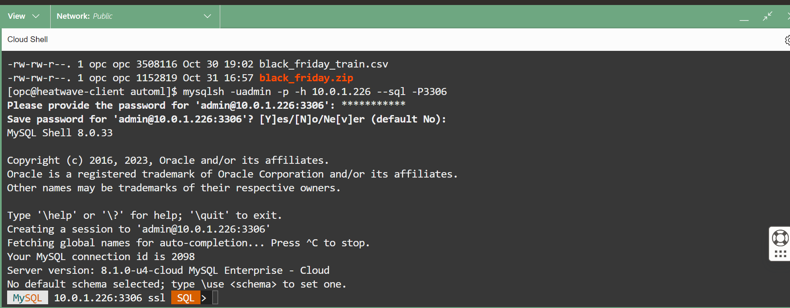
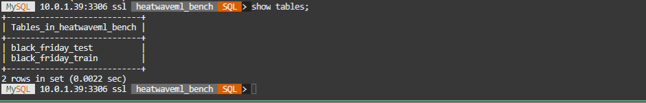
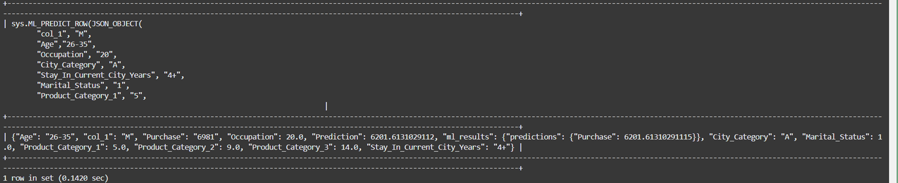
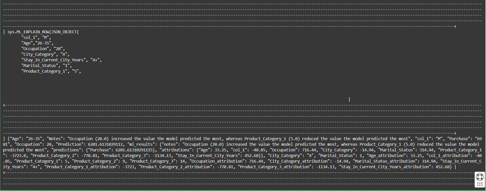

# HeatWave AutoML 모델 생성 및 사용 - black_friday


## 세션 소개

HeatWave ML은 초보자이든 숙련된 ML 실무자이든 머신 러닝을 사용하기 쉽게 해줍니다. 데이터를 제공하면 HeatWave AutoML이 데이터의 특성을 분석하고 예측과 설명을 생성하는 데 사용할 수 있는 최적화된 머신 러닝 모델을 만듭니다. ML 모델은 데이터의 패턴을 식별하고 이러한 패턴을 보이지 않는 데이터에 적용하여 예측을 수행합니다. HeatWave ML 설명은 예측이 어떻게 이루어지는지 이해하는 데 도움이 됩니다. 예를 들어, 데이터 세트의 어떤 특징이 예측에 가장 큰 영향을 미치는지 등입니다.

black_friday 데이터 구성 요소를 로드하려면 다음 단계를 수행하여 필요한 스키마와 테이블을 만들고 로드합니다. Python 3에 대한 요구 사항은 이미 컴퓨트 인스턴스에 로드되어 있으며 이전 랩에서 MySQL Shell을 이미 설치했습니다.

이 단계를 거치면 데이터는 다음 스키마와 테이블로 MySQL HeatWave 데이터베이스에 저장됩니다.

**heatwaveml\_bench schema:** 훈련 및 테스트 데이터 세트 테이블을 포함하는 스키마입니다.

**black\_friday\_train table:** 훈련 데이터 세트. 특징 열 (feature columns) 포함(Gender,Age,Occupation,City\_Category,Stay\_In\_Current\_City\_Years,Marital\_Status,Product\_Category\_1,Product\_Category\_2,Product\_Category\_3,Purchase).

**black\_friday\_test table:** 테스트 데이터 세트(레이블 없음). 특징 열 (feature columns) 포함(Gender,Age,Occupation,City\_Category,Stay\_In\_Current\_City\_Years,Marital\_Status,Product\_Category\_1,Product\_Category\_2,Product\_Category\_3,Purchase).

_Estimated Time:_ 30 minutes 소요

### 목표

In this lab, you will be guided through the following task:

- Train the machine learning model
- Predict and Explain using the test table
- Score your machine learning model to assess its reliability and unload the model

### Prerequisites (필요사항)

- An Oracle Trial or Paid Cloud Account
- MySQL Shell에 사용경험
- 다음 관련 랩을 진행하기전 완료하세요
    - HeatWave Lakehouse의 Object Storage에 Train 및 Test 데이터 업로드
    - OCI 개체 저장소에서 CSV Train 및 Test 로드

## 작업 1: 머신러닝 모델(machine learning model)을 훈련

1. SSH로 아직 연결되지 않은 경우 명령줄에서 SSH를 사용하여 Compute 인스턴스에 연결합니다. "개인 키 파일"과 "새 Compute 인스턴스 IP"를 반드시 바꿔야 합니다.

     ```bash
    <copy>ssh -i private_key_file opc@new_compute_instance_ip</copy>
     ```

2. 아직 MySQL에 연결되지 않았다면 다음 명령을 사용하여 MySQL Shell 클라이언트 도구를 사용하여 MySQL에 연결합니다.

    ```bash
    <copy>mysqlsh -uadmin -p -h 10.0.1... --sql -P3306</copy>
    ```

    

3. default database 설정

    ```bash
    <copy>USE heatwaveml_bench;</copy>
    ```

4. train과 test tables 확인

    ```bash
    <copy>show tables;</copy>
    ```

    

5. ML_TRAIN을 사용하여 모델을 훈련합니다. 이는 회귀 데이터 세트(regression dataset)이므로 회귀 작업은 회귀 모델(regression model)을 생성하도록 지정됩니다.

    ```bash
    <copy>CALL sys.ML_TRAIN('heatwaveml_bench.black_friday_train', 'Purchase', JSON_OBJECT('task', 'regression'), @model_black_friday);</copy>
    ```

6. 학습 작업이 완료되면 모델 핸들이 @model\_black\_friday 세션 변수에 할당되고 모델은 모델 카탈로그에 저장됩니다. 다음 쿼리를 사용하여 모델 카탈로그의 항목을 볼 수 있습니다. 여기서 user은 MySQL 계정 이름입니다.

    ```bash
    <copy>SELECT model_id, model_handle, train_table_name FROM ML_SCHEMA_admin.MODEL_CATALOG;</copy>
    ```

## 작업 2: 예측을 하고 예측을 설명 (Predictions and Explain Predictions)

1. ML\MODEL\LOAD 루틴을 사용하여 HeatWave ML에 모델을 로드합니다.

    a.  모델 핸들 변수 재설정

    ```bash
    <copy>SET @model_black_friday = (SELECT model_handle FROM ML_SCHEMA_admin.MODEL_CATALOG   ORDER BY model_id DESC LIMIT 1); </copy>
    ```

    b. 모델은 사용하기 전에 로드해야 합니다. 모델은 언로드하거나 HeatWave 클러스터를 다시 시작할 때까지 로드된 상태로 유지됩니다.

    ```bash
    <copy>CALL sys.ML_MODEL_LOAD(@model_black_friday, NULL);</copy>
    ```

2. ML\_PREDICT\_ROW 루틴을 사용하여 단일 데이터 행에 대한 예측을 수행합니다.

    ```bash
    <copy>SELECT sys.ML_PREDICT_ROW(JSON_OBJECT(
        "Gender", "M", 
        "Age","26-35", 
        "Occupation", "20", 
        "City_Category", "A", 
        "Stay_In_Current_City_Years", "4+", 
        "Marital_Status", "1", 
        "Product_Category_1", "5", 
        "Product_Category_2", "9", 
        "Product_Category_3", "14", 
        "Purchase", "6981"), 
        @model_black_friday, NULL);</copy>
    ```

    제공된 기능 입력을 기반으로, 이 모델은 올해 구매 가치가 낮아질 것으로 예측합니다. 예측을 위해 사용된 기능 값도 표시됩니다.

    

3. 이제 ML\_EXPLAIN\_ROW를 사용하여 동일한 데이터 행에 대한 설명을 생성해 보겠습니다.

    ```bash
    <copy>SELECT sys.ML_EXPLAIN_ROW(JSON_OBJECT(
        "Gender", "M", 
        "Age","26-35", 
        "Occupation", "20", 
        "City_Category", "A", 
        "Stay_In_Current_City_Years", "4+", 
        "Marital_Status", "1", 
        "Product_Category_1", "5", 
        "Product_Category_2", "9", 
        "Product_Category_3", "14", 
        "Purchase", "6981"), 
        @model_black_friday, 
        JSON_OBJECT('prediction_explainer', 'permutation_importance'));</copy>
    ```

    속성 값은 어떤 기능이 예측에 가장 많이 기여했는지 보여줍니다.

    


4. ML\_PREDICT\_ROW 루틴을 사용하여 테스트 테이블 데이터에 대한 예측을 수행합니다. 이 테이블은 OAC를 사용하여 더 많은 의사 결정 정보를 수집하는 데 사용할 수 있습니다.

    ```bash
    <copy>CALL sys.ML_PREDICT_TABLE('heatwaveml_bench.black_friday_test', @model_black_friday,'heatwaveml_bench.black_predictions',NULL);</copy>
    ```

5. 일부 예측 (predictions)을 개별적으로 검색합니다.

    ```bash
    <copy>SELECT * FROM heatwaveml_bench.black_predictions limit 5\G</copy>
    ```

6. 행 표시에서 일부 예측 (predictions) 검색

    a. Javascript 사용

    ```bash
    <copy>\js</copy>

    ```

    b. MySQL Shell 구성 옵션 resultFormat을 테이블로 설정

    ```bash
    <copy>shell.options.set('resultFormat','tabbed')</copy>

    ```

    b. 5개의 행을 리스트

    ```bash
    <copy>session.sql("SELECT * FROM heatwaveml_bench.black_predictions limit 5")</copy>

    ```

7. ML\_MODEL\_UNLOAD를 사용하여 모델을 Unload

    ```bash
    <copy>\sql</copy>

    ```

    ```bash
    <copy>CALL sys.ML_MODEL_UNLOAD(@model_black_friday);</copy>
    ```

    너무 많은 공간을 차지하는 것을 피하려면 모델 사용이 끝나면 모델을 언로드(Unload)하는 것이 좋습니다.

이제 다음 랩으로 진행할 수 있습니다.

## 참고 자료

- [Oracle Cloud Infrastructure MySQL Database Service Documentation ](https://docs.cloud.oracle.com/en-us/iaas/MySQL-database)
- [MySQL HeatWave ML Documentation] (https://dev.mysql.com/doc/heatwave/en/heatwave-machine-learning.html)

## Acknowledgements

- **Author** - Perside Foster, MySQL Solution Engineering
- **Contributors** - Salil Pradhan, Principal Product Manager,
Nick Mader, MySQL Global Channel Enablement & Strategy Manager
- **Last Updated By/Date** - Kihyuk, MySQL Solution Engineering, Feburary 2025
