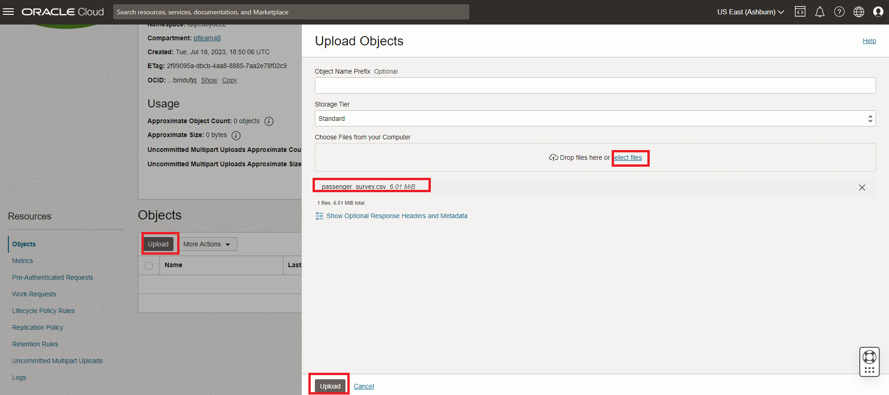

# HeatWave Lakehouse 생성 및 테스트


## 세션 소개

MySQL HeatWave에는 MySQL HeatWave Lakehouse가 포함되어 있어 사용자가 다른 데이터베이스에서 export된 CSV, Parquet, Aurora/Redshift 등 다양한 파일 형식으로 객체 스토리지에서 수백 테라바이트의 데이터를 로드하여 쿼리할 수 있습니다. 고객은 표준 MySQL 명령을 사용하여 MySQL 데이터베이스의 트랜잭션 데이터, 객체 스토리지의 다양한 형식의 데이터 또는 두 가지를 조합하여 쿼리할 수 있습니다. 객체 스토리지의 데이터를 쿼리하는 것은 데이터베이스 내부의 데이터를 쿼리하는 것만큼 빠릅니다.

### 목표

이 랩에서는 다음 작업을 안내합니다.

- Create Object Storage bucket 생성
- Upload survey data 업로드
- survey file에 대해 PAR Link 생성
- 스키마를 유추하고 용량을 추정하기 위해 Autoload 실행
- Object Store에서 MySQL HeatWave 클러스터로 survey table 로드

### Prerequisites (필요사항)

- Oracle 평가판 또는 유료 클라우드 계정
- MySQL Shell에 대한 약간의 경험

## 작업 1: survey file 로컬 머신에 다운로드하세요

1. 로컬머신에 다운로드 받기 위해  **Download file [passenger_survey.csv](files/passenger_survey.csv)** 클릭 하세요.

## 작업 2: Object Storage bucket 생성

1. 테넌트 이름, 사용자 이름, 비밀번호를 사용하여 OCI에 로그인하세요.
2. 로그인 후 **root** compartment을 선택하세요.
3. 콘솔 탐색 메뉴에서 **Storage**를 클릭합니다.
4. Object Storage 아래, Buckets 클릭합니다.

    **NOTE:** 올바른 Compartment가 선택되었는지 확인 하세요. : **root** 선택

    

5. Bucket 생성 클릭. Bucket 생성화면이 표시 됩니다.
6. Bucket 이름으로 **airport-survey** 입력하세요.
7. Default Storage Tier 아래, Standard 클릭하세요. 남아 있는 필드들을 default values으로 남겨 두세요.
8. Create 클릭 하세요.

    

## 작업 3: Airport-survey 데이터 업로드

1. Buckets page에서, **airport-survey** 이름을 클릭하세요. bucket의 상세한 정보가 표시됩니다.
2. Resources 아래에서, bucket에 있는 객체 목록을 표시하려면 객체를 클릭합니다.
3. Upload 클릭하세요. 파일 업로드 창이 표시됩니다.
4. 로컬 컴퓨터에서 **passenger_survey.csv** 파일을 선택하세요.
    - 열기를 클릭하여 Passenger_survey.csv 파일을 로드합니다
    - 업로드 버튼을 클릭하세요
       

    - **Abort**가 **close**로 변경될 때까지 기다리세요
    - **close** 버튼을 클릭하세요

## 작업 4: airport-survey 파일에 대해 PAR Link(URL) 생성

1. PAR URL 생성하기 위해
    - **Storage —> Buckets** 매뉴로 이동
     

    - **airport-survey**  폴더를 선택 하십시요.
2. 처음 **passenger_survey.csv** 파일을 선택하고 3개의 vertical dots를 클릭 하세요.
3. **Create Pre-Authenticated Request** 를 클릭하세요.

    

4. **Object** 옵션이 미리 선택됩니다.
5. **Permit object reads**를 선택된 상태로 유지하세요.
6. **Access Type**에 대한 다른 옵션은 변경하지 마세요.
7. **Create Pre-Authenticated Request** 버튼을 클릭합니다.

    

8. **Copy** 아이콘을 클릭하여 PAR URL을 복사합니다.
    

9. 생성된 PAR URL을 저장하세요. 다음 작업에서 필요합니다.

## 작업 5: Lakehouse 처리를 위한 MySQL HeatWave 시스템 설정

1. HeatWave Lakehouse가 활성화되어 있는지 확인하세요. 그렇지 않은 경우 **Lab 4: Heatwave Cluster에 Airportdb Data Load**를 실행하세요.
    

2. Cloud Shell로 이동하여 Compute Instance에 SSH를 실행합니다.

    (Example: **ssh -i ~/.ssh/id_rsa opc@132.145.170...**) 

    ```bash
    <copy>ssh -i ~/.ssh/id_rsa opc@<your_compute_instance_ip></copy>
    ```

3. 다음 명령을 사용하여 MySQL Shell을 사용하여 HeatWave 데이터베이스에 연결합니다.

    ```bash
    <copy>mysqlsh -uadmin -p -h 10.0.1... --sql </copy>
    ```

    

4. SQL 모드로 변경

    ```bash
    <copy>\sql</copy>
    ```

5. heatwave instance에서 schemas를 리스트 하세요.

    ```bash
    <copy>show databases;</copy>
    ```

    

6. airportdb 데이터베이스로 변경

    프롬프트에 다음 명령을 입력하세요.

    ```bash
    <copy>USE airportdb;</copy>
    ```

7. airportdb 스키마에서 사용 가능한 테이블 목록을 보려면

    프롬프트에 다음 명령을 입력하세요.

    ```bash
    <copy>show tables;</copy>
    ```

    이제 Autoload를 사용하여 객체 저장소에서 MySQL HeatWave로 테이블을 로드할 준비가 되었습니다.

## 작업 6: Object Store의 DELIVERY 테이블에 필요한 스키마 유추 및 용량을 추정하기 위해 Autoload를 실행

1. survey information는 이전 작업에서 PAR URL을 생성한 object store의 Passenger_survey.csv 파일에 있습니다. 

   우리는 Passenger_survey 테이블에 대한 파일을 MySQL HeatWave에 로드하겠습니다.

   다음 명령을 하나씩 입력하고 Enter를 누르세요.

3. 아래와 같이 명령어를 수행하면 테이블 데이터를 로드할 schema가 설정됩니다. 이 schema가 생성되지 않았더라도 걱정하지 마세요. schema가 없으면 Autopilot에서 이 schema를 생성할 수 있는 명령을 생성합니다.

    ```bash
    <copy>SET @db_list = '["airportdb"]';</copy>
    ```

4. 아래와 같이 명령어를 수행하면 우리가 데이터를 로드하고자 하는 테이블 이름과 객체 저장소의 소스 파일에 대한 다른 정보에 대한 매개변수를 설정합니다. 아래의 **(PAR URL)** 을 이전 작업에서 생성한 것으로 대체합니다.

    ```bash
    <copy>SET @dl_tables = '[{
    "db_name": "airportdb",
    "tables": [{
    "table_name": "passenger_survey",
    "dialect": {
        "format": "csv",
        "field_delimiter": ",",
        "record_delimiter": "\\n",
        "has_header": true,
        "is_strict_mode": false},
        "file": [{"par": "(PAR URL)"}]}]  }]';</copy>
    ```

    - 다음 예제와 같아야 합니다. (따옴표("") 안에 PAR 링크를 포함해야 합니다.):

        

    - 지금 테이블 설정 스크립트를 실행하세요.

5. 이 명령은 Autoload에 필요한 모든 옵션을 설정합니다.

    ```bash
    <copy>SET @options = JSON_OBJECT('mode', 'dryrun',  'policy', 'disable_unsupported_columns',  'external_tables', CAST(@dl_tables AS JSON));</copy>
    ```

6. Autoload 명령어 실행 하세요. (option에 dryrun이 포함 되어 있어 실제 테이블 생성 및 로드는 진행하지 않습니다):

    ```bash
    <copy>CALL sys.heatwave_load(@db_list, @options);</copy>
    ```

7. Autoload가 실행을 완료하면 명령어 출력에 여러 정보가 포함됩니다.
    - a. 식별한 schema에 테이블이 존재하는지 여부입니다.
    - b. Auto schema inference는 테이블의 열 수를 결정합니다.
    - c. Auto schema sampling은 테이블에서 적은 수의 행을 샘플링하고 테이블의 행 수와 테이블 크기를 결정합니다.
    - d. Auto provisioning은 테이블을 HeatWave에 로드하는 데 필요한 메모리 양과 이 데이터를 로드하는 데 걸리는 시간을 결정합니다.

8. Autoload는 아래와 같은 문장도 생성합니다. 지금 이 문장을 실행하세요.

    ```bash
    <copy>SELECT log->>"$.sql" AS "Load Script" FROM sys.heatwave_autopilot_report WHERE type = "sql" ORDER BY id;</copy>
    ```

    

10. 실행 결과에는 테이블을 생성하고 이 테이블 데이터를 Object Store에서 HeatWave로 로드하는 데 필요한 SQL 문이 포함됩니다.

    

11. 결과에서 **CREATE TABLE** 명령을 복사합니다. 다음 예와 같아야 합니다.

      

12. 수정된 **CREATE TABLE** 명령을 실행하여 Passenger_survey 테이블을 생성합니다.

13. 생성 명령과 결과는 다음과 같아야 합니다.

    

## 작업 7: Object Store에서 MySQL HeatWave로 전체 Passenger_survey 테이블을 로드

1. 생성된 테이블 구조를 보려면 이 명령을 실행하세요.

    ```bash
    <copy>desc passenger_survey;</copy>
    ```

    

2. 이제 object storage에 있는 데이털ㄹ 아래 명령어를 사용하여 Heatwave cluster(passenger_survery테이블)로 load 합니다.

    ```bash
    <copy> ALTER TABLE `airportdb`.`passenger_survey` SECONDARY_LOAD; </copy>
    ```

3. Autoload가 완료되면 테이블에 로드된 행 수를 확인하세요.

    ```bash
    <copy>select count(*) from passenger_survey;</copy>
    ```

4. 테이블의 데이터 샘플을 확인하세요.

    ```bash
    <copy>select * from passenger_survey limit 5;</copy>
    ```

    a. schema의 다른 테이블과 Passenger_survey 테이블을 조인합니다.

    ```bash
    <copy> select p.* , ps.* from passenger p 
    join passenger_survey ps on p.passenger_id = ps.ID
    where p.passenger_id = 28; </copy>
    ```

5. 2단계부터 5단계까지의 출력은 다음과 같습니다.

    

6. passenger_survey table은 다른 테입블과 쿼리 조인해서 사용할 수 있습니다.
   
이제 다음 Lab으로 진행할 수 있습니다.

## Acknowledgements

- **Author** - Perside Foster, MySQL Principal Solution Engineering
- **Contributors** - Mandy Pang, MySQL Principal Product Manager,  Nick Mader, MySQL Global Channel Enablement & Strategy Manager, Selena Sanchez, MySQL Solution Engineering
- **Last Updated By/Date** - Kihyuk, MySQL Solution Engineering, September 2024
