# HeatWave Lakehouse 생성 및 테스트


## 세션 소개

MySQL HeatWave에는 MySQL HeatWave Lakehouse가 포함되어 있어 사용자가 다른 데이터베이스에서 export된 CSV, Parquet, Aurora/Redshift 등 다양한 파일 형식으로 객체 스토리지에서 수백 테라바이트의 데이터를 로드하여 쿼리할 수 있습니다. 고객은 표준 MySQL 명령을 사용하여 MySQL 데이터베이스의 트랜잭션 데이터, 객체 스토리지의 다양한 형식의 데이터 또는 두 가지를 조합하여 쿼리할 수 있습니다. 객체 스토리지의 데이터를 쿼리하는 것은 데이터베이스 내부의 데이터를 쿼리하는 것만큼 빠릅니다.

### 목표

이 랩에서는 다음 작업을 안내합니다.

- Create Object Storage bucket 생성
- Upload survey data 업로드
- survey file에 대해 PAR Link 생성
- 스키마를 유추하고 용량을 추정하기 위해 Autoload 실행
- Object Store에서 MySQL HeatWave 클러스터로 survey table 로드

### Prerequisites (필요사항)

- Oracle 평가판 또는 유료 클라우드 계정
- MySQL Shell에 대한 약간의 경험

## 작업 1: survey file 로컬 머신에 다운로드하세요

1. 로컬머신에 다운로드 받기 위해  **Download file [passenger_survey.csv](files/passenger_survey.csv)** 클릭 하세요.

## 작업 2: Object Storage bucket 생성

1. 테넌트 이름, 사용자 이름, 비밀번호를 사용하여 OCI에 로그인하세요.
2. 로그인 후 **root** compartment을 선택하세요.
3. 콘솔 탐색 메뉴에서 **Storage**를 클릭합니다.
4. Object Storage 아래, Buckets 클릭합니다.

    **NOTE:** 올바른 Compartment가 선택되었는지 확인 하세요. : **root** 선택

    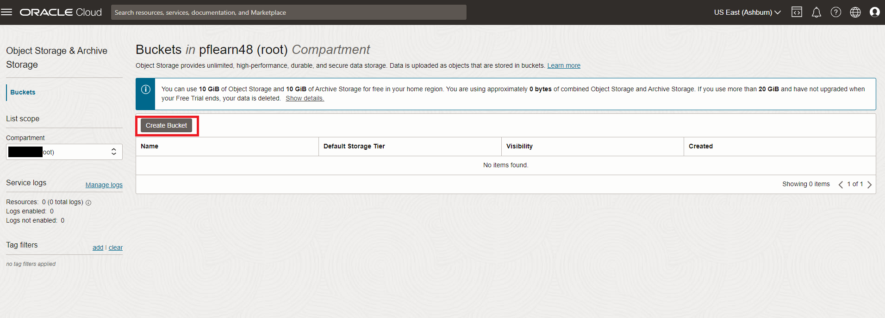

5. Bucket 생성 클릭. Bucket 생성화면이 표시 됩니다.
6. Bucket 이름으로 **airport-survey** 입력하세요.
7. Default Storage Tier 아래, Standard 클릭하세요. 남아 있는 필드들을 default values으로 남겨 두세요.
8. Create 클릭 하세요.

    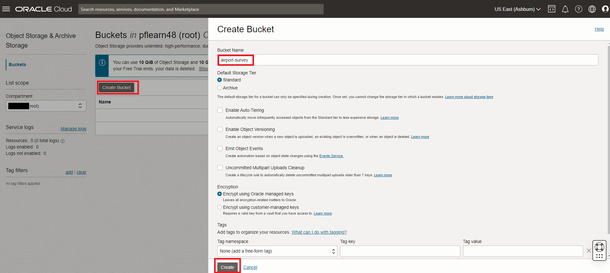

## 작업 3: Upload airport-survey data

1. In the Buckets page, click the **airport-survey** name to load images into. The bucket's details page is displayed.
2. Under Resources, click Objects to display the list of objects in the bucket.
3. Click Upload. The Upload Objects pane is displayed.
4. Select the **passenger_survey.csv** file from your local machine
    - Click open to load the passenger_survey.csv file
    - Click the Upload button
       

    - Wait for the **Abort** to change into **close**
    - Click the **close** button

## 작업 4: Create the PAR Link for the "airport-survey" files

1. To create a PAR URL
    - Go to menu **Storage —> Buckets**
     

    - Select **airport-survey**  folder.
2. Select the first file —> **passenger_survey.csv** and click the three vertical dots.
3. Click on **Create Pre-Authenticated Request**

    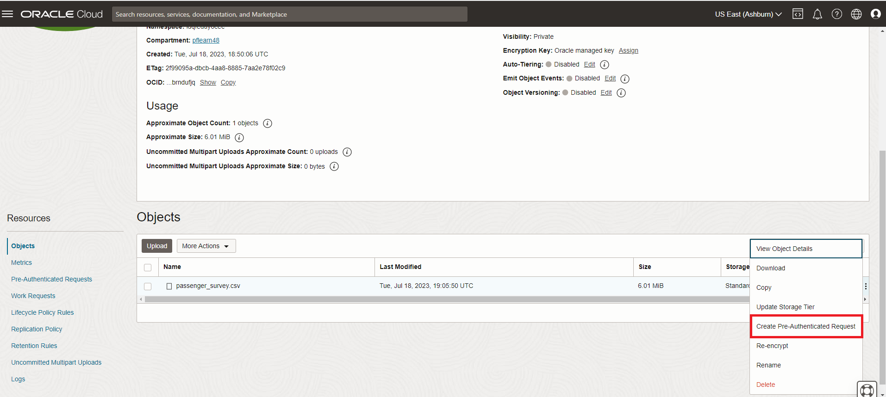

4. The **Object** option will be pre-selected.
5. Keep **Permit object reads** selected
6. Kep the other options for **Access Type** unchanged.
7. Click the **Create Pre-Authenticated Request** button.

    

8. Click the **Copy** icon to copy the PAR URL.
    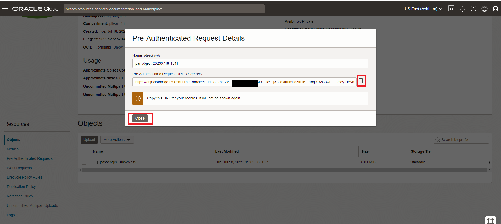

9. Save the generated PAR URL; you will need it in the next task

## 작업 5: Setup MySQL HeatWave system for Lakehouse processing

1. Make sure HeatWave Lakehouse is enabled. If not then execute **Lab 4: Load Airportdb Data into HeatWave**

    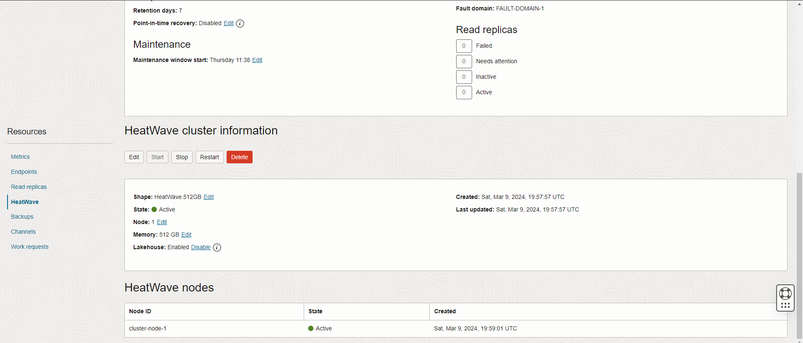

2. Go to Cloud shell to SSH into the Compute Instance

    (Example: **ssh -i ~/.ssh/id_rsa opc@132.145.170...**) 

    ```bash
    <copy>ssh -i ~/.ssh/id_rsa opc@<your_compute_instance_ip></copy>
    ```

3. Connect to the HeatWave Database using MySQL Shell with the following command:

    ```bash
    <copy>mysqlsh -uadmin -p -h 10.0.1... --sql </copy>
    ```

    

4. Change to SQL mode

    ```bash
    <copy>\sql</copy>
    ```

5. List schemas in your heatwave instance

    ```bash
    <copy>show databases;</copy>
    ```

    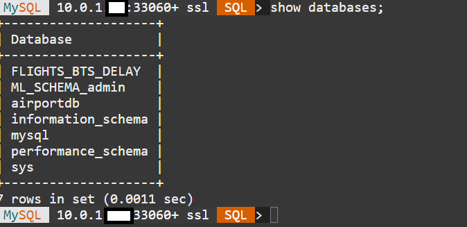

6. Change to the airportdb database

    Enter the following command at the prompt

    ```bash
    <copy>USE airportdb;</copy>
    ```

7. To see a list of the tables available in the airportdb schema

    Enter the following command at the prompt

    ```bash
    <copy>show tables;</copy>
    ```

    You are now ready to use Autoload to load a table from the object store into MySQL HeatWave

## 작업 6: Run Autoload to infer the schema and estimate capacity required for the DELIVERY table in the Object Store

1. The survey information is in the passenger_survey.csv file in object store for which we have created a PAR URL in the earlier task. We will load the file for the passenger_survey table into MySQL HeatWave. Enter the following commands one by one and hit Enter.

2. This sets the schema we will load table data into. Don’t worry if this schema has not been created. Autopilot will generate the commands for you to create this schema if it doesn’t exist.

    ```bash
    <copy>SET @db_list = '["airportdb"]';</copy>
    ```

3. This sets the parameters for the table name we want to load data into and other information about the source file in the object store. Substitute the **(PAR URL)** below with the one you generated in the previous task:

    ```bash
    <copy>SET @dl_tables = '[{
    "db_name": "airportdb",
    "tables": [{
    "table_name": "passenger_survey",
    "dialect": {
        "format": "csv",
        "field_delimiter": ",",
        "record_delimiter": "\\n",
        "has_header": true,
        "is_strict_mode": false},
        "file": [{"par": "(PAR URL)"}]}]  }]';</copy>
    ```

    - It should look like the following example (Be sure to include the PAR Link inside at of quotes("")):

        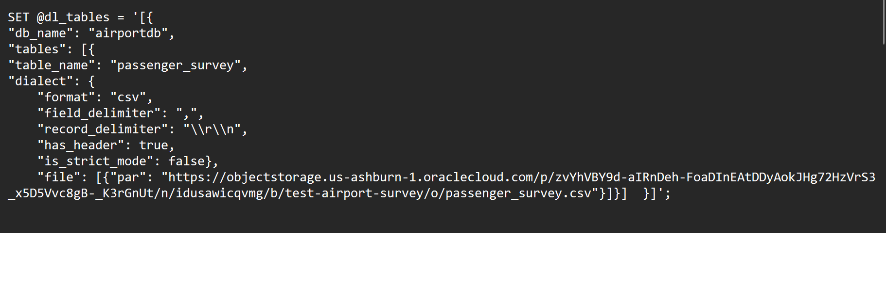

    - Run the set table script now.

4. This command populates all the options needed by Autoload:

    ```bash
    <copy>SET @options = JSON_OBJECT('mode', 'dryrun',  'policy', 'disable_unsupported_columns',  'external_tables', CAST(@dl_tables AS JSON));</copy>
    ```

5. Run this Autoload command:

    ```bash
    <copy>CALL sys.heatwave_load(@db_list, @options);</copy>
    ```

6. Once Autoload completes running, its output has several pieces of information:
    - a. Whether the table exists in the schema you have identified.
    - b. Auto schema inference determines the number of columns in the table.
    - c. Auto schema sampling samples a small number of rows from the table and determines the number of rows in the table and the size of the table.
    - d. Auto provisioning determines how much memory would be needed to load this table into HeatWave and how much time loading this data take.

7. Autoload also generated a statement lke the one below. Execute this statement now.

    ```bash
    <copy>SELECT log->>"$.sql" AS "Load Script" FROM sys.heatwave_autopilot_report WHERE type = "sql" ORDER BY id;</copy>
    ```

    

8. The execution result conatins the SQL statements needed to create the table and then load this table data from the Object Store into HeatWave.

    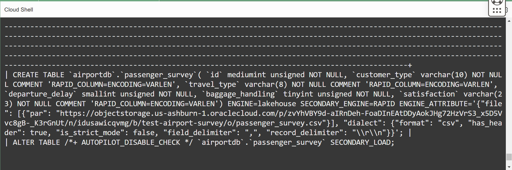

9. Copy the **CREATE TABLE** command from the results. It should look like the following example

    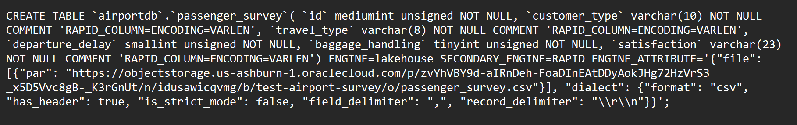  

10. Execute the modified **CREATE TABLE** command to create the passenger_survey table.

11. The create command and result should look lie this

    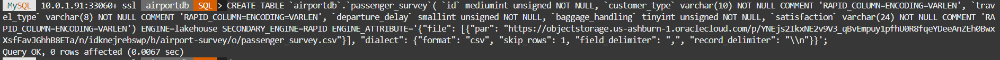

## 작업 7: Load complete passenger_survey table from Object Store into MySQL HeatWave

1. Run this command to see the created table structure .

    ```bash
    <copy>desc passenger_survey;</copy>
    ```

    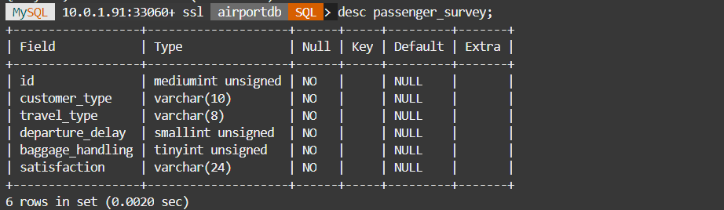

2. Now load the data from the Object Store into the passenger_survey table.

    ```bash
    <copy> ALTER TABLE `airportdb`.`passenger_survey` SECONDARY_LOAD; </copy>
    ```

3. Once Autoload completes, check the number of rows loaded into the table.

    ```bash
    <copy>select count(*) from passenger_survey;</copy>
    ```

4. View a sample of the data in the table.

    ```bash
    <copy>select * from passenger_survey limit 5;</copy>
    ```

    a. Join the passenger_survey table with another table in the schema

    ```bash
    <copy> select p.* , ps.* from passenger p 
    join passenger_survey ps on p.passenger_id = ps.ID
    where p.passenger_id = 28; </copy>
    ```

5. Your output for steps 2 thru 5 should look like this:

    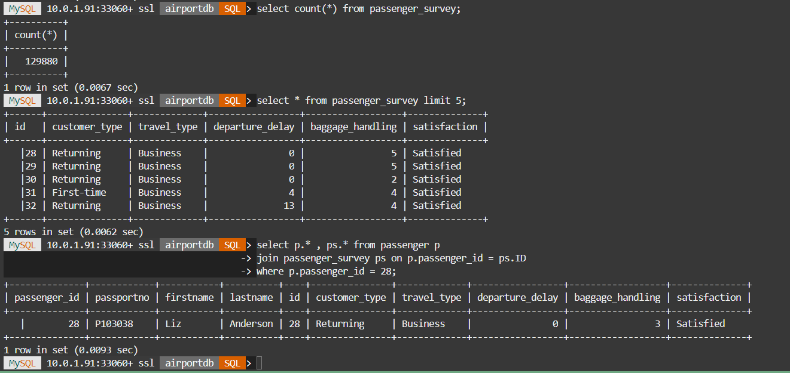

6. Your passenger_survey table is now ready to be used in queries with other tables.

You may now **proceed to the next lab**

## Acknowledgements

- **Author** - Perside Foster, MySQL Principal Solution Engineering
- **Contributors** - Mandy Pang, MySQL Principal Product Manager,  Nick Mader, MySQL Global Channel Enablement & Strategy Manager, Selena Sanchez, MySQL Solution Engineering
- **Last Updated By/Date** - Kihyuk, MySQL Solution Engineering, September 2024
