# HeatWave로 Oracle Analytics Cloud 대시보드 구축


## 세션 소개

MySQL HeatWave는 Oracle Cloud Analytics와 같은 기존 Oracle 서비스를 사용한 개발 작업에 쉽게 사용할 수 있습니다. -> Oracle Analytics Cloud(OAC)는 단일 통합 플랫폼에서 업계에서 가장 포괄적인 클라우드 분석을 제공하며, 여기에는 셀프 서비스 시각화 및 인라인 데이터 준비부터 기업 보고, 고급 분석 및 사전 예방적 통찰력을 제공하는 자체 학습 분석이 포함됩니다.

MySQL HeatWave를 OAC와 함께 사용하면 MySQL 데이터를 탐색하고 협업 분석을 수행할 수 있습니다.

_Estimated Time: :_ 20 minutes 소요

### 목표

이 랩에서는 다음 작업을 안내해 드립니다 :

- Oracle Analytics Cloud를 생성하고 MySQL HeatWave에 연결
- airportdb에 대한 OAC 대시보드 만들기

### Prerequisites (필요사항)

- An Oracle Trial or Paid Cloud Account
- MySQL Shell에 사용경험

## 작업 1:  Create an Oracle Analytic Cloud Service

1. From the OCI console, navigate to Analytics & AI-> Analytics Clouds
 

2. Click Create Instance
 

3. On the Create Analytics Instance enter the required information as shown below

    Name:

    ```bash
    <copy>hwoac</copy> 
    ```

    Description:

    ```bash
        <copy>Oracle Analytics Cloud HeatWave Test</copy>
    ```

    Capacity: select **OCPU** and select **1**

    License Type: select **License Included**

4. Click the **Create** button

    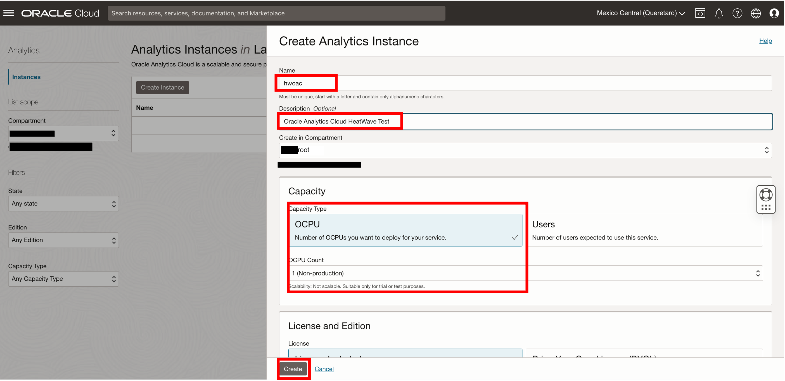

5. It takes about 12-15 mins for OAC instance creation to complete.

    

## 작업 2: Configure Private Access Channel

1. Go down to the “Private Access Channel” resources page and click on the **Configure Private Access Channel**  button.

2. Click the create Private Access Channel button

3. On the create Private Access Channel page enter the following:

    Name:

    ```bash
         <copy>hwoacpac</copy>
    ```

    DNS Zones:
    **Check Virtual Cloud Network's domain name as DNS zone (hwvcn.oraclevcn.com)**

    Description:

    ```bash
        <copy>Testing</copy>
    ```

    **Remove second  DNS Zone entry**

4. Click the **Create** button

    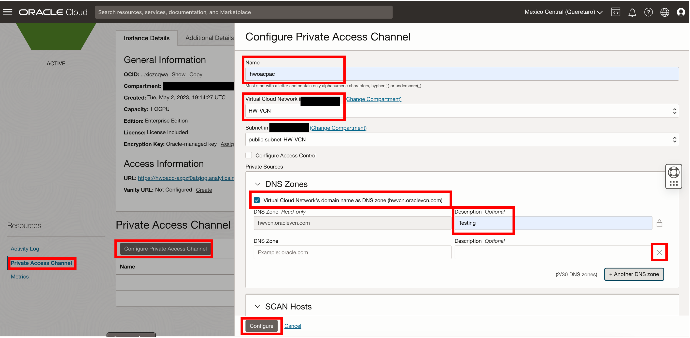

5. Wait 30 minutes for the process to finish, then continue to Task 3
    

## 작업 3: Get HeatWave DB Hostname

1. Before starting go to Menu Databases > DB Systems

2. Select HeatWave database: HeatWave-DB

3. Go to the **Connections** tab  on the Endpoinst Link. On the **Internal FQDN** click show, and  copy the  and save it to notepad

    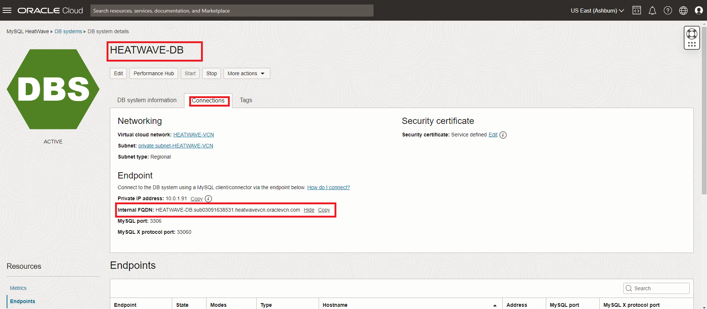

4. Save the Hostname for use with OAC

    Example : **hwdb.sub09012.....hwvcn.oraclevcn.com**

## 작업 4: - Build OAC Dashboard

1. Navigate to hamburger->Analytics->Analytics Clouds

2. Select the OAC instance you provisioned to access the OAC console by clicking on Analytics Home Page

    

3. Create a Connection to HeatWave to build a dashboard

    

4. Search for mysql and select mysql as the database

    Example: **HEATWAVE-HW.sub0….heatwavevcn.oraclevcn.com**

    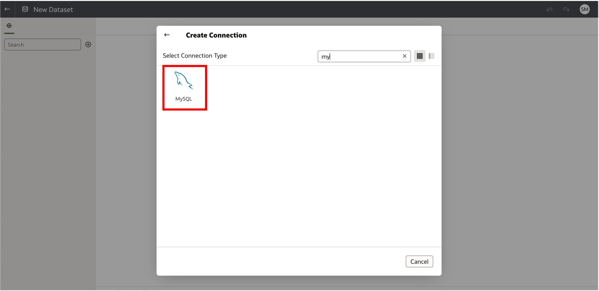

5. Specify the connections details

    - Specify the hostname of HEATWAVE-DB in FQDN from Task 4.
    - Be sure to use mysql admin user name and password.

    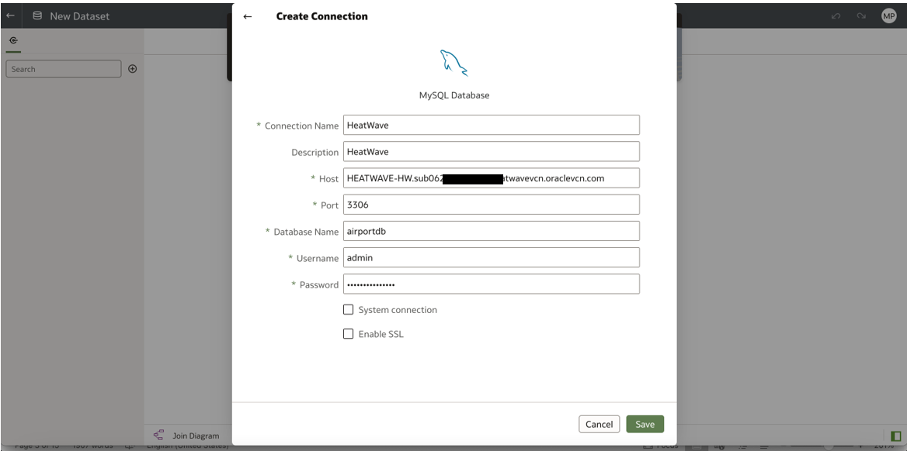

6. Select the MySQL Connection created earlier

7. Double click "Manual Query" on the left panel and click ”Manual Query” tab on the bottom

    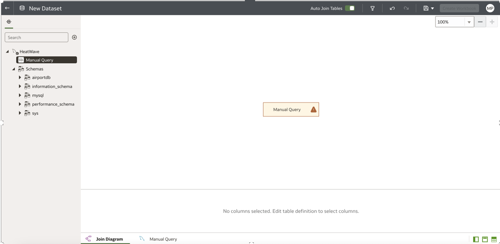

8. Add the following SQL query (find per-company average age of passengers from Switzerland, Italy and France) in the statement text box, and select “Live” in Data Access on the right, then click OK on the top

    ```bash  
    <copy> SELECT
        airline.airlinename,
        AVG(datediff(departure,birthdate)/365.25) as avg_age,
        count(*) as nbpeople
    FROM
        booking, flight, airline, passengerdetails
    WHERE
        booking.flight_id=flight.flight_id AND
        airline.airline_id=flight.airline_id AND
        booking.passenger_id=passengerdetails.passenger_id AND
        country IN ("SWITZERLAND", "FRANCE", "ITALY")
    GROUP BY
        airline.airlinename
    ORDER BY
        airline.airlinename, avg_age
    LIMIT 10;</copy>
    ```

9. Dataset screen
    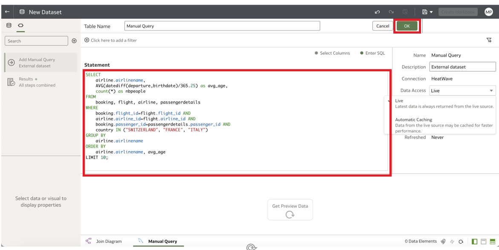

10. Click the  save button and set the DataSet name to Passengers then click Create workbook button
    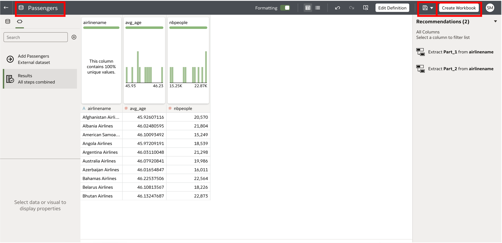

11. On new display page  click on the Dataset icon, select airline and nbrpeople
    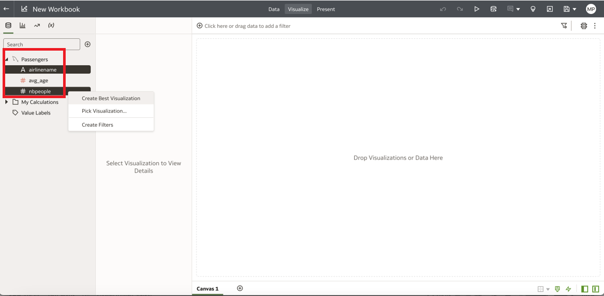
12. Right click and select "Create Best Visualization".
    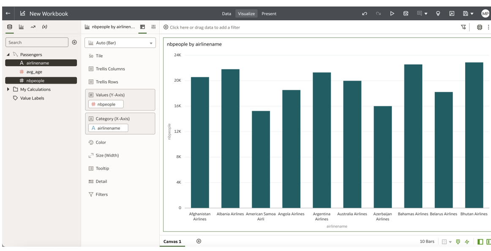

13. Click on the bottom + sign to add Canvas 2 , select airline and avg_age
14. Right click and select "Pick Visualization" and select pie chart.
    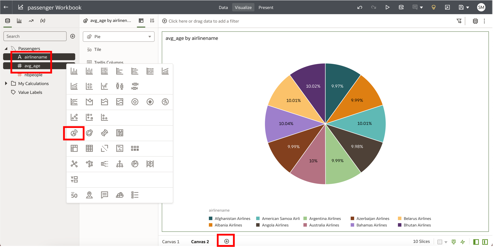

15. Save Workbook as "passenger Workbook" and close OAC application


16. Add chart to OAC using the following query

    ```bash
    <copy>SELECT satisfaction,customer_type, travel_type, AVG(departure_delay) departure_delay,count(*) as nb_psgr
    FROM airportdb.passenger_survey
    group by customer_type,travel_type,satisfaction;</copy>
    ```

    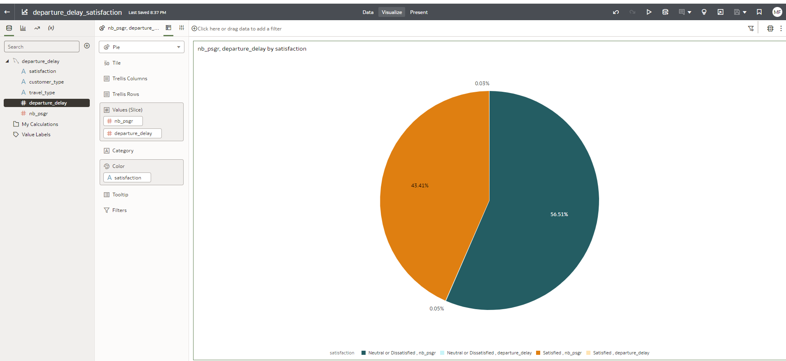

You may now **proceed to the next lab**

## Acknowledgements

- **Author** - Perside Foster, MySQL Principal Solution Engineering
- **Contributors** - Mandy Pang, MySQL Principal Product Manager,  Nick Mader, MySQL Global Channel Enablement & Strategy Manager, Selena Sanchez, MySQL Solution Engineering
- **Last Updated By/Date** - kihyuk, MySQL Solution Engineering, Dec 2024
