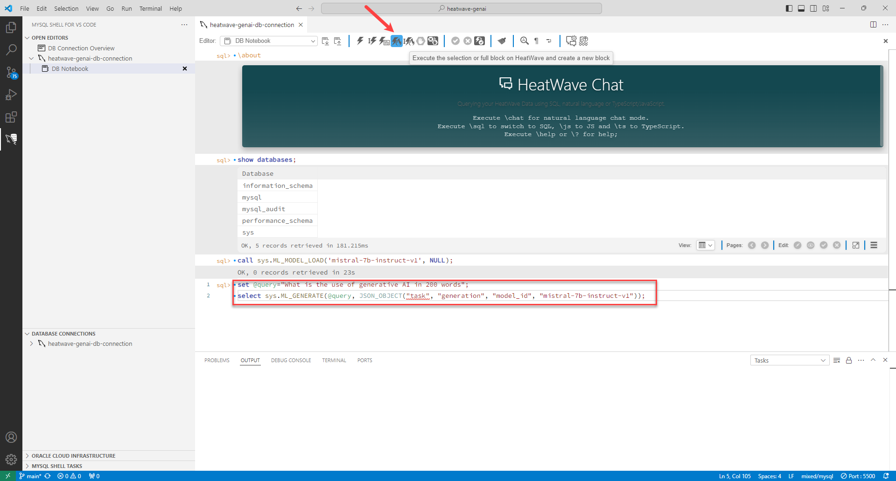
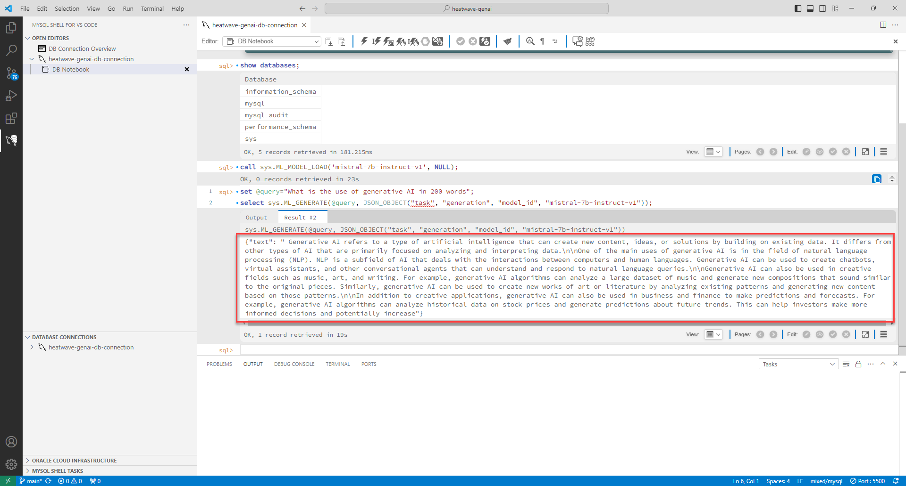
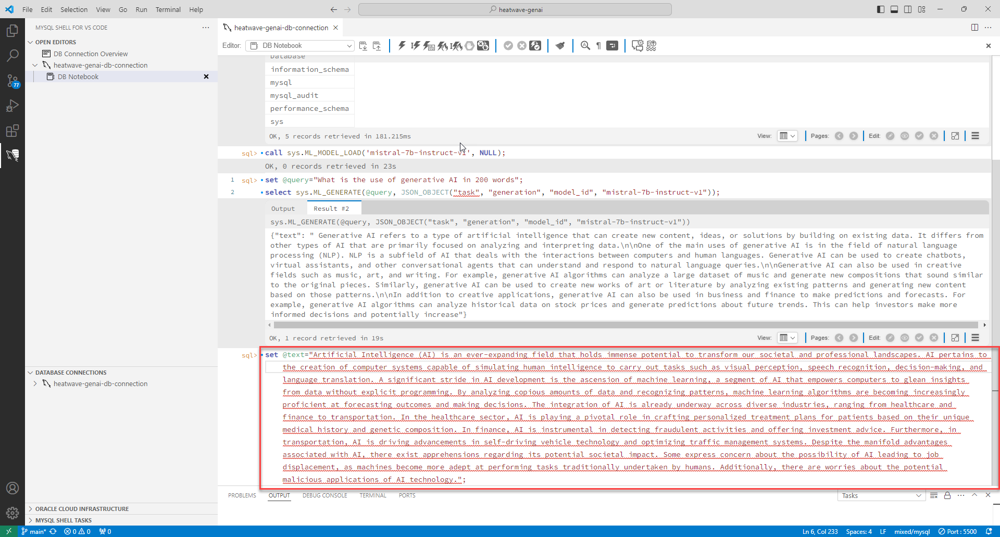
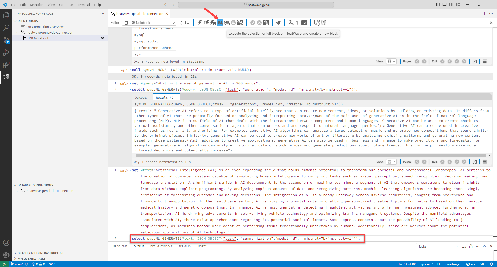
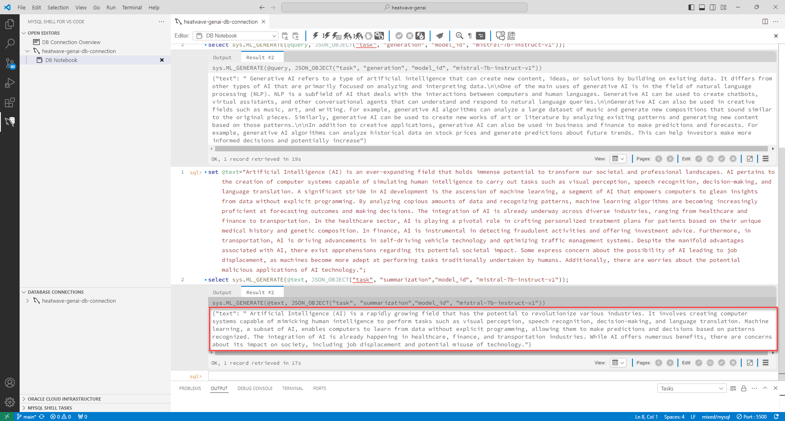

# HeatWave 데이터베이스 내 LLM을 사용하여 콘텐츠 생성 및 요약

## 세션 소개

HeatWave GenAI는 두 개의 데이터베이스 내 대규모 언어 모델(LLM)을 지원합니다: mistral-7b-instruct-v1 및 llama2-7b-v1, llama3-8b-instruct-v1. 이러한 모델을 사용하여 응답을 생성하거나 요약할 수 있습니다.

_Estimated Time:_ 10 minutes 소요

### 목표

이 Lab에서는 다음과 같은 작업들을 진행합니다.

- 데이터베이스 내 LLM을 사용하여 응답 생성.
- 데이터베이스 내 LLM을 사용하여 텍스트 요약.

### Prerequisites (필요사항)

- An Oracle Trial or Paid Cloud Account
- MySQL Shell에 사용경험

## 작업 1:  데이터베이스 내 LLM을 사용하여 응답(Generate) 생성

1. HeatWave에 LLM 로드합니다. **Enter**:

    - llama3-8b-instruct-v1 모델을 로드하려면:

        ```bash
        <copy>call sys.ML_MODEL_LOAD('llama3-8b-instruct-v1', NULL);</copy>
        ```

        

2. Set the @query session variable with your query in natural language, and click **Enter**.

    ```bash
    <copy>set @query="<QueryInNaturalLanguage>";</copy>
    ```

    For example:
    
    ```bash
    <copy>set @query="What is the use of generative AI in 200 words";</copy>
    ```
3. Generate the response from LLM by entering the following command and click **Execute the selection or full block on HeatWave and create a new block**:

    ```bash
    <copy>select sys.ML_GENERATE(@query, JSON_OBJECT("task", "generation", "model_id", "mistral-7b-instruct-v1"));</copy>
    ```

    

4. HeatWave GenAI generates a response using the in-database LLMs.

    

## 작업 2: Summarize text using in-database LLMs

1. Define the text that you want to summarize, and click **Enter**:

    ```bash
    <copy>set @text="<TextToSummarize>";</copy>
    ```

    For example:
    ```bash
    <copy>set @text="Artificial Intelligence (AI) is an ever-expanding field that holds immense potential to transform our societal and professional landscapes. AI pertains to the creation of computer systems capable of simulating human intelligence to carry out tasks such as visual perception, speech recognition, decision-making, and language translation. A significant stride in AI development is the ascension of machine learning, a segment of AI that empowers computers to glean insights from data without explicit programming. By analyzing copious amounts of data and recognizing patterns, machine learning algorithms are becoming increasingly proficient at forecasting outcomes and making decisions. The integration of AI is already underway across diverse industries, ranging from healthcare and finance to transportation. In the healthcare sector, AI is playing a pivotal role in crafting personalized treatment plans for patients based on their unique medical history and genetic composition. In finance, AI is instrumental in detecting fraudulent activities and offering investment advice. Furthermore, in transportation, AI is driving advancements in self-driving vehicle technology and optimizing traffic management systems. Despite the manifold advantages associated with AI, there exist apprehensions regarding its potential societal impact. Some express concern about the possibility of AI leading to job displacement, as machines become more adept at performing tasks traditionally undertaken by humans. Additionally, there are worries about the potential malicious applications of AI technology.";</copy>
    ```

    

2. Generate the summarized text by entering the following command and click **Execute the selection or full block on HeatWave and create a new block**:

    ```bash
    <copy>select sys.ML_GENERATE(@text, JSON_OBJECT("task", "summarization","model_id", "mistral-7b-instruct-v1"));</copy>
    ```

    

 3. LLM generates a summary of your text:

    


You may now **proceed to the next lab**.

## Learn More

- [HeatWave User Guide](https://dev.mysql.com/doc/heatwave/en/)

- [HeatWave on OCI User Guide](https://docs.oracle.com/en-us/iaas/mysql-database/index.html)

- [MySQL Documentation](https://dev.mysql.com/)


## Acknowledgements

- **Author** - Aijaz Fatima, Product Manager
- **Contributors** - Mandy Pang, Senior Principal Product Manager, Aijaz Fatima, Product Manager
- **Last Updated By/Date** - Aijaz Fatima, Product Manager, August 2024

