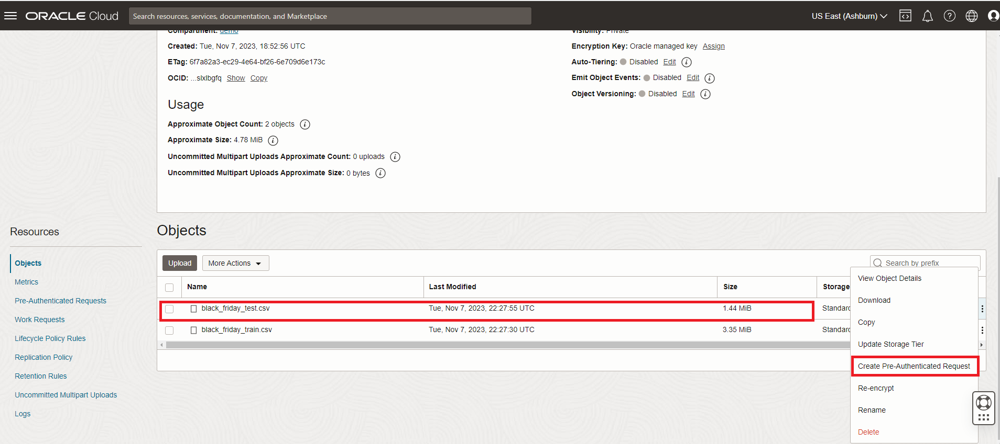
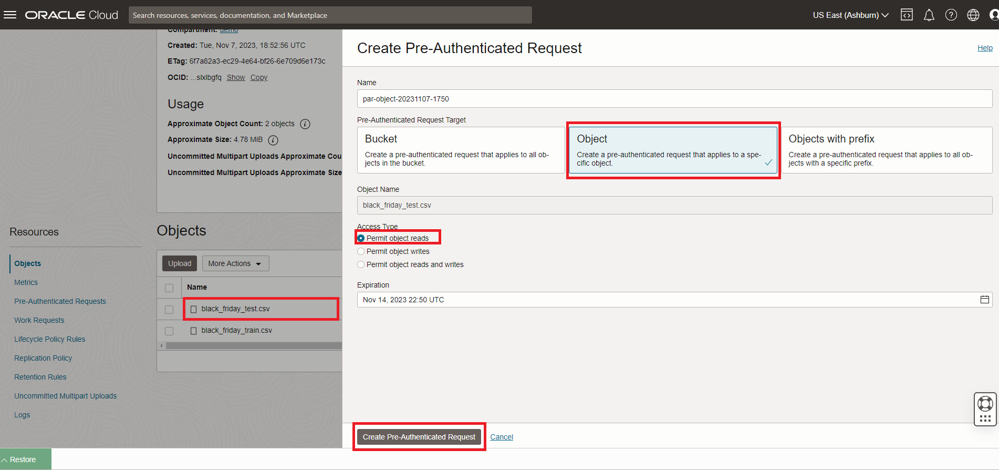
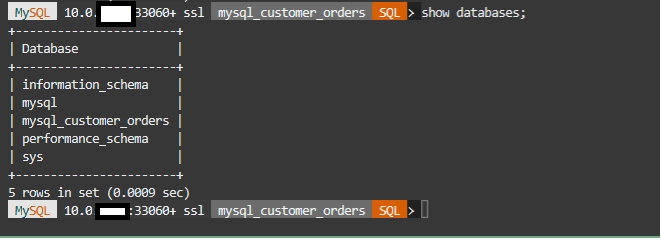
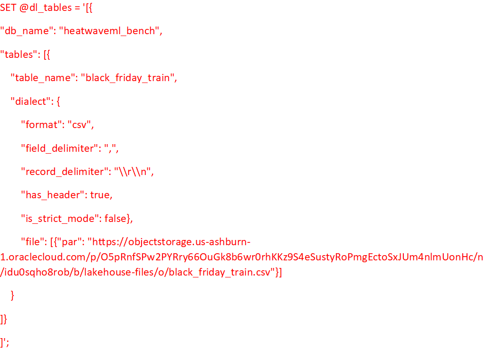
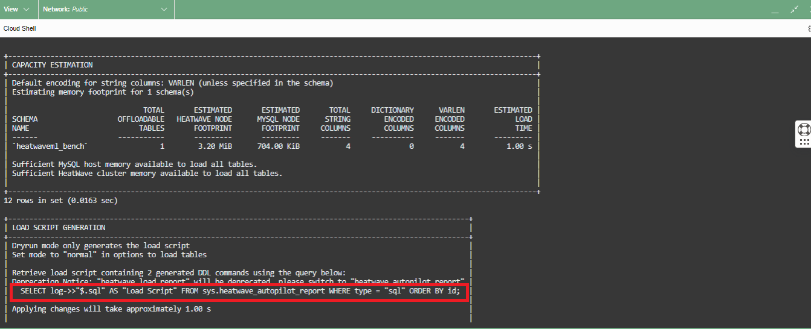
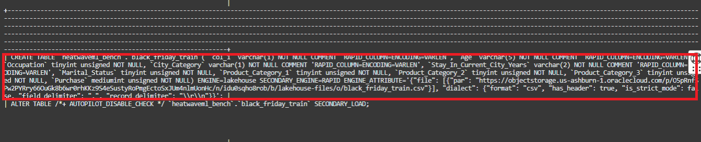
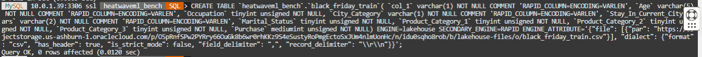
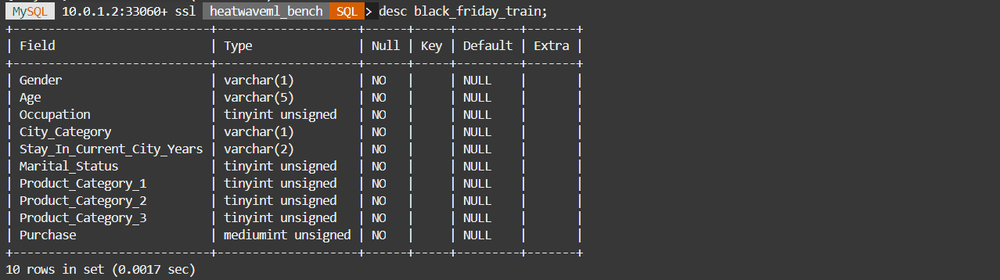
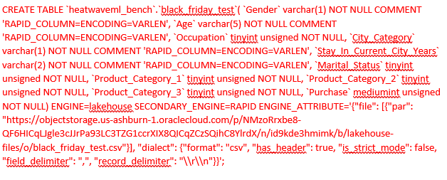

# OCI Object Store에서 Lakehouse로 CSV 데이터 로드 - black-friday

## 세션 소개

Object Storage에서 HeatWave로 데이터를 로드하려면 Object Storage에 있는 파일이나 폴더 객체의 위치를 ​​지정해야 합니다.

1. [Resource Principal 사용](https://docs.oracle.com/en-us/iaas/autonomous-database-serverless/doc/resource-principal-enable.html) - 민감한 데이터일 경우 Object Storage에 있는 데이터에 액세스하려면 리소스 주체 기반 접근 방식을 사용하는 것이 좋습니다. 이 접근 방식이 더 안전하기 때문입니다.

2. [Pre-Authenticated Request URLs (PARs) 사용](https://docs.oracle.com/en-us/iaas/Content/Object/Tasks/usingpreauthenticatedrequests.htm) - PAR을 사용하기로 선택한 경우 Lakehouse에서 읽기 전용 PAR을 사용하고 PAR에 대한 짧은 만료 날짜를 지정하는 것이 좋습니다. 만료 날짜는 로딩 일정과 일치해야 합니다.

샘플 데이터 세트를 사용하므로 이 LiveLab에서 PAR을 활용하겠습니다. HeatWave에서 이미 MySQL에서 로드된 여러 테이블을 사용할 수 있습니다.

이제 Object Store에서 Black Friday 테이블을 로드하겠습니다.

### 목표

- "black_friday" 파일에 대한 PAR 링크 생성
- 스키마(schema)를 유추하고 용량을 추정하기 위해 Autoload를 실행합니다.
- Object Store에서 MySQL HeatWave로 전체 black_friday 테이블 로드

### Prerequisites (필요사항)

- An Oracle Trial or Paid Cloud Account
- MySQL Shell에 사용경험
- Lab 4에 작업1까지 완료가 필요

## 작업 1: "black\_friday" 파일에 대한 PAR 링크 생성

1. **black\_friday\_train.csv** 개체에 대한 PAR URL을 만듭니다.

    - a. OCI 콘솔에서 OCI의 lakehouse-files 버킷으로 이동합니다.
    - b. black\_friday\_train.csv 파일을 선택하고 세 개의 세로 점을 클릭합니다.

        

    - c. '사전 인증된 요청 생성 (Pre-Authenticated Request)'을 클릭하세요.
    - d. '사전 인증된 요청 대상 (PreAuthentcated Request Target)'에서 '개체 (Object)' 옵션을 선택하려면 클릭하세요.
    - e. '액세스 유형 (Access Type)' 옵션 : '개체 읽기 허용'(Permit object reads)
    - h. '사전 인증된 요청 만들기 (Pre-Authenticated Request)' 버튼을 클릭하세요.

       

    - i. '복사' 아이콘을 클릭하여 PAR URL을 복사합니다.
    - j. 생성된 PAR URL을 저장하세요. 나중에 필요합니다.

2. Save the generated PAR URL; you will need it in the next task

3. Do the same to create a PAR URL for the **black\_friday\_test.csv** object

    - a. From your OCI console, navigate to your lakehouse-files bucket in OCI.
    - b. Select the black\_friday\_test.csv file and click the three vertical dots.
    - c. Click on ‘Create Pre-Authenticated Request’
    - d. Click to select the ‘Object’ option under ‘PreAuthentcated Request Target’.
    - e. Leave the ‘Access Type’ option as-is: ‘Permit object reads’.
    - h. Click the ‘Create Pre-Authenticated Request’ button.
    - i. Click the ‘Copy’ icon to copy the PAR URL.
    - j. Save the generated PAR URL; you will need it later.

4. Save the generated PAR URL; you will need it in the next task

## 작업 2: Connect to your MySQL HeatWave system using Cloud Shell

1. If not already connected with SSH, on Command Line, connect to the Compute instance using SSH ... be sure replace the  "private key file"  and the "new compute instance ip"

     ```bash
    <copy>ssh -i private_key_file opc@new_compute_instance_ip</copy>
     ```

2. If not already connected to MySQL then connect to MySQL using the MySQL Shell client tool with the following command:

    ```bash
    <copy>mysqlsh -uadmin -p -h 10.0.1... --sql </copy>
    ```

    

3. List schemas in your heatwave instance

    ```bash
        <copy>show databases;</copy>
    ```

    

4. Create the Machine Learning schema 

    ```bash
    <copy>CREATE DATABASE heatwaveml_bench;</copy>
    ```

5. Set new database as default

    ```bash
    <copy>use heatwaveml_bench;</copy>
    ```

    You are now ready to use Autoload to load a table from the object store into MySQL HeatWave

## 작업 3: Run Autoload to infer the schema and estimate capacity for the black\_friday tables in the Object Store

1. The data is contained in the black\_friday\_train.csv file in object store for which we have created a PAR URL in the earlier task. Enter the following commands one by one and hit Enter.

2. This sets the schema we will load table data into. Don’t worry if this schema has not been created. Autopilot will generate the commands for you to create this schema if it doesn’t exist.

    ```bash
    <copy>SET @db_list = '["heatwaveml_bench"]';</copy>
    ```

3. This sets the parameters for the table name we want to load data into and other information about the source file in the object store. Substitute the **(PAR URL)** below with the one you generated in the previous task:

    ```bash
    <copy>SET @dl_tables = '[{
    "db_name": "heatwaveml_bench",
    "tables": [{
        "table_name": "black_friday_train",
        "dialect": {
            "format": "csv",
            "field_delimiter": ",",
            "record_delimiter": "\\r\\n",
            "has_header": true,
            "is_strict_mode": false},
            "file": [{"par": "(PAR URL)"}]
        }
    ]}
    ]';</copy>
    ```

    - It should look like the following example (Be sure to include the PAR Link inside at of quotes("")):

    

4. This command populates all the options needed by Autoload:

    ```bash
    <copy>SET @options = JSON_OBJECT('mode', 'dryrun', 'policy', 'disable_unsupported_columns', 'external_tables', CAST(@dl_tables AS JSON));</copy>
    ```

5. Run this Autoload command:

    ```bash
    <copy>CALL sys.heatwave_load(@db_list, @options);</copy>
    ```

6. Once Autoload completes running, its output has several pieces of information:
    - a. Whether the table exists in the schema you have identified.
    - b. Auto schema inference determines the number of columns in the table.
    - c. Auto schema sampling samples a small number of rows from the table and determines the number of rows in the table and the size of the table.
    - d. Auto provisioning determines how much memory would be needed to load this table into HeatWave and how much time loading this data take.


    

7. Autoload also generated a statement lke the one below. Execute this statement now.

    ```bash
    <copy>SELECT log->>"$.sql" AS "Load Script" FROM sys.heatwave_autopilot_report WHERE type = "sql" ORDER BY id;</copy>
    ```


8. The execution result contains the SQL statements needed to create the table and then load this table data from the Object Store into HeatWave.

    

9. Copy the **CREATE TABLE** command from the results.

10. Execute the **CREATE TABLE** command to create the black-friday table.

11. The create command and result should look lie this

    

## 작업 4: Load the black\_friday\_train table from Object Store into MySQL HeatWave

1. Run this command to see the table structure created.

    ```bash
    <copy>desc black_friday_train;</copy>
    ```

    

2. Now load the data from the Object Store file into the table.

    ```bash
    <copy> ALTER TABLE `heatwaveml_bench`.`black_friday_train` SECONDARY_LOAD; </copy>
    ```

3. Check the number of rows loaded into the table.

    ```bash
    <copy>select count(*) from black_friday_train;</copy>
    ```

    The black\_friday\_train table has 116698 rows.

4. View a sample of the data in the table.

    ```bash
    <copy>select * from black_friday_train limit 5;</copy>
    ```

## 작업 5: Create and Load the black\_friday\_test table from Object Store into MySQL HeatWave

1. Create the black\_friday\_test table by copying the black\_friday\_train Create command and replace the  (PAR URL) with the black\_friday\_test.csv PAR URL  you saved earlier. It will be the source for the black\_friday\_test.csv table:

    ```bash
    <copy>CREATE TABLE `heatwaveml_bench`.`black_friday_test`( `Gender` varchar(1) NOT NULL COMMENT 'RAPID_COLUMN=ENCODING=VARLEN', `Age` varchar(5) NOT NULL COMMENT 'RAPID_COLUMN=ENCODING=VARLEN', `Occupation` tinyint unsigned NOT NULL, `City_Category` varchar(1) NOT NULL COMMENT 'RAPID_COLUMN=ENCODING=VARLEN', `Stay_In_Current_City_Years` varchar(2) NOT NULL COMMENT 'RAPID_COLUMN=ENCODING=VARLEN', `Marital_Status` tinyint unsigned NOT NULL, `Product_Category_1` tinyint unsigned NOT NULL, `Product_Category_2` tinyint unsigned NOT NULL, `Product_Category_3` tinyint unsigned NOT NULL, `Purchase` mediumint unsigned NOT NULL) ENGINE=lakehouse SECONDARY_ENGINE=RAPID ENGINE_ATTRIBUTE='{"file": [{"par": "(PAR URL)"}], "dialect": {"format": "csv", "has_header": true, "is_strict_mode": false, "field_delimiter": ",", "record_delimiter": "\\r\\n"}}';</copy>
    ```


    - It should look like the following example 
    (Be sure to include the PAR Link inside at of quotes("")):

        

2. Run this command to see the table structure created:

    ```bash
    <copy>desc black_friday_test;</copy>
    ```

3. Load the data from the Object Store into the black\_friday\_test table.

    ```bash
    <copy>ALTER TABLE /*+ AUTOPILOT_DISABLE_CHECK */ `heatwaveml_bench`.`black_friday_test` SECONDARY_LOAD;</copy>
    ```

4. Once Autoload completes, check the number of rows loaded into the table.

    ```bash
    <copy>select count(*) from black_friday_test;</copy>
    ```

5. View a sample of the data in the table.

    ```bash
    <copy>select * from black_friday_test limit 5;</copy>
    ```

You may now **proceed to the next lab**

## Acknowledgements

- **Author** - Perside Foster, MySQL Solution Engineering

- **Contributors** - Abhinav Agarwal, Senior Principal Product Manager, Nick Mader, MySQL Global Channel Enablement & Strategy Manager
- **Last Updated By/Date** - kihyuk, MySQL Solution Engineering, Feburary 2025
