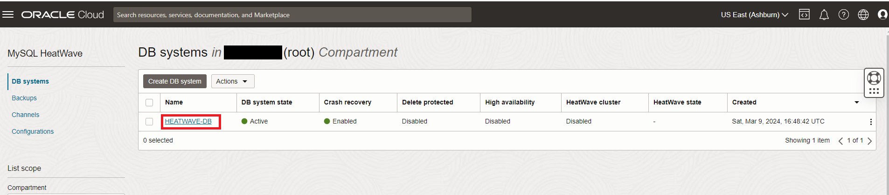
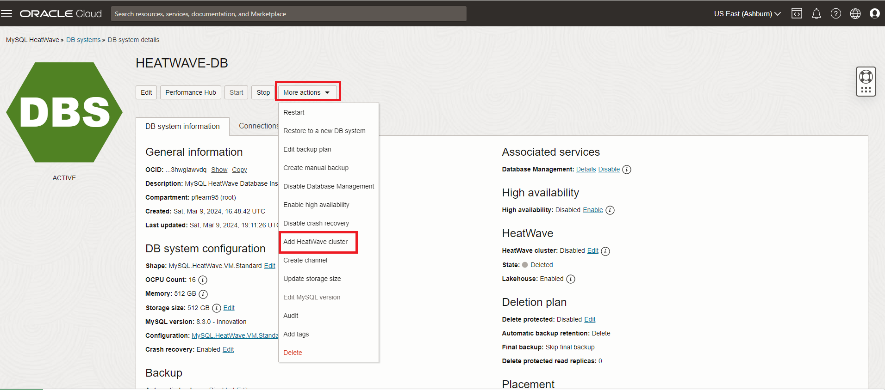
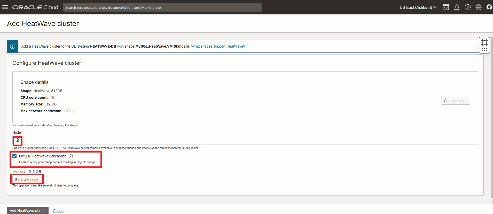
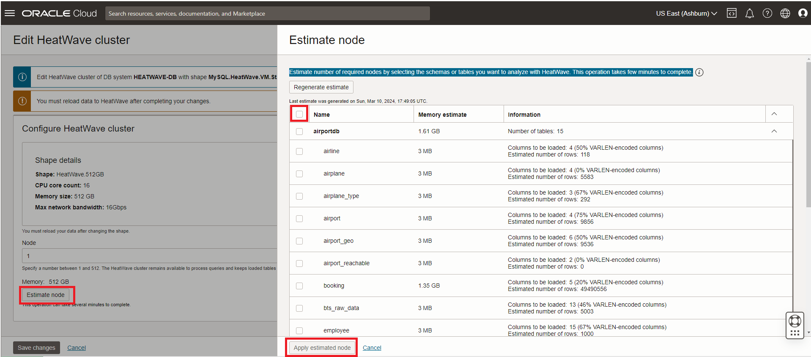
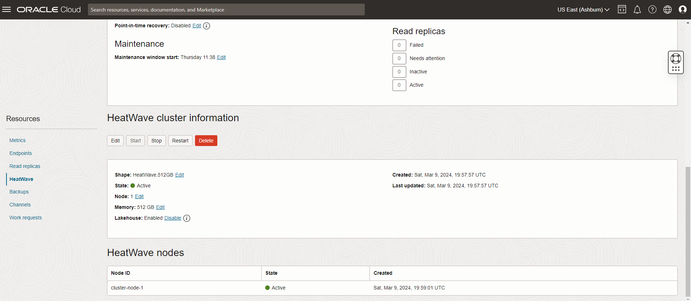
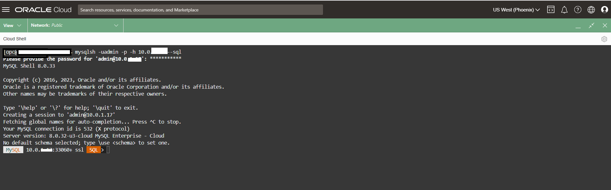

# Heatwave Cluster에 Airportdb Data Load


## 세션 소개

HeatWave 클러스터는 MySQL DB 시스템 노드와 하나 이상의 HeatWave 노드로 구성됩니다. MySQL DB 시스템 노드에는 클러스터 관리, HeatWave 클러스터로의 데이터 로드, 쿼리 스케줄링 및 쿼리 결과 반환을 담당하는 플러그인이 포함됩니다.


_Estimated Time:_ 10 minutes 소요

[//]:    [](youtube:OzqCt3XATto)

### 목표

이 Lab에서는 다음 작업을 안내해 드립니다.

- MySQL Database System에 HeatWave Cluster 추가 하기
- HeatWave Cluster에 Airportdb Data 로드하기

### Prerequisites

- An Oracle Trial or Paid Cloud Account
- MySQL Shell에 사용경험


## 작업 1: MySQL Database System에 HeatWave Cluster 추가 하기

1. Navigation Menu에서 아래와 같이 이동
    - Databases
    - MySQL
    - DB Systems
2. root Compartment 선택하면 해당 Compartment에 DB 시스템 목록이 표시됩니다.
    

3. DB 시스템 목록에서, **HEATWAVE-DB** system 클릭하고 **More Action ->  Add HeatWave Cluster**를 클릭합니다.
    

    >**참고** **HeatWave Cluster**가 이미 활성화되어 있는 경우 **작업 2**로 건너뜁니다.

    - a. Enable the **MySQL HeatWave LakeHouse** checkbox
    - b. **Node Count**를 2로 설정 
    - c. Enable the **MySQL HeatWave Lakehouse** checkbox
    - d. the HeatWave cluster를 생성하기 위해 **Add HeatWave Cluster** button를 클릭

        

    >**참고** HeatWave가 데이터에 필요한 노드 수를 추정하도록 할 수 있습니다. **Estimate Node** 버튼을 클릭한 다음 HeatWave로 분석하려는 스키마나 테이블을 선택합니다. 이 작업을 완료하는 데 몇 분이 걸립니다.

    - 

4. HeatWave 클러스터 생성에는 약 10분이 걸립니다. DB 표시 페이지에서 리소스 섹션으로 스크롤합니다. **HeatWave** 링크를 클릭합니다. 완성된 HeatWave 클러스터 정보 섹션은 다음과 같습니다.
    

## 작업 2: HeatWave Cluster에 Airportdb Data 로드하기

1. Cloud Shell로 이동하여 Compute Instance에 SSH를 실행합니다.

    (Example: **ssh -i ~/.ssh/id_rsa opc@132.145.170...**) 

    ```bash
    <copy>ssh -i ~/.ssh/id_rsa opc@<your_compute_instance_ip></copy>
    ```

2. 다음 명령을 사용하여 MySQL Shell을 사용하여 HeatWave 데이터베이스에 연결합니다.

     ```bash
    <copy>mysqlsh -uadmin -p -h 10.0.1... --sql </copy>
    ```

    

3. 다음 Auto Parallel Load 명령을 실행하여 AirportDB 테이블을 HeatWave 클러스터에 로드합니다.

     ```bash
    <copy>CALL sys.heatwave_load(JSON_ARRAY('airportdb'), NULL);</copy>
    ```

    - >**참고** 테이블을 로드하는 데 필요한 시간은 데이터 크기에 따라 다릅니다. 다음 쿼리를 실행하여 로드 진행 상황을 모니터링할 수 있으며, 로드 진행 상황을 나타내는 백분율 값을 반환합니다.

        ```bash
        <copy>SELECT VARIABLE_VALUE  FROM performance_schema.global_status  WHERE VARIABLE_NAME = 'rapid_load_progress';</copy>
        ```

4. 완성된 로드 클러스터 화면은 다음과 같습니다.

    

5. HeatWave 클러스터에 테이블이 로드되었는지 확인하십시오. 로드된 테이블은 AVAIL_RPDGSTABSTATE 로드 상태를 갖습니다.

     ```bash
    <copy>USE performance_schema;</copy>
    ```

     ```bash
    <copy>SELECT NAME, LOAD_STATUS FROM rpd_tables,rpd_table_id WHERE rpd_tables.ID = rpd_table_id.ID;</copy>
    ```

    

    >**지금은 실행하지 마세요!** - 데이터가 필요하지 않을 경우 아래와 같이 unload 할 수 있습니다.
    - HeatWave 클러스터에서 airportdb 스키마를 unload 하려면

     ```bash
    <copy>CALL sys.heatwave_unload(JSON_ARRAY("airportdb"),NULL);</copy>
    ```

## 더 알아보기

- [Oracle Cloud Infrastructure MySQL Database Service Documentation](https://docs.cloud.oracle.com/en-us/iaas/MySQL-database)
- [MySQL Database Documentation](https://www.MySQL.com)

이제 **다음 Lab으로 진행**할 수 있습니다.

## Acknowledgements

- **Author** - Perside Foster, MySQL Principal Solution Engineering
- **Last Updated By/Date** - kihyuk, MySQL Solution Engineering, July 2024
