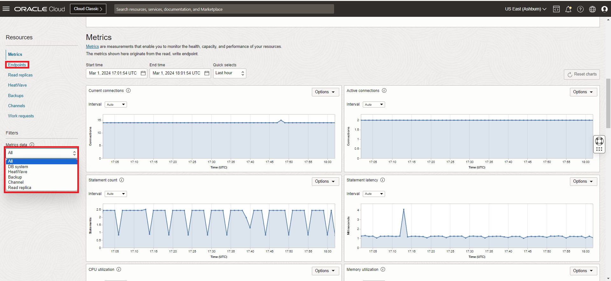
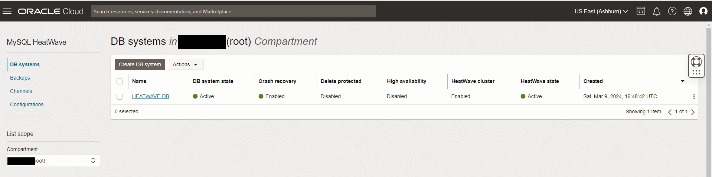
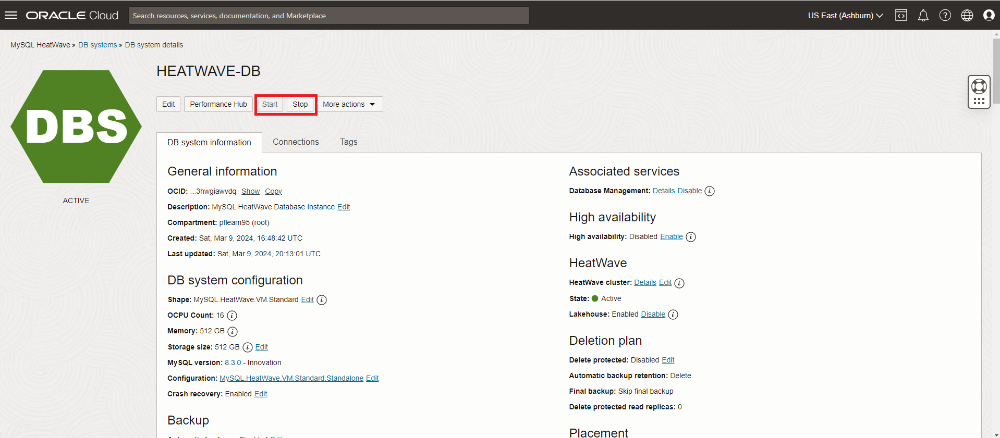

# MySQL HeatWave Service 관리

## 세션 소개

이 Lab에서는 Oracle Cloud Console을 사용하여 Oracle Cloud Infrastructure(OCI)에서 MySQL HeatWave 서비스 인스턴스를 관리하는 방법을 알아봅니다.

_Estimated Time:_ 10 minutes 소요

### 목표
이 Lab에서는 다음 작업을 안내해 드립니다.

- MySQL HeatWave Metrics 살펴보기
- MySQL HeatWave System 시작, 중단, 재시작
- MySQL HeatWave DatabaseSystem 삭제

### Prerequisites

- An Oracle Free Tier, Always Free, Paid or LiveLabs Cloud Account
- MySQL Shell에 사용경험

## 작업 1: MySQL HeatWave Metrics 살펴보기

DB 시스템의 Metrics을 보려면 다음을 수행하세요.:

1. 탐색 메뉴를 열고 데이터베이스를 클릭합니다. MySQL HeatWave에서 DB 시스템을 클릭합니다.
2. 목록 범위에서 Compartment을 선택합니다.
3. DB 시스템의 이름을 클릭하면 DB 시스템 세부 정보 페이지가 오픈됩니다.
4. Resources 아래, Metrics 클릭합니다.
5. 특정 Resources에 대한 Metrics을 보려면 Metrics 데이터 필터를 사용하세요.:
    - All: 모든 리소스에 대한 메트릭을 표시합니다.
    - DB system: 현재 DB 시스템에 대한 메트릭을 표시합니다.
    - Backup: 현재 DB 시스템의 모든 백업에 대한 메트릭을 표시합니다.

    

## 작업 2: MySQL HeatWave System 시작, 중단, 재시작

1. 왼쪽 상단 모서리에 있는 **Navigation Menu**를 클릭하고 나서, **Databases**로 이동한 후 **DB Systems**을 선택합니다.

   

2. Database Systems이 표시됩니다.

   

3. **HeatWave\_Sandbox** Compartment을 선택하고 **HeatWave\_DB**를 클릭하여 MySQL DB 시스템 세부 정보 페이지를 엽니다.

    

4. 다음 작업 중 하나를 선택하세요:

    - Start: 중지된 데이터베이스 시스템을 시작합니다. 데이터베이스 시스템이 시작된 후 **Stop** 작업이 활성화되고 **Start** 옵션이 비활성화됩니다.
    - Stop: 실행 중인 데이터베이스 시스템을 중지합니다. 데이터베이스 시스템의 전원이 꺼지면 **Start** 작업이 활성화됩니다.
    - Restart: 데이터베이스 시스템을 종료하고 다시 시작합니다.

     > **참고:** 데이터베이스 시스템을 중지하면 해당 시스템과 연결된 모든 OCPU에 대한 요금 청구가 중지됩니다.
       - 저장 공간(storage)에 대한 요금 청구는 계속됩니다.
       - 데이터베이스 시스템을 다시 시작하면 OCPU에 대한 청구가 재개됩니다.
       - **Stop** 또는 **Restart**을 선택하면 MySQL HeatWave 데이터베이스 시스템 Restart 시작 대화 상자가 표시됩니다.
    
5. Shutdown 유형을 선택하세요:

     - Fast: 데이터베이스 시스템을 종료하기 전에 dirty 페이지를 플러시합니다. 일부 플러시 작업은 다음 시작 중에 수행해야 하므로 시작 프로세스의 지속 시간이 늘어날 수 있습니다.
     - Slow: dirty 페이지를 플러시하고 이전 트랜잭션에 대한 실행 취소 로그 페이지를 제거합니다. 종료 자체는 더 오래 걸릴 수 있지만 후속 시작은 더 빠릅니다.
     - Immediate: dirty 페이지를 플러시하지 않고 실행 취소 로그 페이지를 제거하지 않습니다. MySQL을 즉시 중지합니다. 페이지 플러시와 로그 제거는 다음 시작 시에 발생하여 시작 프로세스의 지속 시간이 늘어납니다.

6. 필요한 종료 유형을 선택하고 선택한 작업에 따라 **Stop** 또는 **Restart**을 클릭합니다.

## 작업 3: MySQL HeatWave DatabaseSystem 삭제

데이터베이스 시스템을 삭제하면 영구적으로 삭제됩니다. 삭제된 데이터베이스 시스템과 관련된 모든 수동 백업은 보관 기간 동안 보관됩니다. 자동 백업은 데이터베이스 시스템과 함께 삭제됩니다.

1. 왼쪽 상단 모서리에 있는 **Navigation Menu**를 클릭하고 **Databases**로 이동한 다음 **DB Systems**을 선택합니다.

    

2. Database Systems이 표시됩니다.

    

3. **root** Compartment 선택합니다.

4. MySQL DB System Details page를 오픈하기 위해서 **HeatWave_DB**를 클릭합니다.

    

5. **More Actions** drop-down list에서, **Delete** 선택합니다.

      

    >**경고** HeatWave DB 시스템을 계속 사용하려는 경우 다음 단계를 건너뛰세요. **6단계**

6. **Delete DB System Permanently** box를 체크하고 **Delete DB System** 버튼을 클릭합니다.

    

삭제 프로세스가 완료되면 **HeatWave_DB**가 **Delete** 상태로 설정됩니다

## 더 알아보기

- [MySQL Heatwave Documentation](https://docs.oracle.com/en-us/iaas/mysql-database/)

- [MySQL HeatWave Database Documentation](https://www.mysql.com)

## Acknowledgements

- **Author** - Perside Foster, MySQL Principal Solution Engineering
- **Last Updated By/Date** - kihyuk, MySQL Solution Engineering, July 2024
