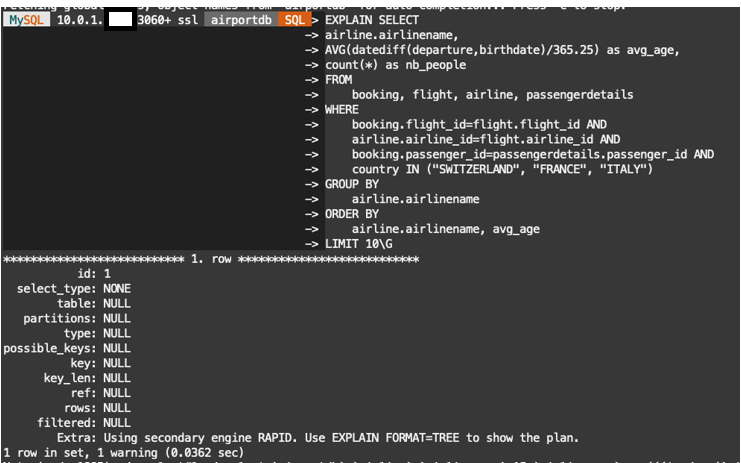
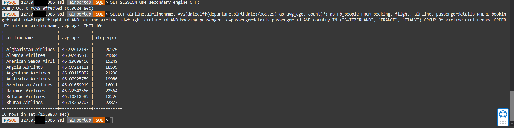

# HeatWave과 MySQL에서 쿼리 수행 


## 세션 소개

이 Lab에서는 HeatWave와 MySQL에서 쿼리를 실행합니다. MySQL과 비교했을 때 HeatWave에서 쿼리 성능이 향상되는 것을 볼 수 있습니다.

_Estimated Time:_ 10 minutes

[//]:   [](youtube:fOcDBTf-KqE)

### 목표

이 Lab에서는 다음 작업을 안내해 드립니다.

- MySQL Shell를 사용하여 쿼리 수행

### Prerequisites (필요사항)

- An Oracle Trial or Paid Cloud Account
- MySQL Shell에 사용경험

## Task 1: HeatWave에서 쿼리 수행

1. Cloud Shell로 이동하여 Compute Instance에 SSH를 실행합니다.

    (Example: **ssh -i ~/.ssh/id_rsa opc@132.145.170...**) 

    ```bash
    <copy>ssh -i ~/.ssh/id_rsa opc@<your_compute_instance_ip></copy>
    ```

2. 다음 명령을 사용하여 MySQL Shell을 사용하여 HeatWave 데이터베이스에 연결합니다.

    ```bash
    <copy>mysqlsh -uadmin -p -h 10.0.1... --sql </copy>
    ```

3. airport database로 이동

    Enter the following command at the prompt

    ```bash
    <copy>USE airportdb;</copy>
    ```

4. **Query 1** - 스위스, 이탈리아, 프랑스의 승객들의 회사별 평균 연령을 찾아보세요.

5. 쿼리를 실행하기 전에 EXPLAIN을 사용하여 쿼리를 HeatWave 클러스터로 오프로드할 수 있는지 확인합니다. 설명 계획에 "Use secondary engine RAPID"이 표시되어야 합니다. 예를 들어:

    ```bash
    <copy>EXPLAIN SELECT
    airline.airlinename,
    AVG(datediff(departure,birthdate)/365.25) as avg_age,
    count(*) as nb_people
    FROM
        booking, flight, airline, passengerdetails
    WHERE
        booking.flight_id=flight.flight_id AND
        airline.airline_id=flight.airline_id AND
        booking.passenger_id=passengerdetails.passenger_id AND
        country IN ("SWITZERLAND", "FRANCE", "ITALY")
    GROUP BY
        airline.airlinename
    ORDER BY
        airline.airlinename, avg_age
    LIMIT 10\G</copy>
    ```

    

6. 쿼리가 오프로드될 수 있는지 확인한 후 쿼리를 실행하고 실행 시간을 기록합니다. 프롬프트에 다음 명령을 입력합니다.

     ```bash
    <copy>SELECT
    airline.airlinename,
    AVG(datediff(departure,birthdate)/365.25) as avg_age,
    count(*) as nb_people
    FROM
        booking, flight, airline, passengerdetails
    WHERE
        booking.flight_id=flight.flight_id AND
        airline.airline_id=flight.airline_id AND
        booking.passenger_id=passengerdetails.passenger_id AND
        country IN ("SWITZERLAND", "FRANCE", "ITALY")
    GROUP BY
        airline.airlinename
    ORDER BY
        airline.airlinename, avg_age
    LIMIT 10;
    </copy>
    ```

7. HeatWave 실행 시간을 MySQL DB 시스템 실행 시간과 비교하려면 `use_secondary_engine` 변수를 비활성화하여 MySQL DB 시스템에서 동일한 쿼리를 실행하는 데 걸리는 시간을 확인합니다. 예를 들어:

    프롬프트에 다음 명령을 입력하세요:

    ```bash
    <copy>SET SESSION use_secondary_engine=OFF;</copy>
    ```

8. 프롬프트에 다음 명령을 입력하세요:

    ```bash
    <copy>SELECT
    airline.airlinename,
    AVG(datediff(departure,birthdate)/365.25) as avg_age,
    count(*) as nb_people
    FROM
        booking, flight, airline, passengerdetails
    WHERE
        booking.flight_id=flight.flight_id AND
        airline.airline_id=flight.airline_id AND
        booking.passenger_id=passengerdetails.passenger_id AND
        country IN ("SWITZERLAND", "FRANCE", "ITALY")
    GROUP BY
        airline.airlinename
    ORDER BY
        airline.airlinename, avg_age
    LIMIT 10;</copy>
    ```

    

9. `use_secondary_engine`이 활성화되어 있는지 확인하려면(=ON)

    프롬프트에 다음 명령을 입력하세요:

    ```bash
    <copy>SHOW VARIABLES LIKE 'use_secondary_engine%';</copy>
    ```

10. 추가 쿼리를 실행합니다. 실행 시간을 비교하려면 `use_secondary_engine`을 켜고 끄는 것을 잊지 마세요.

    (Example  **SET SESSION `use_secondary_engine`=On;**)

    (Example  **SET SESSION `use_secondary_engine`=Off;**)      

11. 프롬프트에 다음 명령을 입력하세요.

    ```bash
    <copy>SET SESSION use_secondary_engine=ON;</copy>
    ```

12. **Query 2** -  미국 공항에서 이륙하는 비행기 티켓을 가장 많이 판매하는 상위 10개 회사를 찾아보세요. 가격 요약 보고서 쿼리 실행:

    ```bash
    <copy> SELECT
    airline.airlinename,
    SUM(booking.price) as price_tickets,
    count(*) as nb_tickets
    FROM
        booking, flight, airline, airport_geo
    WHERE
        booking.flight_id=flight.flight_id AND
        airline.airline_id=flight.airline_id AND
        flight.from=airport_geo.airport_id AND
        airport_geo.country = "UNITED STATES"
    GROUP BY
        airline.airlinename
    ORDER BY
        nb_tickets desc, airline.airlinename
    LIMIT 10;
        </copy>
    ```

13. 프롬프트에 다음 명령을 입력하세요:

    ```bash
    <copy>SET SESSION use_secondary_engine=OFF;</copy>
    ```

    쿼리를 다시 실행하세요:

    ```bash
    <copy> SELECT
    airline.airlinename,
    SUM(booking.price) as price_tickets,
    count(*) as nb_tickets
    FROM
        booking, flight, airline, airport_geo
    WHERE
        booking.flight_id=flight.flight_id AND
        airline.airline_id=flight.airline_id AND
        flight.from=airport_geo.airport_id AND
        airport_geo.country = "UNITED STATES"
    GROUP BY
        airline.airlinename
    ORDER BY
        nb_tickets desc, airline.airlinename
    LIMIT 10;
    </copy>
    ```

14. **Query 3** - Neil Armstrong과 Buzz Aldrin가 $400.00 이상 예약한 횟수를 알려주세요.

    ```bash
    <copy>SET SESSION use_secondary_engine=ON;</copy>
    ```

    ```bash
    <copy>SELECT
    firstname,
    lastname,
    COUNT(booking.passenger_id) AS count_bookings
    FROM
        passenger,
        booking
    WHERE
        booking.passenger_id = passenger.passenger_id
            AND passenger.lastname = 'Aldrin'
            OR (passenger.firstname = 'Neil'
            AND passenger.lastname = 'Armstrong')
            AND booking.price > 400.00
    GROUP BY firstname , lastname;</copy>
    ```

    ```bash
    <copy>SET SESSION use_secondary_engine=OFF;</copy>
    ```

    ```bash
    <copy>SELECT
    firstname,
    lastname,
    COUNT(booking.passenger_id) AS count_bookings
    FROM
        passenger,
        booking
    WHERE
        booking.passenger_id = passenger.passenger_id
            AND passenger.lastname = 'Aldrin'
            OR (passenger.firstname = 'Neil'
            AND passenger.lastname = 'Armstrong')
            AND booking.price > 400.00
    GROUP BY firstname , lastname;</copy>
    ```

15. HeatWave 처리를 활성화 상태로 유지하세요

    ```bash
    <copy>SET SESSION use_secondary_engine=ON;</copy>
    ```

이제 **다음 Lab으로 진행**할 수 있습니다.

## Acknowledgements

- **Author** - Perside Foster, MySQL Principal Solution Engineering
- **Last Updated By/Date** - kihyuk, MySQL Solution Engineering, July 2024
