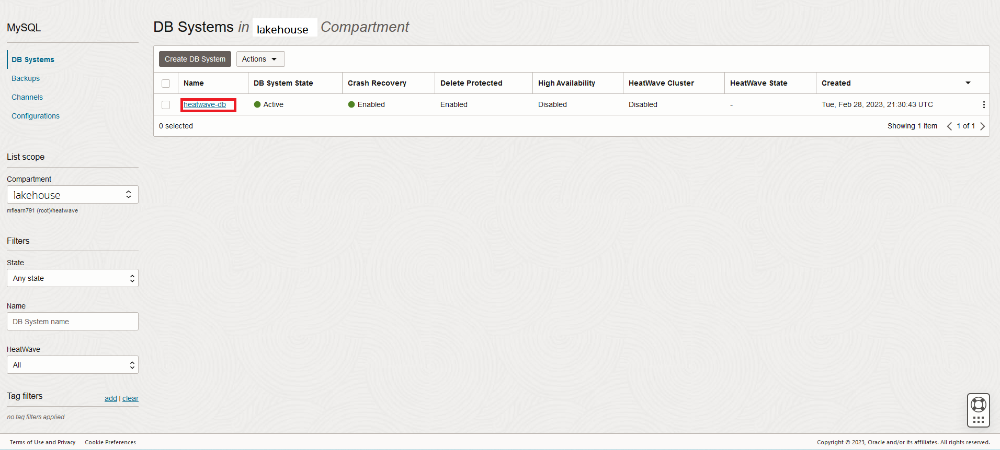
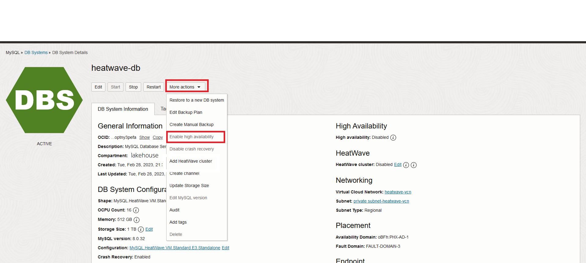
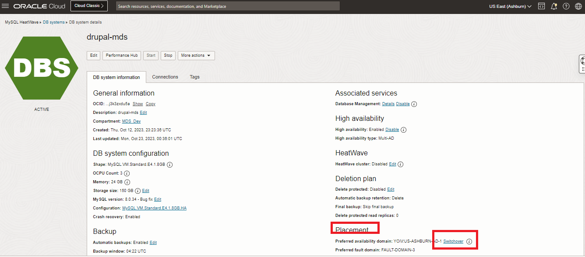

# MySQL HeatWave High Availability 구성

## 세션 소개

High availability DB system은 세 개의 MySQL 인스턴스로 구성됩니다. 1개의 primary instance와 2개의 secondary instances입니다. primary instance에 쓰는 모든 데이터는 secondary instances에 복사됩니다. high availability DB system은 한 인스턴스가 실패하면 다른 인스턴스가 인계하여 데이터 손실이 없고 가동 중지 시간이 최소화되도록 보장합니다.

_Estimated Time:_ 15 minutes 소요

### 목표

이 Lab에서는 다음 작업을 안내해 드립니다.

- High Availability Enable
- Switchover 수행

### Prerequisites (필수사항)

- An Oracle Trial or Paid Cloud Account
- MySQL Shell에 사용경험

## 작업 1: High Availability Enable

standalone DB 시스템에서 high availability을 활성화하면 기존 MySQL 인스턴스를 primary instance로 사용하고 두 개의 secondary instances를 더 만든 다음 primary instance에 있는 데이터를 secondary instances에 복제하여 high availability DB 시스템을 만듭니다.

DB 시스템에서 고가용성을 활성화하려면 다음을 수행하십시오:

1. Navigation Menu > Databases > HeatWave > DB Systems 로 이동합니다.

2. `heatwave-db` Database System link 클릭합니다.

    

3. DB Systems 리스트에서, **heatwave-db** system 클릭하고 **More Action -> Enable high availability** 클릭합니다.
    

4. In the Enable high availability dialog box, Enable 클릭합니다.

    DB 시스템이 UPDATING 상태로 전환됩니다. 선택된 configuration이 DB 시스템에 적용되고 secondary instances들이 primary instance에서 복제됩니다. 업데이트 프로세스가 실패하면 DB 시스템이 standalone 실행형 상태로 돌아갑니다. 작업 요청(work request)에서 정보를 확인하세요.

## 작업 2: Switchover 수행

secondary MySQL instances 중 하나를 수동으로 primary instance로 승격할 수 있습니다. 이 과정을 switchover라고 합니다.

switchover를 수행하면 primary instance의 새로 선택된 배치(placement)로 기본 배치(placement)가 변경됩니다. 즉, primary instance의 현재 배치는 기본 배치와 동일합니다. DB 시스템 엔드포인트(endpoint)의 IP 주소는 변경되지 않습니다. switchover는 primary instance가 새로 승격된(promoted) instance로 리디렉션되는 동안 짧은 다운타임을 초래합니다.

이 작업에는 다음이 필요합니다:
    - 고가용성(high availability)이 활성화된 실행 중인 DB 시스템

현재 primary instance 에서 secondary instances중 하나로 전환하려면 다음을 수행하십시오.:

1. navigation menu를 엽니다. MySQL HeatWave에서 DB 시스템을 클릭합니다.
2. 목록 범위에서 compartment을 선택하세요.
3. DB systems 리스트에서, 전환하려는 DB 시스템을 찾고, 그리고 다음을 수행하세요:
DB 시스템 이름을 클릭하면 DB 시스템 세부 정보 페이지가 열립니다. Placement section에서 Switchover 선택하세요.
    

4. Switchover 대화 상자에서 설정에 따라 전환하려는 인스턴스가 포함된 가용성(availability) 또는 오류 도메인(fault domain)을 선택합니다.

5. Switchover 클릭합니다.

DB 시스템의 상태가 업데이트 중으로 변경되고, 선택한 instance가 primary instance가 됩니다.

이제 next lab으로 진행할 수 있습니다.

## Acknowledgements

- **Author** - Perside Foster, MySQL Principal Solution Engineering
- **Contributors** - Mandy Pang, MySQL Principal Product Manager,  Nick Mader, MySQL Global Channel Enablement & Strategy Manager, Selena Sanchez, MySQL Solution Engineering
- **Last Updated By/Date** - kihyuk, MySQL Solution Engineering, July 2024
