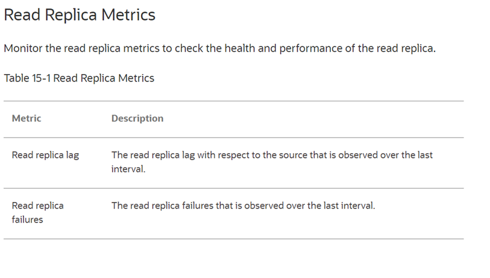

# MySQL HeatWave Read Replicas 설정

## 세션 소개

읽기 복제본은 동일한 지역 내의 DB 시스템의 기본 MySQL 인스턴스의 읽기 전용 복사본입니다. 읽기 복제본은 DB 시스템에 더 높은 성능과 내구성을 제공합니다. 읽기를 확장하여 쿼리 대기 시간을 줄입니다. 소스 DB 시스템에 적용한 모든 업데이트는 비동기적으로 읽기 복제본에 복사됩니다.

자세한 내용은 OCI 문서를 참조하세요:
[MySQL HeatWave Read Replica](
https://docs.oracle.com/en-us/iaas/mysql-database/doc/read-replica.html).

_Estimated Time:_ 20 minutes 소요

### 목표

이 Lab에서는 다음 작업을 안내해 드립니다.:

- Read Replica 생성
- Read Replica 변경
- Read Replica Metrics 모니터링
- read replica load balancer 설명
- read replica 접속

### Prerequisites (필수사항)

- An Oracle Trial or Paid Cloud Account
- MySQL Shell에 사용경험

## 작업 1: Read Replica 생성

Console(콘솔)을 사용하여 DB 시스템의 읽기 복제본을 만듭니다.

이 작업에는 다음이 필요합니다:
    - 실행 중인 DB 시스템.

읽기 복제본을 만들려면 다음을 수행하세요.

1. 탐색 메뉴를 열고 데이터베이스를 선택합니다. MySQL HeatWave에서 DB 시스템을 클릭합니다.
2. 목록 범위에서 compartment을 선택합니다.
3. DB 시스템의 이름을 클릭하면 DB 시스템 세부 정보 페이지가 열립니다.
4. Resources 아래, Read replicas 클릭합니다.
5. Create read replica 클릭합니다.
6. 읽기 복제본(Create read replica) 만들기 패널에서 다음 정보를 제공합니다.
    - Name: 읽기 복제본의 이름을 지정합니다. 이름을 정의하지 않으면 MySQL HeatWave Service가 MysqlReadReplicaDateTime 형식으로 생성합니다.
    - Description: (선택 사항) 읽기 복제본에 대한 설명을 지정합니다.
    - Select a shape: (선택 사항) Select shape를 클릭하여 읽기 복제본의 모양을 변경합니다. 최소 8개의 ECPU 또는 4개의 OCPU가 있는 모양을 선택할 수 있습니다. 기본적으로 읽기 복제본은 DB 시스템과 동일한 모양을 사용합니다. 지원되는 모양을 참조하세요.
    - Show advanced options: (선택 사항) 읽기 복제본을 추가로 구성할 수 있는 탭 그룹을 열려면 옵션을 클릭하세요.
    - Deletion plan: (선택 사항) 읽기 복제본과 관련 DB 시스템을 삭제 작업으로부터 보호하려면 삭제 보호 상자를 체크합니다. 기본적으로 읽기 복제본과 DB 시스템은 삭제 보호되지 않습니다. 읽기 복제본이나 관련 DB 시스템을 삭제하려면 옵션 선택을 취소합니다.
        > **참고** 삭제 보호 설정은 개별 읽기 복제본에 적용됩니다. 읽기 복제본이 삭제 보호된 경우 DB 시스템을 삭제할 수 없습니다.
    - Configuration:
        - Select a configuration: (선택 사항) 구성 선택을 클릭하여 읽기 복제본 모양의 구성을 변경합니다.
        > **참고** 읽기 복제본의 모양을 변경한 경우 구성을 선택해야 합니다.

    - MySQL version: 읽기 복제본의 MySQL 버전을 선택합니다. 기본적으로 읽기 복제본은 연결된 DB 시스템과 동일한 MySQL 버전을 사용합니다. MySQL 서버 버전을 참조하세요.
    - Tags: tab을 사용하여 테넌시의 리소스를 구성하고 추적합니다:
        - Tag namespace: 태그 이름을 선택하세요.
        - Tag key: 태그 키를 선택하세요.
        - Tag value: 태그에 대한 값을 지정하세요.
        - Add tag: 더 많은 태그를 추가하려면 이 옵션을 클릭하세요.
        - 
7. Create read replica 클릭합니다.

    **읽기 복제본이 생성되었습니다.**

## 작업 2: Read Replica 변경

읽기 복제본의 세부 정보와 설정을 편집할 수 있습니다.

Console(콘솔)을 사용하여 DB 시스템의 읽기 복제본을 편집합니다.

이 작업에는 다음이 필요합니다:
    - A running DB system.
    - A read replica.

읽기 복제본을 편집하려면 다음을 수행하세요:

1. 탐색 메뉴를 열고 데이터베이스를 선택합니다. MySQL HeatWave에서 DB 시스템을 클릭합니다.
2. 목록 범위에서 compartment을 선택하세요.
3. DB 시스템의 이름을 클릭하면 DB 시스템 세부 정보 페이지가 열립니다.
4. Resources 아래, Read replicas 클릭합니다.
5. 다음 중 하나를 수행하세요:
    - 읽기 복제본(read replica)과 같은 줄에 있는 Actions 메뉴에서 편집(Edit)을 클릭합니다.
    - 읽기 복제본(read replica)의 이름을 클릭하여 읽기 복제본 세부 정보 페이지를 연 다음 편집(Edit)을 클릭합니다.

6. 읽기 복제본(read replica) 편집 패널에서 다음 정보를 변경하세요:

    - Name: 필요한 경우 읽기 복제본의 이름을 변경합니다.
    - Description: (선택 사항) 필요한 경우 읽기 복제본의 설명을 변경합니다.
    - Select a shape: (선택 사항) Select shape를 클릭하여 읽기 복제본의 모양을 변경합니다. 최소 8개의 ECPU 또는 4개의 OCPU가 있는 모양을 선택할 수 있습니다. 기본적으로 읽기 복제본은 DB 시스템과 동일한 모양을 사용합니다. 지원되는 모양을 참조하세요.
    - Show advanced options: (선택 사항) 읽기 복제본을 추가로 구성할 수 있는 탭 그룹을 열려면 옵션을 클릭하세요.
        - Deletion plan: (선택 사항) 필요한 경우 삭제 보호 설정을 변경합니다.
        >**참고** 삭제 보호 설정은 개별 읽기 복제본에 적용됩니다. 읽기 복제본이 삭제 보호된 경우 DB 시스템을 삭제할 수 없습니다.
        - Configuration:
            - Select a configuration: (선택 사항) 구성 선택을 클릭하여 읽기 복제본 모양의 구성을 변경합니다.
            >**참고** 읽기 복제본의 모양을 변경한 경우 구성을 선택해야 합니다.
        - MySQL version: 필요한 경우 읽기 복제본의 MySQL 버전을 변경합니다. MySQL 서버 버전을 참조하세요.
    - Tags: tab을 사용하여 테넌시의 리소스를 구성하고 추적합니다:
        - Tag namespace: 태그 이름을 선택하세요.
        - Tag key: 태그 키를 선택하세요.
        - Tag value: 태그에 대한 값을 지정하세요.
        - Add tag: 더 많은 태그를 추가하려면 이 옵션을 클릭하세요
7. Save changes 클릭합니다.

## 작업 3: Read Replica Metrics 모니터링

Console(콘솔)을 사용하여 읽기 복제본(read replica) 메트릭을 모니터링합니다.

1. 탐색 메뉴를 열고 데이터베이스를 선택합니다. MySQL HeatWave에서 DB 시스템을 클릭합니다.
2. 목록 범위에서 compartment을 선택하세요.
3. DB 시스템 목록에서 해당 DB 시스템을 찾고, DB 시스템 이름을 클릭하여 DB 시스템 세부 정보 페이지를 엽니다.
4. Resources 목록에서 메트릭(Metrics)을 선택합니다.
5. 메트릭(Metrics) 데이터 필터에서 읽기 복제본(read replica)을 선택하여 읽기 복제본 메트릭을 필터링하고 확인합니다.
6. (선택 사항) 메트릭에 대한 쿼리를 편집하고 생성하려면 옵션을 클릭한 다음 7. 메트릭 탐색기에서 쿼리 보기를 선택합니다.
7. (선택 사항) 쿼리에 대한 알람을 생성하려면 옵션을 클릭한 다음 이 쿼리에 대한 알람 생성을 선택합니다.
8. 읽기 복제본(read replica) 메트릭을 모니터링하여 읽기 복제본의 상태와 성능을 확인합니다.
    

## 작업 4: read replica load balancer 설명

읽기 복제본 로드 밸런서(read replica load balancer)는 읽기 복제본 간에 읽기 트래픽을 분산하는 데 도움이 됩니다. 첫 번째 읽기 복제본을 만들면 읽기 복제본 로드 밸런서(read replica load balancer)가 자동으로 만들어지고 모든 읽기 복제본이 로드 밸런서에 백엔드로 추가됩니다. 어떤 이유로든 읽기 복제본 로드 밸런서가 만들어지지 않으면 읽기 복제본도 만들어지지 않습니다. 읽기 복제본 로드 밸런서는 연결된 DB 시스템을 삭제할 때만 삭제됩니다.

자세한 내용은 OCI 문서를 참조하세요:
[Read replicas on MySQL Database Service](https://blogs.oracle.com/mysql/post/read-replicas-mysql-database-service).

## 작업 5: read replica 접속

DB 시스템에 연결하는 것과 비슷한 방식, 즉 컴퓨팅 인스턴스(compute instance), 배스천 세션(bastion session) 또는 VPN을 사용하여 읽기 복제본에 연결할 수 있습니다. **Lab 3: MySQL Shell 및 Workbench를 사용하여 HeatWave에 연결**을 참조하세요.

자세한 내용은 OCI 문서를 참조하세요:
[Overview of Read Replica](https://docs.oracle.com/en-us/iaas/mysql-database/doc/overview-read-replica.html#:~:text=You%20can%20connect%20to%20a,the%20read%20replica%20lag%20metric).

이제 **다음 Lab으로 진행**할 수 있습니다.

## Acknowledgements

- **Author** - Perside Foster, MySQL Principal Solution Engineering
- **Last Updated By/Date** - kihyuk, MySQL Solution Engineering, July 2024
