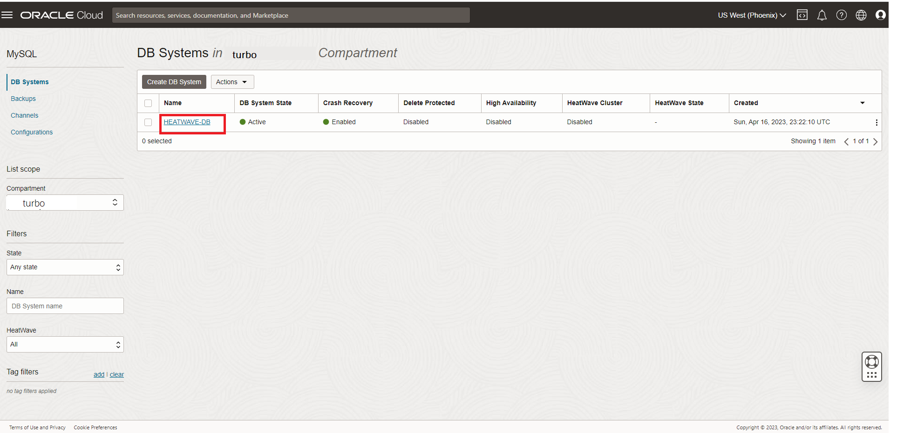
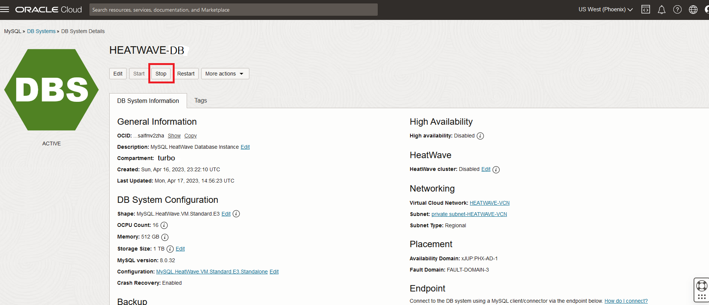
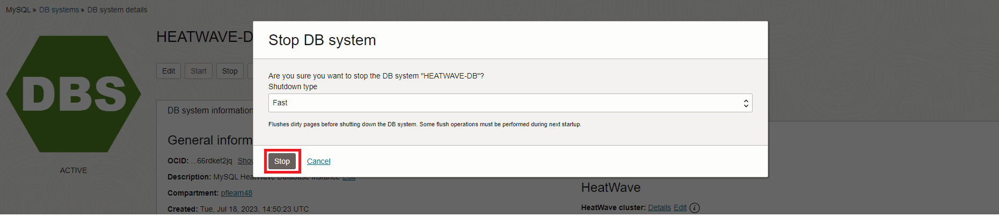
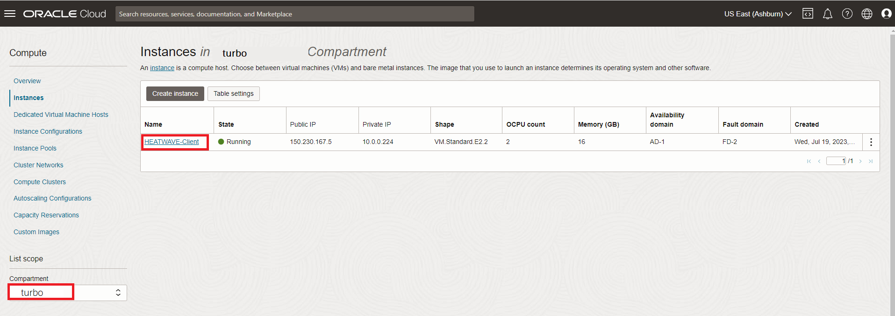
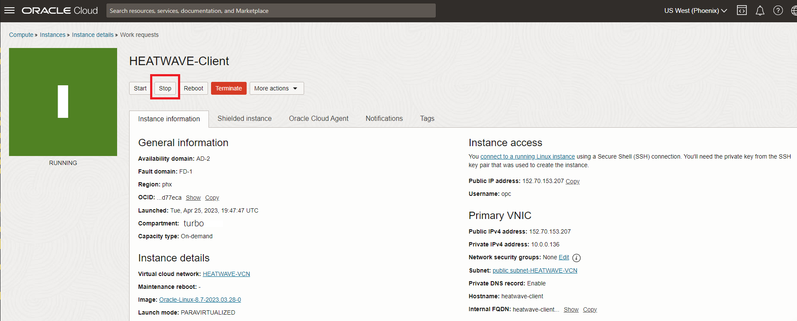
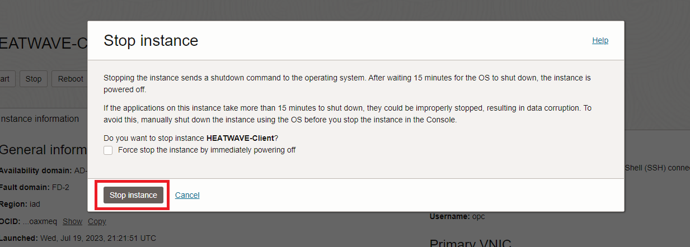

# OCI Services 중단

## 세션 소개

이 Lab에서는 콘솔을 사용하여 이 워크숍에서 만든 모든 서비스를 중지합니다.

_Estimated Time:_ 5 minutes 소요

### 목표

이 Lab에서는 다음 작업을 안내해 드립니다.:

- HeatWave Database Instance 중단
- Compute Instance 중단

### Prerequisites (필수사항)

- An Oracle Trial or Paid Cloud Account
- MySQL Shell에 사용경험

## 작업 1: HEATWAVE-DB Database Instance 중단

1. Navigation menu 선택하고 아래처럼 이동합니다.
    - Databases
    - MySQL
    - DB Systems
2. **root** Compartment 선택하면 DB Systems 리스트가 표시됩니다.
    

3. Displayed Instance에서 **Stop** 클릭합니다.
    

4. Displayed **Stop DB system** dialog box에서, **Stop** 버튼을 클릭합니다.
    

## 작업 2: HEATWAVE-Client Compute Instance 중단

1. Navigation menu 선택하고 아래처럼 이동합니다. 
    - Compute
    - Instances

2. **root** Compartment 선택하면 Compute intances 리스트가 표시됩니다. Compute Instances 리스트에서, **HEATWAVE-Client** 인스턴스를 클릭하세요.
    

3. Displayed Instance에서 **Stop** 클릭합니다.
    

4. Displayed **Stop Instance** dialog box에서, **Stop instance** 버튼을 클릭합니다.
    

**축하합니다! Workshop을 성공적으로 마쳤습니다.**

## 더 알아보기

- [Oracle Cloud Infrastructure MySQL Database Service Documentation](https://docs.cloud.oracle.com/en-us/iaas/MySQL-database)
- [MySQL Database Documentation](https://www.MySQL.com)

## Acknowledgements

- **Author** - Perside Foster, MySQL Principal Solution Engineering
- **Contributors** - Mandy Pang, MySQL Principal Product Manager,  Nick Mader, MySQL Global Channel Enablement & Strategy Manager, Selena Sanchez, MySQL Solution Engineering
- **Last Updated By/Date** - kihyuk, MySQL Solution Engineering, July 2024
