# 검색 증강 생성(Retrieval Augmented Generation) 수행 

## 세션 소개

데이터베이스 내 벡터 저장소와 검색 증강 생성(RAG)을 사용하면 HeatWave 생태계 내에서 자연어를 사용하여 개체 스토리지에 저장된 비정형 문서를 로드하고 쿼리할 수 있습니다.

_Estimated Time:_ 30 minutes 소요

### 목표

이 Lab에서는 다음 작업을 안내해 드립니다 :

- HeatWave 파일 다운로드.
- Object Storage에 버킷(bucket)과 폴더(folder) 생성.
- 버킷(bucket) 폴더에 파일 업로드.
- 동적 그룹(dynamic group) 구성.
- 동적 그룹(dynamic group)에 대한 정책(policies) 작성.
- vector store 설정.
- 벡터 검색(vector search)을 수행.

### Prerequisites (필요사항)

- An Oracle Trial, Paid or LiveLabs Cloud Account
- MySQL Shell에 사용경험

## 작업 1: HeatWave 파일 다운로드

벡터 검색(vector search)을 수행할 HeatWave 파일을 다운로드합니다.

1. 다음 파일을 다운로드하여 로컬 컴퓨터에 저장하세요.

    - https://www.oracle.com/a/ocom/docs/mysql-heatwave-technical-brief.pdf
    - https://www.oracle.com/a/ocom/docs/mysql/mysql-heatwave-on-aws-brief.pdf
    - https://www.oracle.com/a/ocom/docs/mysql/mysql-heatwave-ml-technical-brief.pdf
    - https://www.oracle.com/a/ocom/docs/mysql/mysql-heatwave-lakehouse-technical-brief.pdf

    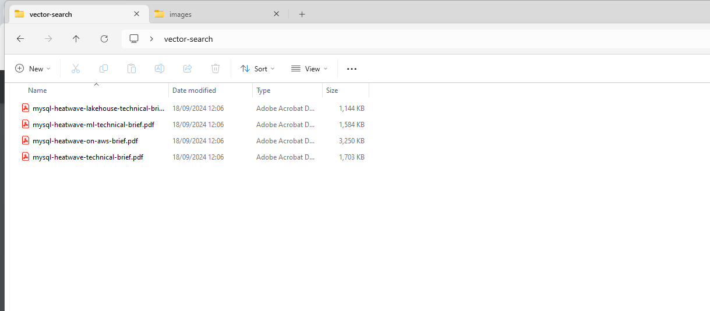

## 작업 2: Object Storage에 버킷(bucket)과 폴더(folder) 생성

Object Storage 서비스는 안정적이고, 안전하고, 확장 가능한 Object Storage를 제공합니다. Object Storage는 버킷을 사용하여 파일을 보관합니다.

1. **Navigation menu**를 열고 **Storage**를 클릭합니다. **Object Storage & Archive Storage**에서 **Buckets**을 클릭합니다.

    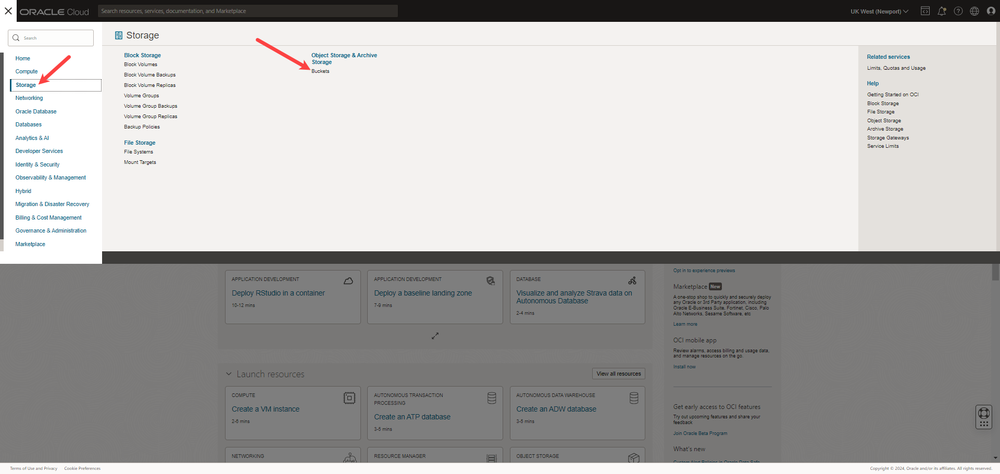

2. **heatwave-genai** compartment에서, **Bucket 생성** 클릭합니다. 

    

3. **Bucket Name**을 입력하고 나머지 필드는 기본값을 그대로 사용합니다.

    ```bash
    <copy>bucket-vector-search</copy>
    ```

4. **Create** 클릭합니다.

    

5. 버킷이 생성되면 버킷 이름을 클릭하여 **Bucket Details** 페이지를 엽니다.

    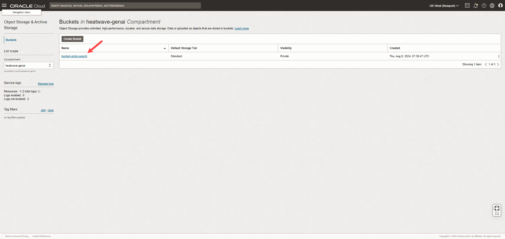

6. 버킷 이름과 **Namespace**를 복사하여 나중에 참조할 수 있도록 어딘가에 붙여넣습니다.

    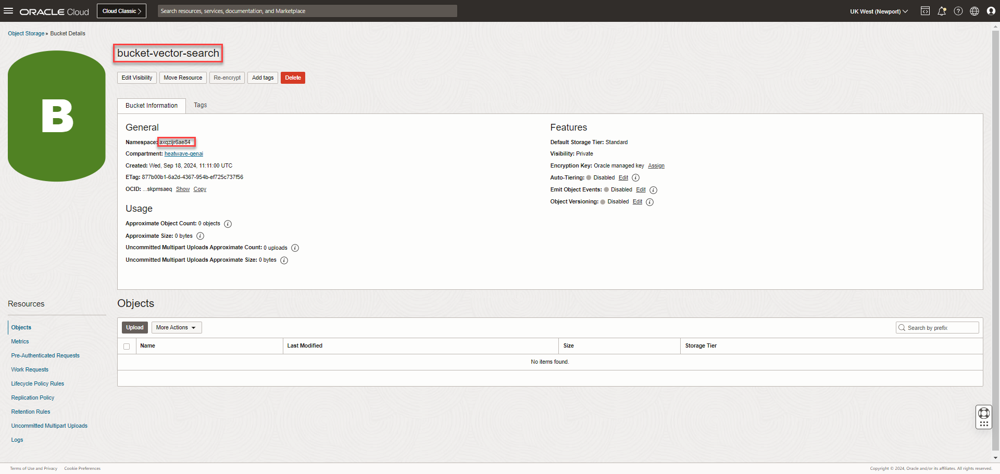

7. **Objects**에서 **More Actions**을 클릭한 다음 **Create New Folder**를 클릭합니다.

    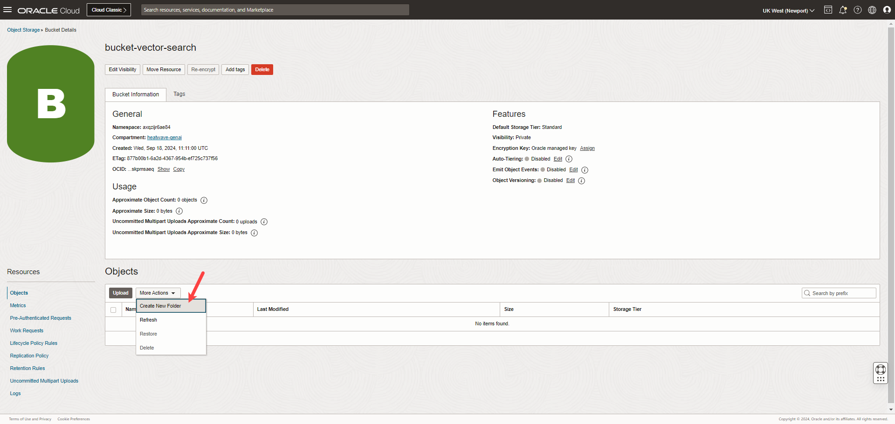

8. **Create New Folder** 페이지에서 폴더의 **Name**을 입력하고 향후 참조를 위해 기록해 둡니다.

    ```bash
    <copy>bucket-folder-heatwave</copy>
    ```

    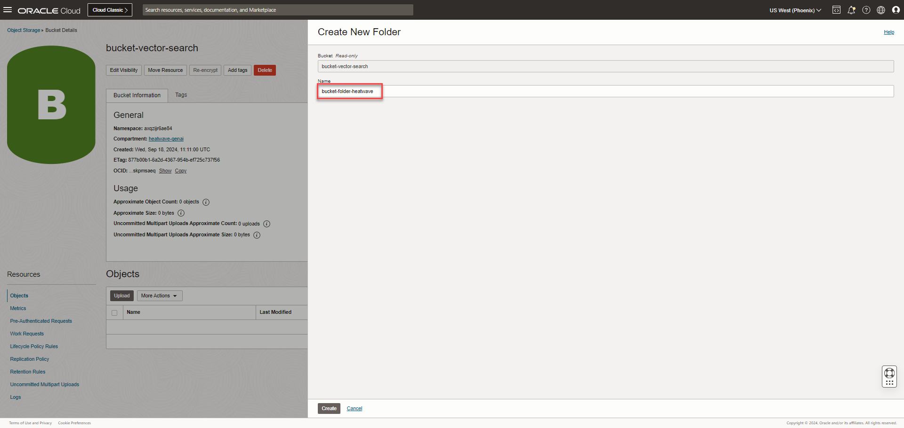

9. **Create** 클릭합니다.

## 작업 3: 버킷 폴더(bucket folder)에 파일 업로드

1.  **Bucket Details** 페이지의 **Objects** 아래에서 버킷 폴더 이름을 클릭합니다.

    

2.  **Upload** 클릭합니다.

    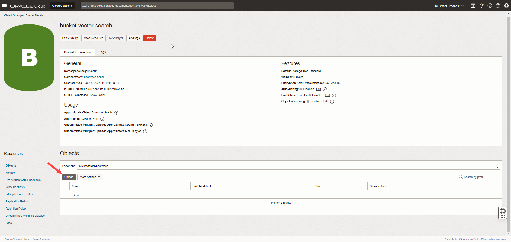

3. **select files**을 클릭하면 파일 선택 대화 상자가 표시됩니다.

4. 작업 1에서 다운로드한 파일을 선택하고 **Upload**를 클릭합니다.

    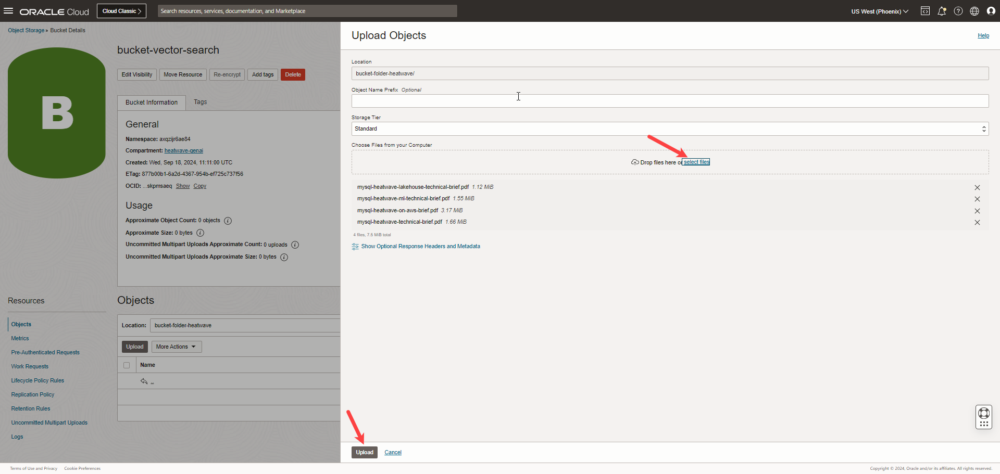

5. 파일 상태가 **Finished**로 표시되면 **Close**를 클릭하여 버킷으로 돌아갑니다.

    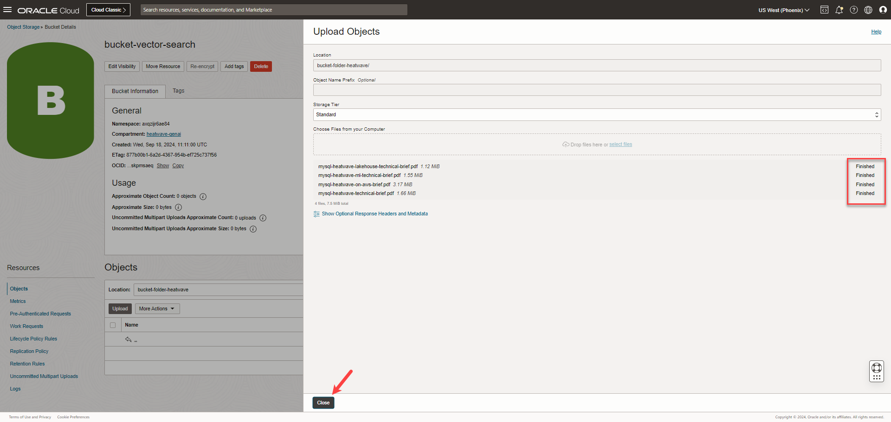


## 작업 4: 동적 그룹(dynamic group) 만들기

동적 그룹(Dynamic groups)을 사용하면 Oracle Cloud Infrastructure 리소스(resources)를 주체(principal)로 그룹화할 수 있습니다. 그런 다음 동적 그룹(Dynamic groups)이 Oracle Cloud Infrastructure 서비스에 액세스할 수 있도록 허용하는 정책(policies)을 만들 수 있습니다.

1. **Navigation menu**를 열고 **Identity & Security**을 클릭한 다음 **Identity**에서 **Compartments**을 클릭합니다. 

    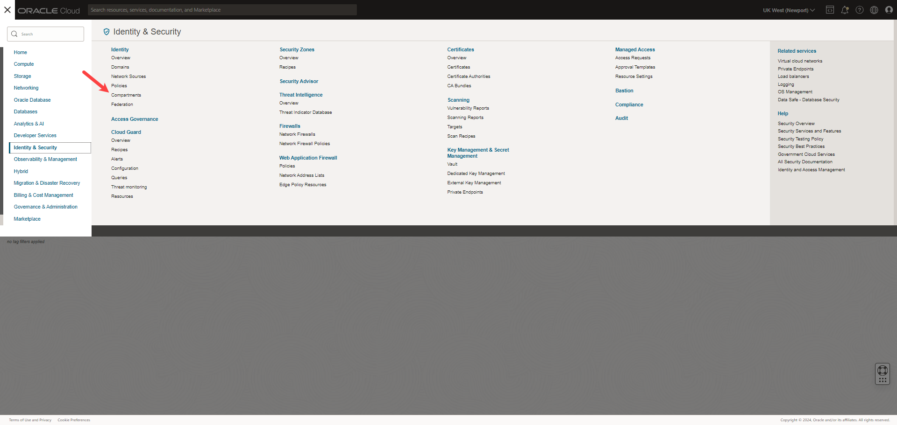

2. **Compartments** 페이지에서 Compartments의 OCID 위에 마우스를 올려놓고 **Copy**를 클릭한 후 나중에 참조할 수 있도록 OCID를 어딘가에 붙여넣습니다.

    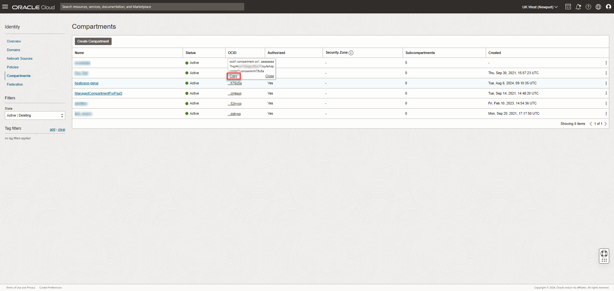

3. **Navigation menu**를 열고 **Identity & Security**을 클릭한 다음 **Identity**에서 **Domains**을 클릭합니다.

    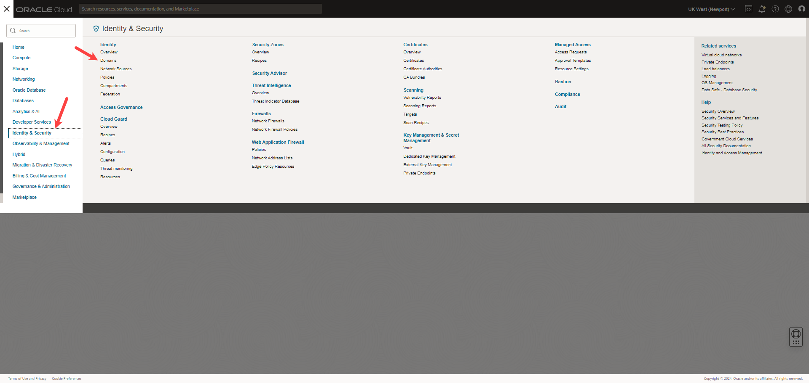

4. **Default** 도메인을 클릭합니다. 기본 ID 도메인을 사용하여 OCI 콘솔에 로그인했음을 유의하세요.

    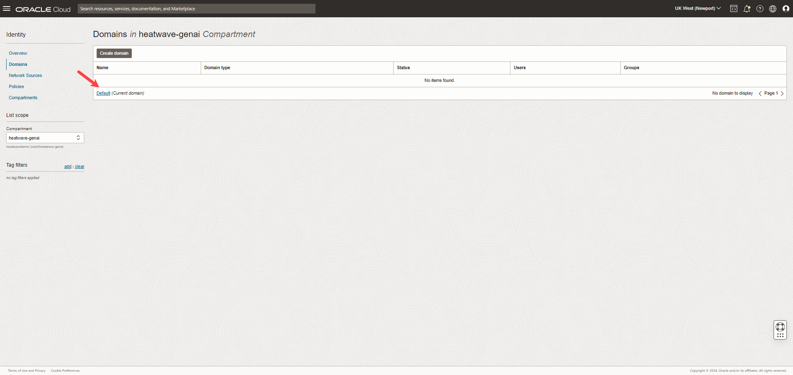

5. **Identity domain**에서 **Dynamic groups**을 클릭합니다.

    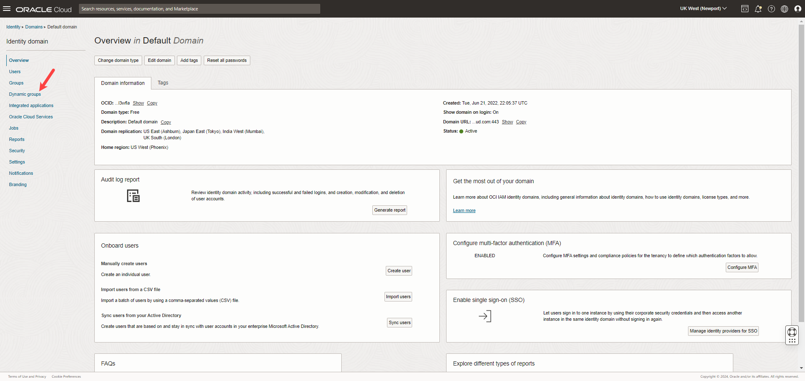

6. **동적 그룹 만들기 - Create dynamic group**를 클릭합니다.

7. **동적 그룹(Create dynamic group) 만들기** 페이지에서 동적 그룹의 **Name**과 **Description**을 입력합니다. *참고* 동적 그룹의 이름.  

    **이름**:
    
    ```bash
    <copy>heatwave-genai-dynamic-group</copy>
    ```
    **Description**:

    ```bash
    <copy>Dynamic group for HeatWave GenAI</copy>
    ```

    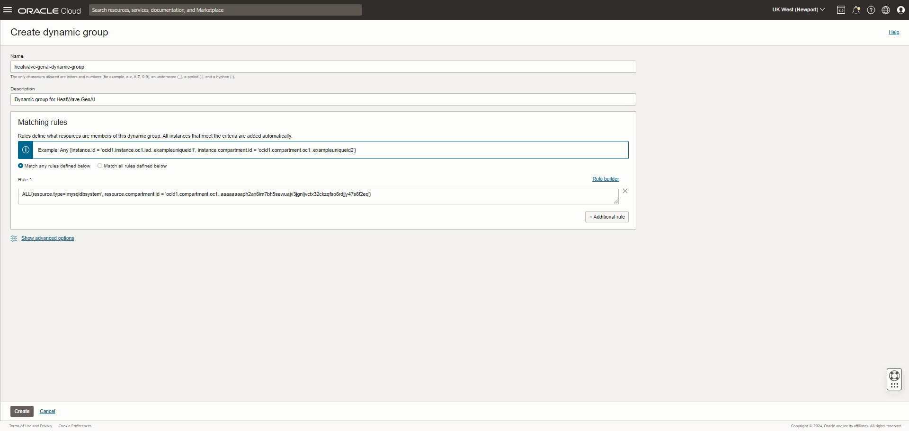

8. 다음 규칙을 입력하세요 : 

    ```bash
    <copy>ALL{resource.type='mysqldbsystem', resource.compartment.id = '<OCIDComparment>'}</copy>
    ```
    OCID Comparment를 작업 4 항목 1과 2에서 복사한 compartment의 OCID로 바꾸세요.

    For example:

    ```bash
    <copy>ALL{resource.type='mysqldbsystem', resource.compartment.id = 'ocid1.compartment.oc1..aaaaaaaad2mplktxh7unkxodwcqpvtj32ierpvvixvu7qedzsfonq'}</copy>
    ```

    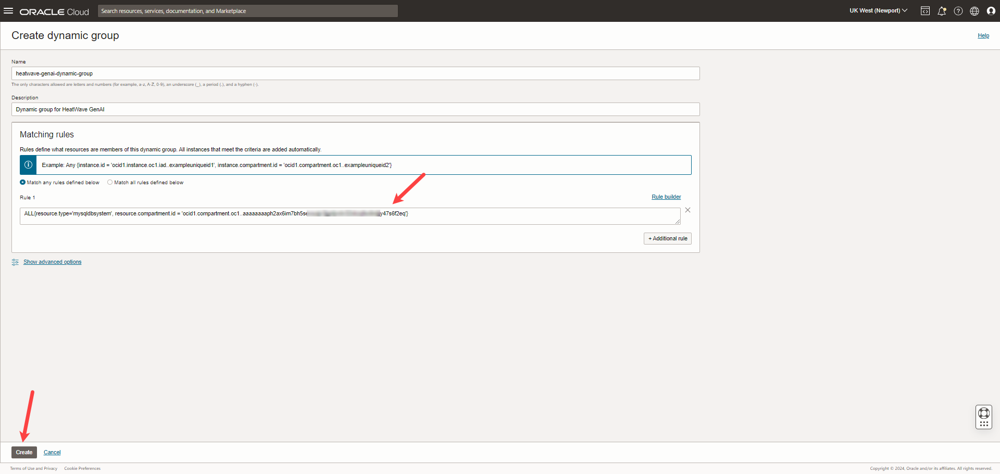

9. **Create** 클릭합니다.


## 작업 5: 동적 그룹(dynamic group)이 Object Storage 버킷에 액세스할 수 있도록 정책(policies)을 작성합니다.

HeatWave에서 Object Storage에 액세스하려면 동적 그룹(dynamic group)이 버킷과 해당 폴더에 액세스할 수 있도록 하는 정책(policy)을 정의해야 합니다.

 1. **Navigation menu**를 열고 **Identity & Security**을 클릭한 다음 **Identity**에서 **Policies**을 클릭합니다.

    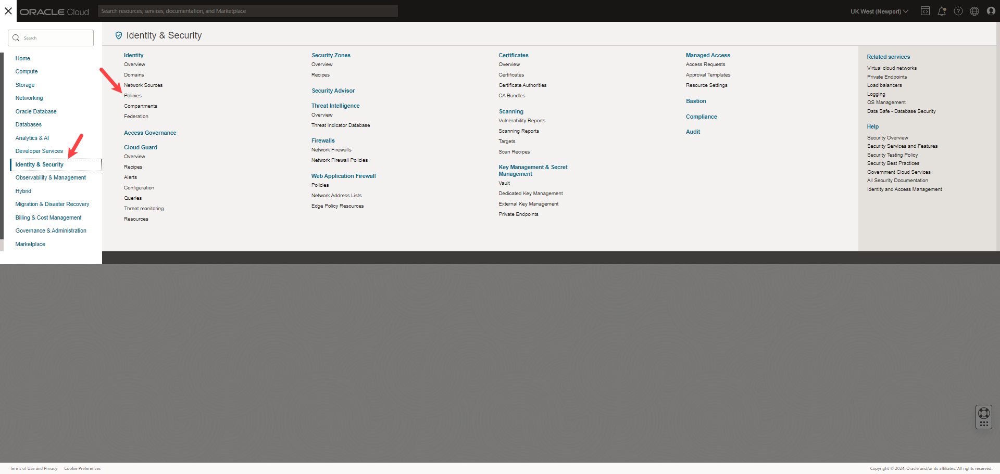

 2. **Create Policy** 클릭합니다.

   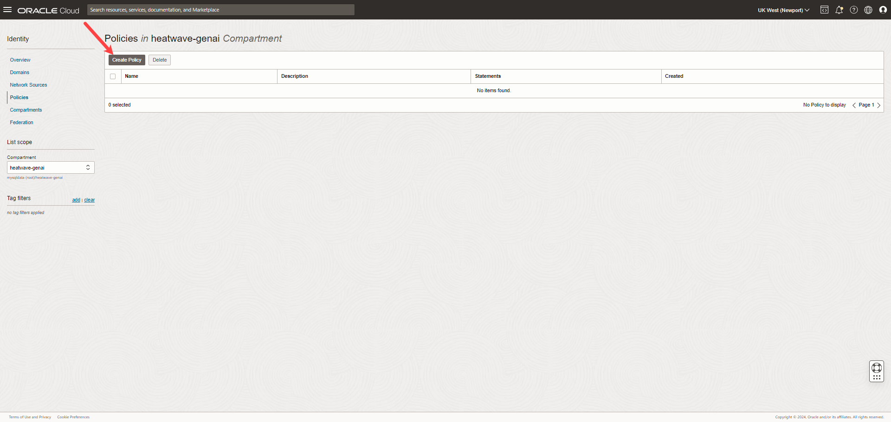

3. **Create policy** 페이지에서 정책의 **이름**과 **설명**을 입력합니다.

    **이름**:

    ```bash
    <copy>heatwave-genai-policy</copy>
    ```
    **Description**:
    ```bash
    <copy>Policy for HeatWave GenAI</copy>
    ```

4. Compartment가 **heatwave-genai** 인지 확인하세요.

5. **Show manual editor** 버튼을 토글하고 다음 정책을 붙여넣습니다. *참고* 기본 도메인을 사용하여 OCI 콘솔에 로그인한 경우에만 다음 명령을 사용할 수 있습니다.

    ```bash
    <copy>Allow dynamic-group <DynamicGroupName> to read buckets in compartment <CompartmentName></copy>
    <copy>Allow dynamic-group <DynamicGroupName> to read objects in compartment <CompartmentName></copy>
    ```
    DynamicGroupName을 동적 그룹의 이름으로, CompartmentName을 compartment의 이름으로 바꿉니다.

    For example:
        
    ```bash
    <copy>Allow dynamic-group heatwave-genai-dynamic-group to read buckets in compartment heatwave-genai</copy>
    <copy>Allow dynamic-group heatwave-genai-dynamic-group to read objects in compartment heatwave-genai</copy>
    ```

  6. **Create** 클릭합니다.

    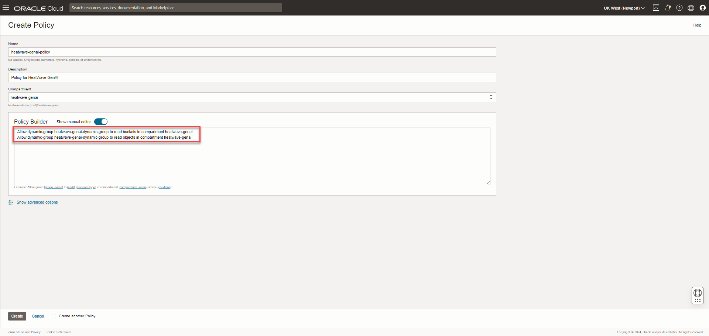


<!-- /*## Task 3: Create a Pre-Authenticated Request

Pre-authenticated requests provide a way to let you access a bucket or an object without having your own credentials.

1. In the **Bucket Details** page, under **Resources**, click **Pre-Authenticated Request**, and then click **Create Pre-Authenticated Request**.

    

2. In the **Create Pre-Authenticated Request** dialog box, do the following:
    - Enter the **Name**.
    - Select **Bucket** in **Pre-Authenticated Request Target**.
    - Select **Permits object reads** in **Access Type**.
    - Select **Enable Object Listing**.
    - You can choose to increase the **Expiration** date of the Pre-Authenticated Request.
    - Click **Create Pre-Authenticated Request**. 

    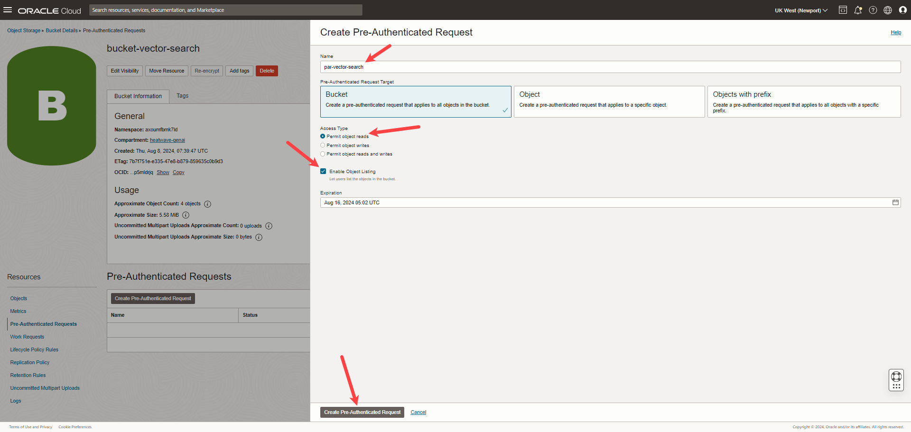

3. Copy the URL that appears in the **Pre-Authenticated Request Details** dialog box, paste the URL somewhere for future reference, and click **Close**.

    */ -->


## 작업 6: 벡터 스토어 (vector store) 설정

1. Cloud shell에서 MySQL shell를 사용하여 아래와 같이 Heatwave 서비스 접속합니다.

    


2. 새로운 스키마를 생성하고 선택합니다.

    ```bash
    <copy>create database genai_db;</copy>
	<copy>use genai_db;</copy>
    ```

   

2. 다음 프로시저(procedure)를 호출하여 작업 관리에 사용되는 스키마를 생성합니다.

    ```bash
    <copy>select mysql_task_management_ensure_schema();</copy>
    ```

    

3. Object Storage에서 파일을 수집하고 벡터 임베딩(vector embeddings)을 생성한 다음 벡터 임베딩을 HeatWave Cluster에 로드합니다.

    ```bash
    <copy>call sys.VECTOR_STORE_LOAD('oci://BucketName@Namespace/Path/', '{"table_name": "VectorStoreTableName"}');</copy>
    ```
    Replace the following:

    - BucketName: 작업 2에서 생성한 OCI 개체 저장소 버킷 이름(bucket name).
    - Namespace: 작업 2, 6단계에서 복사한 Object Storage 버킷 네임스페이스(namespace)의 이름.
    - Path: 작업 2, 7단계에서 생성한 소스 파일이 포함된 폴더의 경로.
    - VectorStoreTableName: 벡터 저장소 테이블에 원하는 이름.
   
    For example:

    ```bash
    <copy>call sys.VECTOR_STORE_LOAD('oci://bucket-vector-search@axqzijr6ae84/bucket-folder-heatwave/', '{"table_name": "vector_embedding"}');</copy>
    ```
    


4. 몇 분간 기다렸다가 벡터 임베딩 테이블에 데이터가 임베딩이 로드되었는지 확인하세요.

    ```bash
    <copy>select count(*) from <EmbeddingsTableName>;</copy>
    ```
    For example:
    ```bash
    <copy>select count(*) from vector_embedding; </copy>
    ```
    벡터 임베딩을 만드는 데 몇 분이 걸립니다. 출력에 숫자 값이 표시되어야 하며, 이는 임베딩이 테이블에 성공적으로 로드되었음을 의미합니다.

    

## 작업 7: Perform retrieval augmented generation

HeatWave retrieves content from the vector store and provide that as context to the LLM. This process is called as retrieval-augmented generation or RAG. This helps the LLM to produce more relevant and accurate results for your queries.

1. Set the @options session variable to specify the table for retrieving the vector embeddings, and click **Enter**.

    ```bash
    <copy>set @options = JSON_OBJECT("vector_store", JSON_ARRAY("<DBName>.<EmbeddingsTableName>"));</copy>
    ```

    For example:

    ```bash
    <copy>set @options = JSON_OBJECT("vector_store", JSON_ARRAY("genai_db.livelab_embedding_pdf"));</copy>
    ```

2. Set the session @query variable to define your natural language query, and click **Enter**.

    ```bash
    <copy>set @query="<AddYourQuery>";</copy>
    ```
    
    Replace AddYourQuery with your natural language query.

    For example:

    ```bash
    <copy>set @query="What is HeatWave AutoML?";</copy>
    ```

3. Retrieve the augmented prompt, using the ML_RAG routine, and click **Execute the selection or full block on HeatWave and create a new block**.

    ```bash
    <copy>call sys.ML_RAG(@query,@output,@options);</copy>
    ```

    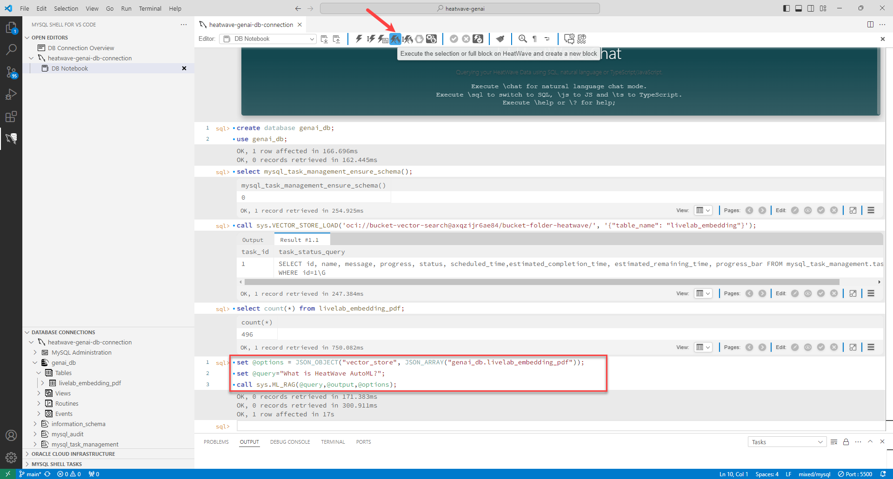

4. Print the output:

    ```bash
    <copy>select JSON_PRETTY(@output);</copy>
    ```
    
    Text-based content that is generated by the LLM in response to your query is printed as output. The output generated by RAG is comprised of two parts:

    - The text section contains the text-based content generated by the LLM as a response for your query.

    - The citations section shows the segments and documents it referred to as context.

    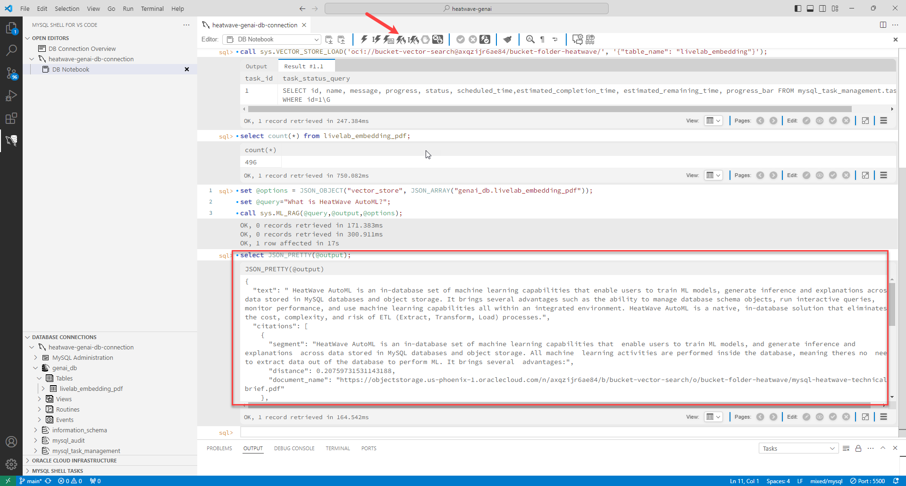

## Learn More (관련 자료)

- [HeatWave User Guide](https://dev.mysql.com/doc/heatwave/en/)

- [HeatWave on OCI User Guide](https://docs.oracle.com/en-us/iaas/mysql-database/index.html)

- [MySQL Documentation](https://dev.mysql.com/)


## Acknowledgements

- **Author** - Aijaz Fatima, Product Manager
- **Contributors** - Mandy Pang, Senior Principal Product Manager, Aijaz Fatima, Product Manager
- **Last Updated By/Date** - kihyuk, MySQL Solution Engineering, December 2024
