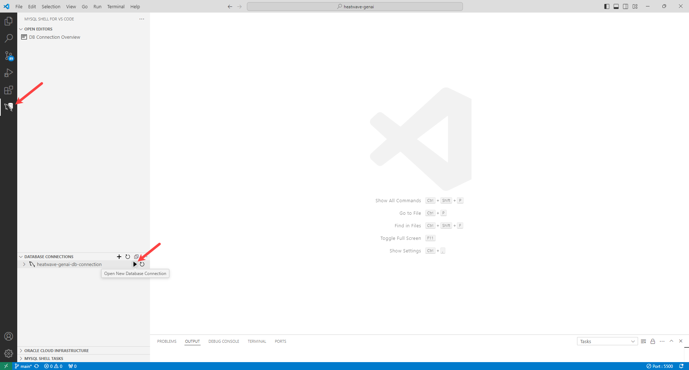
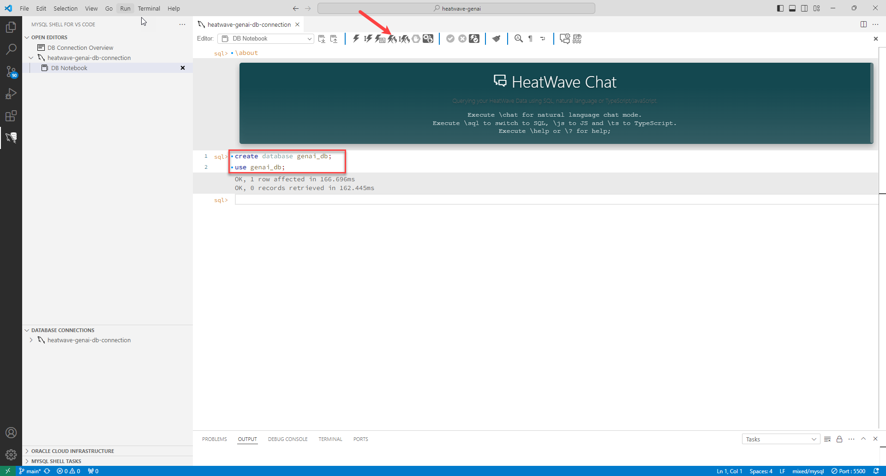
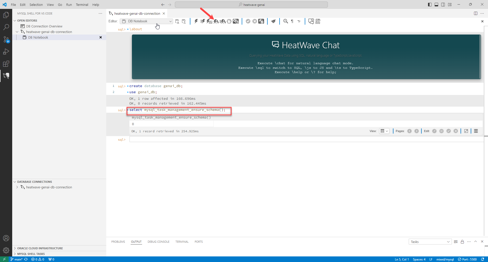
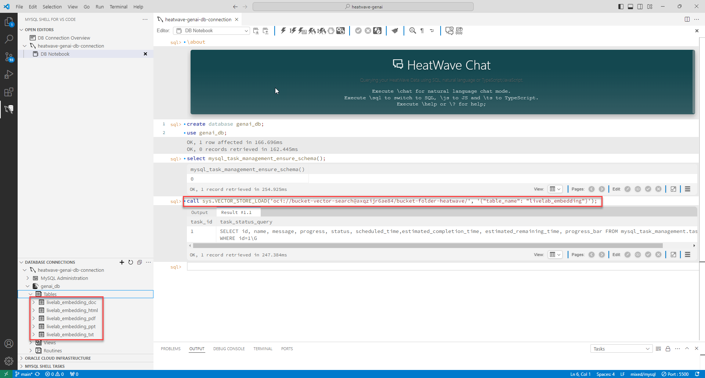
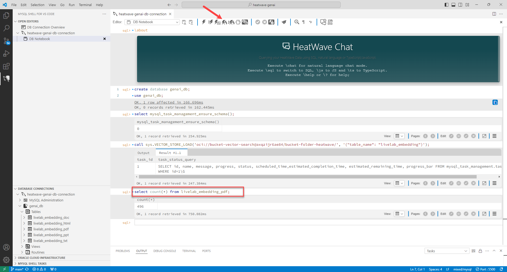

# 검색 증강 생성(Retrieval Augmented Generation) 수행 

## 세션 소개

데이터베이스 내 벡터 저장소와 검색 증강 생성(RAG)을 사용하면 HeatWave 생태계 내에서 자연어를 사용하여 개체 스토리지에 저장된 비정형 문서를 로드하고 쿼리할 수 있습니다.

_Estimated Time:_ 30 minutes 소요

### 목표

이 Lab에서는 다음 작업을 안내해 드립니다 :

- HeatWave 파일 다운로드.
- Object Storage에 버킷(bucket)과 폴더(folder) 생성.
- 버킷(bucket) 폴더에 파일 업로드.
- 동적 그룹(dynamic group) 구성.
- 동적 그룹(dynamic group)에 대한 정책(policies) 작성.
- vector store 설정.
- 벡터 검색(vector search)을 수행.

### Prerequisites (필요사항)

- An Oracle Trial, Paid or LiveLabs Cloud Account
- MySQL Shell에 사용경험

## 작업 1: HeatWave 파일 다운로드

Download HeatWave files on which we will perform a vector search.

1. Download the following files and save it in your local computer.

    - https://www.oracle.com/a/ocom/docs/mysql-heatwave-technical-brief.pdf
    - https://www.oracle.com/a/ocom/docs/mysql/mysql-heatwave-on-aws-brief.pdf
    - https://www.oracle.com/a/ocom/docs/mysql/mysql-heatwave-ml-technical-brief.pdf
    - https://www.oracle.com/a/ocom/docs/mysql/mysql-heatwave-lakehouse-technical-brief.pdf

    

## 작업 2: Object Storage에 버킷(bucket)과 폴더(folder) 생성

The Object Storage service provides reliable, secure, and scalable object storage. Object Storage uses buckets to organize your files. 

1. Open the **Navigation menu** and click **Storage**. Under **Object Storage & Archive Storage**, click **Buckets**.

    

2. In the **heatwave-genai** compartment, click **Create Bucket**. 

    

3. Enter the **Bucket Name**, and accept the defaults for the rest of the fields.

    ```bash
    <copy>bucket-vector-search</copy>
    ```

4. Click **Create**.

    

5. Once the bucket is created, click the name of the bucket to open the **Bucket Details** page. 

    

6. Copy the bucket name and **Namespace**, and paste the it somewhere for future reference.

    

7. Under **Objects**, click **More Actions**, and then click **Create New Folder**.

    

8. In the **Create New Folder** page, enter a **Name** of the folder, and note it for future reference.

    ```bash
    <copy>bucket-folder-heatwave</copy>
    ```

    

9. Click **Create**.

## 작업 3: Upload files to the bucket folder

1.  In the **Bucket Details** page, under **Objects**, click the bucket folder name.

    

2.  Click **Upload**.

    

3. Click **select files** to display a file selection dialog box.

4. Select the files you had downloaded earlier in Task 1, and click **Upload**.

    

5. When the file status shows **Finished**, click **Close** to return to the bucket.

    


## 작업 4: Create a dynamic group

Dynamic groups allow you to group Oracle Cloud Infrastructure resources as principal. You can then create policies to permit the dynamic groups to access Oracle Cloud Infrastructure services. 

1. Open the **Navigation menu**, click **Identity & Security**, and under **Identity**, click **Compartments**.

    

2. In the **Compartments** page, hover over the OCID of your compartment, click **Copy**, and paste the OCID somewhere for future reference.

    

3. Open the **Navigation menu**, click **Identity & Security**, and under **Identity**, click **Domains**.

    

4. Click the domain, **Default**. Note that you had logged into OCI Console using the default identity domain.

    

5. Under **Identity domain**, click **Dynamic groups**.

    

6. Click **Create dynamic group**.

7. In the **Create dynamic group** page, enter a **Name** and a **Description** for the dynamic group. *Note* the name of the dynamic group.

    **Name**:
    
    ```bash
    <copy>heatwave-genai-dynamic-group</copy>
    ```
    **Description**:

    ```bash
    <copy>Dynamic group for HeatWave GenAI</copy>
    ```

    

8. Enter the followng rule:

    ```bash
    <copy>ALL{resource.type='mysqldbsystem', resource.compartment.id = '<OCIDComparment>'}</copy>
    ```
    Replace OCIDComparment with the OCID of the compartment you had copied in Task 4 items 1 and 2.

    For example:

    ```bash
    <copy>ALL{resource.type='mysqldbsystem', resource.compartment.id = 'ocid1.compartment.oc1..aaaaaaaad2mplktxh7unkxodwcqpvtj32ierpvvixvu7qedzsfonq'}</copy>
    ```

    

9. Click **Create**.


## 작업 5: Write policies for the dynamic group to access Object Storage bucket

To access Object Storage from HeatWave, you must define a policy that enables the dynamic group to access to buckets and its folders.

 1. Open the **Navigation menu**, click **Identity & Security**, and under **Identity**, click **Policies**.

    

 2. Click **Create Policy**.

   

3. In **Create policy** page, enter the **Name**, and **Description** of the policy.

    **Name**:

    ```bash
    <copy>heatwave-genai-policy</copy>
    ```
    **Description**:
    ```bash
    <copy>Policy for HeatWave GenAI</copy>
    ```

4. Ensure that the Compartment is **heatwave-genai**.

5. Toggle the **Show manual editor** button, and paste the following policy. *Note* that you can use the following command only when you have logged into OCI Console using the default domain.

    ```bash
    <copy>Allow dynamic-group <DynamicGroupName> to read buckets in compartment <CompartmentName></copy>
    <copy>Allow dynamic-group <DynamicGroupName> to read objects in compartment <CompartmentName></copy>
    ```
    Replace DynamicGroupName with the name of the dynamic group, and CompartmentName with the name of the compartment. 

    For example:
        
    ```bash
    <copy>Allow dynamic-group heatwave-genai-dynamic-group to read buckets in compartment heatwave-genai</copy>
    <copy>Allow dynamic-group heatwave-genai-dynamic-group to read objects in compartment heatwave-genai</copy>
    ```

  6. Click **Create**.

    


<!-- /*## Task 3: Create a Pre-Authenticated Request

Pre-authenticated requests provide a way to let you access a bucket or an object without having your own credentials.

1. In the **Bucket Details** page, under **Resources**, click **Pre-Authenticated Request**, and then click **Create Pre-Authenticated Request**.

    

2. In the **Create Pre-Authenticated Request** dialog box, do the following:
    - Enter the **Name**.
    - Select **Bucket** in **Pre-Authenticated Request Target**.
    - Select **Permits object reads** in **Access Type**.
    - Select **Enable Object Listing**.
    - You can choose to increase the **Expiration** date of the Pre-Authenticated Request.
    - Click **Create Pre-Authenticated Request**. 

    

3. Copy the URL that appears in the **Pre-Authenticated Request Details** dialog box, paste the URL somewhere for future reference, and click **Close**.

    */ -->


## 작업 6: Set up a vector store

1. Go to Visual Studio Code, and under **DATABASE CONNECTIONS**, click **heatwave-genai-db-connection** icon next to your HeatWave instance to connect to it. 

    

2. Create a new schema and select it.

    ```bash
    <copy>create database genai_db;</copy>
	<copy>use genai_db;</copy>
    ```

    

2. Call the following procedure to create a schema that is used for task management.

    ```bash
    <copy>select mysql_task_management_ensure_schema();</copy>
    ```

    

3. Click **Reload Database Information** to view the mysql\_task\_management schema.

    

4. Ingest the file from the Object Storage, create vector embeddings, and load the vector embeddings into HeatWave:

    ```bash
    <copy>call sys.VECTOR_STORE_LOAD('oci://BucketName@Namespace/Path/', '{"table_name": "VectorStoreTableName"}');</copy>
    ```
    Replace the following:

    - BucketName: The OCI Object Storage bucket name that you created in Task 2.
    - Namespace: The name of the Object Storage bucket namespace that you copied in Task 2, Step 6.
    - Path: Path to the folder that contains the source file that you created in Task 2, Step 7.
    - VectorStoreTableName: The name you want for the vector store table
   
    For example:

    ```bash
    <copy>call sys.VECTOR_STORE_LOAD('oci://bucket-vector-search@axqzijr6ae84/bucket-folder-heatwave/', '{"table_name": "livelab_embedding"}');</copy>
    ```

    

5. Wait for a few minutes, and verify that embeddings are loaded in the vector embeddings table.

    ```bash
    <copy>select count(*) from <EmbeddingsTableName>;</copy>
    ```
    For example:
    ```bash
    <copy>select count(*) from livelab_embedding_pdf; </copy>
    ```
    It takes a couple of minutes to create vector embeddings. You should see a numerical value in the output, which means your embeddings are successfully loaded in the table.

    

## 작업 7: Perform retrieval augmented generation

HeatWave retrieves content from the vector store and provide that as context to the LLM. This process is called as retrieval-augmented generation or RAG. This helps the LLM to produce more relevant and accurate results for your queries.

1. Set the @options session variable to specify the table for retrieving the vector embeddings, and click **Enter**.

    ```bash
    <copy>set @options = JSON_OBJECT("vector_store", JSON_ARRAY("<DBName>.<EmbeddingsTableName>"));</copy>
    ```

    For example:

    ```bash
    <copy>set @options = JSON_OBJECT("vector_store", JSON_ARRAY("genai_db.livelab_embedding_pdf"));</copy>
    ```

2. Set the session @query variable to define your natural language query, and click **Enter**.

    ```bash
    <copy>set @query="<AddYourQuery>";</copy>
    ```
    
    Replace AddYourQuery with your natural language query.

    For example:

    ```bash
    <copy>set @query="What is HeatWave AutoML?";</copy>
    ```

3. Retrieve the augmented prompt, using the ML_RAG routine, and click **Execute the selection or full block on HeatWave and create a new block**.

    ```bash
    <copy>call sys.ML_RAG(@query,@output,@options);</copy>
    ```

    

4. Print the output:

    ```bash
    <copy>select JSON_PRETTY(@output);</copy>
    ```
    
    Text-based content that is generated by the LLM in response to your query is printed as output. The output generated by RAG is comprised of two parts:

    - The text section contains the text-based content generated by the LLM as a response for your query.

    - The citations section shows the segments and documents it referred to as context.

    

## Learn More

- [HeatWave User Guide](https://dev.mysql.com/doc/heatwave/en/)

- [HeatWave on OCI User Guide](https://docs.oracle.com/en-us/iaas/mysql-database/index.html)

- [MySQL Documentation](https://dev.mysql.com/)


## Acknowledgements

- **Author** - Aijaz Fatima, Product Manager
- **Contributors** - Mandy Pang, Senior Principal Product Manager, Aijaz Fatima, Product Manager
- **Last Updated By/Date** - kihyuk, MySQL Solution Engineering, December 2024
